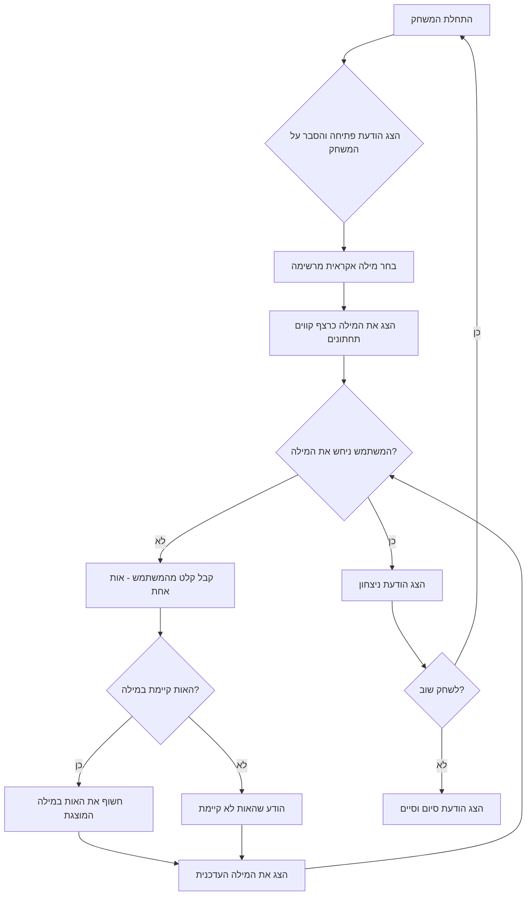

## <algorithm>

1.  **התחלת המשחק**:
    *   הצג הודעת פתיחה למשתמש והסבר את כללי המשחק.
        *   דוגמה: `"ברוכים הבאים למשחק Hl_Q! ... יש לכם מספר בלתי מוגבל של נסיונות!"`
    *   בחר מילה אקראית מתוך רשימה מוגדרת מראש.
        *   דוגמה: רשימת המילים: `["פיתון", "תפוח", "מחשב"]`, המילה הנבחרת: `"פיתון"`.
    *   הצג למשתמש את המילה הנבחרת כרצף של קווים תחתונים.
        *   דוגמה: המילה `"פיתון"` תוצג כ-`"_ _ _ _ _"`.

2.  **לולאת המשחק**:
    *   כל עוד המשתמש לא ניחש את המילה:
        *   קבל קלט מהמשתמש - אות אחת בלבד.
            *   דוגמה: המשתמש מזין `"פ"`.
        *   בדוק אם האות שהוזנה קיימת במילה הנבחרת.
            *   דוגמה: האות `"פ"` קיימת במילה `"פיתון"`.
        *   אם האות קיימת:
            *   חשוף את כל המקומות של האות במילה המוצגת למשתמש.
                *   דוגמה: המילה המוצגת כרגע היא `"_ _ _ _ _"`. לאחר הזנת `"פ"` - המילה המוצגת תהפוך ל-`"פ _ _ _ _"`.
        *   אם האות לא קיימת:
            *   הודע למשתמש שהאות אינה קיימת במילה.
                *   דוגמה: אם המשתמש הזין `"א"`, תוצג הודעה: `"האות א' לא קיימת במילה"`.
        *   הצג את המילה העדכנית למשתמש.
            *   דוגמה: `"פ _ _ _ _"`
    *   סיום הלולאה:
        *   כאשר המילה המוצגת למשתמש שווה למילה הנבחרת - המשתמש ניצח.
        *   דוגמה: אם המילה המוצגת היא `"פ י ת ו ן"` והמילה הנבחרת היא `"פיתון"` - המשחק הסתיים בניצחון.

3.  **סיום המשחק**:
    *   הצג הודעת ניצחון.
        *   דוגמה: `"כל הכבוד! ניחשת את המילה!"`.
    *   שאל את המשתמש אם הוא רוצה לשחק שוב.
        *   דוגמה: `"האם תרצה לשחק שוב? (כן/לא)"`.
    *   אם המשתמש הזין "כן", חזור לשלב 1 (התחלת המשחק).
    *   אם המשתמש הזין "לא", הצג הודעת סיום.
        *   דוגמה: `"תודה ששיחקת!"` וסיים את התוכנית.

## <mermaid>

**הסבר תלויות:**
* אין תלויות משמעותיות בתוך התרשים. הזרימה היא סדרתית וברורה בין השלבים.

**ניתוח שמות המשתנים:**
*   `התחלת המשחק`: התחלת המשחק והגדרת הנתונים הראשוניים.
*   `הצג הודעת פתיחה והסבר על המשחק`: הצגת ההוראות למשתמש.
*   `בחר מילה אקראית מרשימה`: בחירת מילה אקראית מתוך רשימה קבועה.
*  `הצג את המילה כרצף קווים תחתונים`: הצגת המילה הנסתרת למשתמש כרצף של קווים תחתונים.
*   `המשתמש ניחש את המילה?`: בדיקה האם המילה שהמשתמש ניחש שווה למילה המקורית.
*   `קבל קלט מהמשתמש - אות אחת`: קבלת קלט של אות אחת מהמשתמש.
*   `האות קיימת במילה?`: בדיקה האם האות שהזין המשתמש קיימת במילה המקורית.
*   `חשוף את האות במילה המוצגת`: חשיפת האות במילה שהמשתמש מנסה לנחש, כאשר היא קיימת במילה המקורית.
*   `הצג את המילה העדכנית`: הצגת המילה עם האותיות שנחשפו עד כה למשתמש.
*   `הודע שהאות לא קיימת`: הודעה למשתמש כי האות שהזין לא קיימת במילה.
*   `הצג הודעת ניצחון`: הצגת הודעת ניצחון למשתמש.
*   `לשחק שוב?`: שאילת המשתמש האם הוא מעוניין לשחק שוב.
*   `הצג הודעת סיום וסיים`: הצגת הודעת סיום למשתמש והפסקת התוכנית.

## <explanation>

**ייבואים (Imports):**
*   לא מופיעים ייבואים בקוד. המשחק מתבסס על לוגיקה בסיסית של בחירה אקראית של מילים (ניתן להשתמש ב-`random` אבל הוא לא מצוין בתיאור), קבלת קלט מהמשתמש, ובדיקת תנאים.

**מחלקות (Classes):**
*   אין שימוש במחלקות בקוד המתואר. המשחק פשוט וכולל בעיקר פונקציות ומשתנים בסיסיים.

**פונקציות (Functions):**
*   לפי תיאור המשחק, ייתכן שיהיו הפונקציות הבאות:
    *   `start_game()`: מאתחלת את המשחק, בוחרת מילה אקראית ומציגה אותה כקווים תחתונים.
    *   `get_user_input()`: מקבלת קלט מהמשתמש - אות אחת בלבד.
    *   `check_letter(letter, word, displayed_word)`: בודקת האם האות קיימת במילה, ואם כן, חושפת אותה במילה המוצגת למשתמש.
        *   פרמטרים:
            *   `letter`: האות שהמשתמש הזין.
            *   `word`: המילה האמיתית שנבחרה.
            *   `displayed_word`: המילה המוצגת למשתמש עד כה.
        *   ערך מוחזר: המילה המוצגת המעודכנת.
    *  `display_word(displayed_word)`: מציגה את המילה העדכנית עם האותיות שנחשפו.
         *    פרמטרים:
             *    `displayed_word`: המילה המוצגת.
        *   ערך מוחזר: אין.
    *   `check_win(word, displayed_word)`: בודקת האם המשתמש ניחש את כל האותיות.
        *   פרמטרים:
            *   `word`: המילה האמיתית שנבחרה.
            *   `displayed_word`: המילה המוצגת למשתמש עד כה.
        *   ערך מוחזר: `True` אם ניצח, אחרת `False`.
    *   `play_again()`: שואלת את המשתמש אם הוא רוצה לשחק שוב ומחזירה `True` אם כן, `False` אם לא.

**משתנים (Variables):**
*   `word_list`: רשימה של מילים ממנה תבחר המילה האקראית.
    *   סוג: רשימה (List).
    *   שימוש: מכילה את כל האפשרויות למילים שהמשתמש ינסה לנחש.
*   `secret_word`: המילה שנבחרה באקראי.
    *   סוג: מחרוזת (String).
    *   שימוש: המילה שהמשתמש צריך לנחש.
*   `displayed_word`: המילה המוצגת למשתמש עם האותיות שנחשפו עד כה.
    *   סוג: מחרוזת (String).
    *   שימוש: הצגה למשתמש של ההתקדמות שלו במשחק.
*   `user_letter`: הקלט שהמשתמש מזין (אות אחת).
    *   סוג: מחרוזת (String).
    *   שימוש: האות שהמשתמש הזין.

**בעיות אפשריות או תחומים לשיפור:**
*   **טיפול בקלט לא תקין:** הקוד כרגע לא בודק שהקלט מהמשתמש הוא אות אחת בלבד. יש להוסיף בדיקה לכך ולטפל במקרים של קלט לא חוקי.
*   **אפשרות בחירת רמת קושי:** לא קיימת אפשרות לבחירת רמת קושי על ידי הגבלת מספר ניסיונות או בחירת מילים לפי אורך.
*   **ממשק משתמש:** המשחק משתמש בממשק טקסטואלי פשוט. ניתן לשפר זאת בעזרת ספריות גרפיות.
*   **הוספת רמזים:** ניתן להוסיף רמזים למשתמש כמו מספר האותיות במילה או האות הראשונה.
*   **ניקוד וסטטיסטיקות:** ניתן להוסיף מערכת ניקוד ולשמור סטטיסטיקות של משחקים קודמים.

**שרשרת קשרים עם חלקים אחרים בפרויקט:**
*   בפרויקט גדול יותר, ניתן יהיה להשתמש בפונקציות הללו כחלק ממודול של משחקי מילים. ייתכן שיהיו מודולים אחרים לניהול משתמשים, שמירת נתונים וכו'.
*   הקוד כרגע עצמאי ולא תלוי בחלקים אחרים של פרויקט. עם זאת, ניתן להשתמש במודולים אחרים לגרפיקה או לניהול משתמשים, אך הם לא קיימים בתיאור הזה.

בסיכום, הקוד המתואר מייצג משחק ניחוש מילים בסיסי שניתן להרחבה ולשיפור בהתאם לצרכים. הוא כולל לוגיקה פשוטה של בחירה אקראית של מילה, קבלת קלט מהמשתמש, בדיקה וחשיפה של אותיות, ומשמש כדוגמה טובה למשחק טקסטואלי בסיסי.