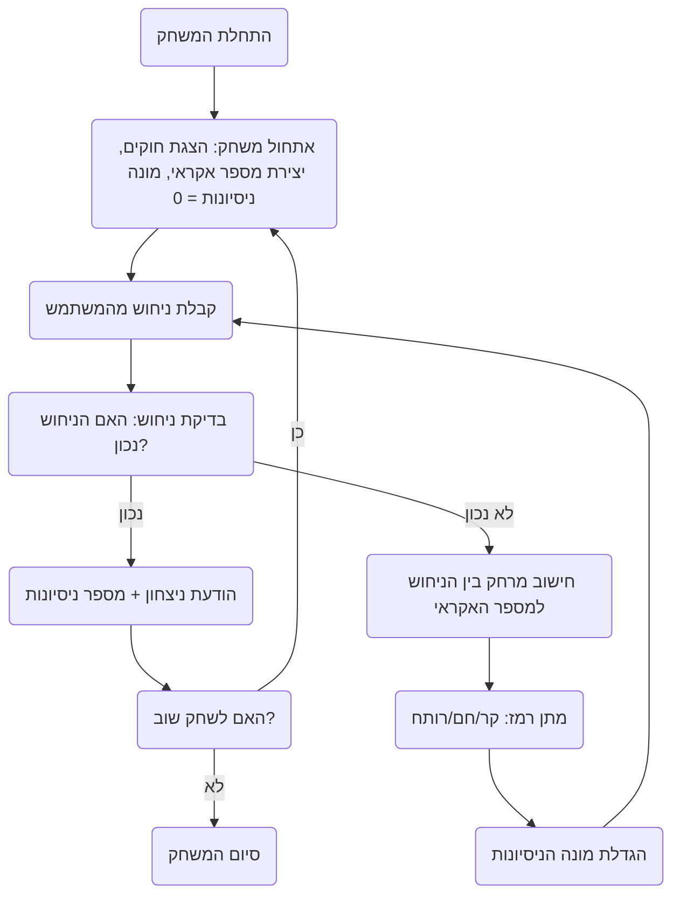

## <algorithm>

1.  **התחלת המשחק:**
    *   הצגת הודעת פתיחה והסבר על חוקי המשחק.
    *   יצירת מספר אקראי בין 1 ל-100 (לדוגמה, 56).
    *   אתחול מונה ניסיונות ל-0.
2.  **לולאת משחק:**
    *   **קבלת קלט מהמשתמש:**
        *   בקשת ניחוש מהמשתמש (לדוגמה, המשתמש מזין 50).
    *   **בדיקת ניחוש:**
        *   השוואת הניחוש עם המספר האקראי.
            *   אם הניחוש זהה למספר האקראי:
                *   הצגת הודעת ניצחון, כולל מספר הניסיונות.
                *   שאילת המשתמש האם לשחק שוב.
            *   אחרת, חישוב מרחק בין הניחוש למספר האקראי:
                *   אם המרחק גדול מאוד, הצגת "קר". לדוגמה: אם המספר האקראי הוא 56 והמשתמש ניחש 10, המרחק הוא 46.
                *   אם המרחק בינוני, הצגת "חם". לדוגמה: אם המספר האקראי הוא 56 והמשתמש ניחש 48, המרחק הוא 8.
                *   אם המרחק קטן מאוד, הצגת "רותח". לדוגמה: אם המספר האקראי הוא 56 והמשתמש ניחש 55, המרחק הוא 1.
    *   **עדכון מונה ניסיונות:**
        *   הגדלת מונה הניסיונות ב-1.
    *   חזרה ללולאה עד שהניחוש נכון.
3.  **סיום המשחק:**
    *   אם המשתמש בוחר לשחק שוב, חזרה לשלב 1.
    *   אחרת, הצגת הודעת סיום המשחק.

## <mermaid>

## <explanation>

**ייבואים (Imports):**

*   הקוד המוצג אינו כולל ייבוא של ספריות חיצוניות. עם זאת, הקוד מזכיר את הצורך בשימוש ב `random` כדי ליצור מספר רנדומלי. במימוש אמיתי, סביר להניח שימוש ב `import random` בהתחלה.

**מחלקות (Classes):**

*   אין שימוש במחלקות בקוד המוצג. המימוש יהיה מבוסס על פונקציות.

**פונקציות (Functions):**

*   בתיאור הקוד לא מוזכרות פונקציות ספציפיות, אך במימוש יהיו פונקציות:
    *   פונקציה `start_game()`: תאתחל את המשחק, תציג את ההודעה, תגריל את המספר ותקרא לפונקציית לולאת המשחק.
    *   פונקציה `get_guess()`: תקבל ניחוש מהמשתמש ותחזיר אותו כמספר.
    *   פונקציה `check_guess(guess, number)`: תקבל את הניחוש והמספר הסודי ותבדוק האם הם שווים. תחזיר `True` אם שווים, ו `False` אם לא.
    *   פונקציה `calculate_distance(guess, number)`: תקבל את הניחוש והמספר הסודי ותחשב את המרחק ביניהם, ותחזיר את המחרוזת המתאימה ("קר","חם","רותח").
    *   פונקציה `provide_hint(distance)`: תקבל את המרחק מהמספר הסודי ותדפיס את הרמז המתאים.
    *   פונקציה `play_again()`: תשאל את המשתמש האם הוא רוצה לשחק שוב ותחזיר `True` או `False` בהתאם.
    *   פונקציה `end_game()`: תסיים את המשחק ותדפיס הודעת סיום.

**משתנים (Variables):**

*   `secret_number`: המספר האקראי שהתוכנית בחרה.
*   `user_guess`: הניחוש שהמשתמש הזין.
*   `tries`: מספר הניסיונות שהמשתמש ביצע.
*  `distance`: המרחק בין הניחוש למספר הסודי, המשמש למתן רמזים.

**בעיות אפשריות או תחומים לשיפור:**

*   **טיפול בקלט לא חוקי:** הקוד צריך לטפל במקרים שבהם המשתמש מכניס קלט שאינו מספר או מספר מחוץ לטווח המותר (1 עד 100). צריך להשתמש בלולאת `try-except` כדי לוודא שהקלט הוא תקין.
*   **אפשרויות נוספות:** כפי שהוצע בתיאור, ניתן להוסיף אפשרות לשנות את טווח המספרים, להוסיף רמות קושי, או להוסיף טיימר למשחק.

**שרשרת קשרים עם חלקים אחרים בפרויקט:**

*   הקוד הזה הוא משחק עצמאי, אין לו קשר ישיר עם חלקים אחרים בפרויקט. אך הוא יכול לשמש כחלק מספריית משחקים או כמודול נפרד בתוך פרויקט גדול יותר.