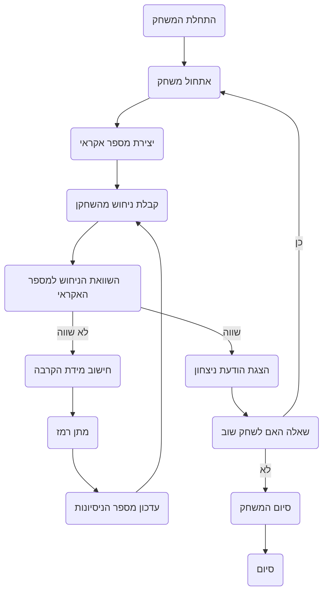

## <algorithm>

1. **התחלת המשחק:**
   - הצגת הודעת פתיחה והסבר על כללי המשחק.
   - יצירת מספר אקראי בין 1 ל-100.
   *דוגמה:*
      ```
      Добро пожаловать в игру HMRABI!
      Я загадаю число в диапазоне от 1 до 100.
      Ваша задача — угадать его.
      Я буду показывать, насколько близким является ваше предположение.
      У вас есть неограниченное количество попыток.
      ```
      *מספר אקראי שנוצר:* 57

2. **לולאת משחק ראשית:**
    - קבלת ניחוש מהמשתמש.
    *דוגמה:* `הכנס ניחוש: 45`
    - השוואת הניחוש למספר האקראי.
        - אם הניחוש שווה למספר האקראי:
            - הצגת הודעת ניצחון.
            - הצגת מספר הניסיונות שלקח למשתמש.
            - שאלה האם המשתמש רוצה לשחק שוב.
                - אם כן, חזרה לשלב 1.
                - אם לא, סיום המשחק.
        - אם הניחוש לא שווה למספר האקראי:
            - חישוב מידת הקרבה:
                - "קר" – אם הניחוש רחוק מהמספר.
                - "חמים" – אם הניחוש קרוב למספר.
                - "רותח" – אם הניחוש מאוד קרוב למספר.
            - הצגת רמז למשתמש.
            *דוגמה:* עבור ניחוש 45, התגובה תהיה: `קר!`
    - עדכון מספר הניסיונות.
    - חזרה לשלב 2 (קבלת ניחוש חדש)

3. **סיום המשחק:**
   - הצגת הודעת סיום המשחק.
    *דוגמה:* `תודה ששיחקת!`

## <mermaid>



**הסבר התלויות ב Mermaid:**

*   אין תלויות חיצוניות. התרשים מתאר זרימה פנימית של לוגיקת המשחק.

## <explanation>

**ייבוא (Imports):**

*   הקוד המתואר אינו כולל ייבוא מפורש של מודולים, אך הוא מרמז על שימוש במודול `random` (למשל, כדי לייצר מספר אקראי). בהקשר של פרויקט גדול יותר, ניתן להניח שהקוד יכלול:
    ```python
    import random
    ```
    המודול `random` הוא חלק מהספרייה הסטנדרטית של Python ומשמש ליצירת מספרים פסאודו-אקראיים.

**מחלקות (Classes):**

*   הקוד לא משתמש באופן מפורש במחלקות, אבל בפרויקט אמיתי אפשר לממש את הלוגיקה של המשחק בתוך מחלקה. למשל, מחלקה בשם `HMRABI` עם מתודות כמו `init_game`, `play_round`, ו-`end_game`.

**פונקציות (Functions):**

*   הקוד לא מציג פונקציות מוגדרות, אבל בפרויקט אמיתי, היינו יכולים לצפות לפונקציות כמו:
    *   `generate_secret_number()` - יוצרת את המספר האקראי.
    *   `get_player_guess()` - קולטת את הניחוש מהמשתמש.
    *   `check_guess(secret_number, guess)` - בודקת את הניחוש ומחזירה רמז.
    *   `play_game()` - הפונקציה הראשית שמשחילה את לוגיקת המשחק.

    *דוגמאות:*

    ```python
    def generate_secret_number():
       return random.randint(1,100)

    def check_guess(secret_number, guess):
        if guess == secret_number:
            return "נכון!"
        elif abs(guess - secret_number) <= 5:
            return "רותח!"
        elif abs(guess - secret_number) <= 20:
            return "חמים!"
        else:
            return "קר!"
    ```

**משתנים (Variables):**

*   `secret_number`: מספר אקראי שנוצר בתחילת המשחק ושהשחקן מנסה לנחש. (סוג: `int`).
*   `guess`: הניחוש של השחקן (סוג: `int`).
*   `attempts`: מספר הניסיונות שהשחקן ניסה לנחש את המספר (סוג: `int`).

**בעיות אפשריות או תחומים לשיפור:**

1.  **טיפול בקלט שגוי:** הקוד צריך לטפל במקרים שבהם המשתמש מזין קלט לא חוקי (למשל, טקסט במקום מספר או מספר מחוץ לטווח).
2.  **ממשק משתמש:** ניתן לשפר את חוויית המשתמש באמצעות ממשק משתמש גרפי (GUI).
3.  **הגדרות קושי:** ניתן להוסיף הגדרות קושי (למשל, טווח מספרים שונה או הגבלת מספר הניסיונות).
4.  **מבנה קוד:** מומלץ להשתמש בפונקציות או מחלקות כדי לחלק את הקוד לחלקים קריאים וניתנים לתחזוקה.

**שרשרת קשרים עם חלקים אחרים בפרויקט:**

*   בהנחה שמדובר במשחק בתוך פרויקט גדול יותר, הקוד של המשחק יכול להיות מחובר למערכת שמנהלת משחקים, שומרת שיאים, או מציגה ממשק משתמש.