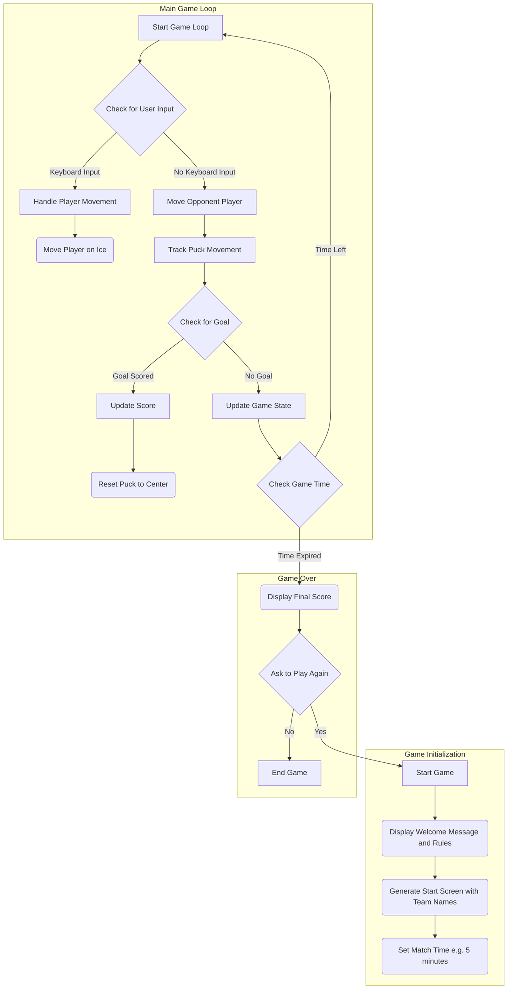

## ניתוח קוד: משחק הוקי

### 1. <algorithm>

**תרשים זרימה של המשחק:**

1.  **התחלת המשחק:**
    *   הצגת הודעת פתיחה והסבר על חוקי המשחק.
    *   יצירת מסך התחלה עם שמות הקבוצות.
    *   הגדרת זמן המשחק (לדוגמה, 5 דקות).
    *   **דוגמה:**
        ```
        הודעה: ברוכים הבאים למשחק הוקי!
        זמן משחק: 5 דקות
        קבוצה 1: שחקן
        קבוצה 2: יריב
        ```
2.  **תהליך המשחק:**
    *   **תנועת שחקנים:**
        *   השחקן משתמש במקשים כדי להזיז את השחקנים שלו על המגרש.
        *   השחקן יכול לתקוף, למסור את הדיסקית או להתגונן.
        *   **דוגמה:** לחיצה על החצים למעלה, למטה, שמאלה וימינה, כדי להזיז שחקן.
    *   **דיסקית ושערים:**
        *   כדי להבקיע, השחקן צריך להזיז את הדיסקית לשער היריב.
        *   כאשר הדיסקית עוברת את קו השער, נרשם גול.
        *   המשחק מתחיל מחדש מאמצע המגרש.
        *   **דוגמה:** דיסקית עוברת את קו השער - גול!
    *   **יריב:**
        *   התוכנה שולטת על שחקני היריב.
        *   היריב מנסה לחטוף את הדיסקית או לחסום זריקות.
        *   **דוגמה:** שחקן יריב נע לכיוון הדיסקית.
    *   **זמן:**
        *   המשחק נמשך עד שנגמר הזמן.
        *   בסוף המשחק מוצגת התוצאה (מספר הגולים של כל קבוצה).
        *   **דוגמה:**
            *   זמן: 4:30
            *   זמן: 0:00 - המשחק נגמר.
3.  **ספירת נקודות:**
    *   כל גול שווה נקודה אחת.
    *   התוכנה מציגה את מצב המשחק, מספר הגולים והזמן שנותר.
    *   **דוגמה:**
        *   תוצאה: 1 - 0 (שחקן - יריב)
        *   תוצאה: 2 - 1 (שחקן - יריב)
4.  **סיום משחק:**
    *   התוכנה מציגה את התוצאה הסופית.
    *   השחקן נשאל אם הוא רוצה לשחק שוב.
    *   אם כן, מתחיל משחק חדש, אחרת התוכנה מסתיימת.
    *   **דוגמה:**
        ```
        משחק נגמר!
        תוצאה: 2 - 1
        רוצה לשחק שוב? (כן/לא)
        ```
**זרימת נתונים:**

*   קלט: מקשי מקלדת (תנועת שחקנים).
*   פלט: תצוגה גרפית של המשחק, הודעות למשתמש.
*   נתונים פנימיים: מיקום שחקנים, מיקום הדיסקית, זמן משחק, תוצאה.
*   פונקציות עיקריות:
    *   `init_game()`: אתחול משחק.
    *   `handle_player_movement()`: טיפול בתנועת השחקן.
    *   `handle_puck_movement()`: טיפול בתנועת הדיסקית.
    *   `check_goal()`: בדיקה האם נרשם גול.
    *   `update_score()`: עדכון התוצאה.
    *   `update_time()`: עדכון הזמן.
    *   `game_over()`: סיום המשחק.

### 2. <mermaid>



**הסבר תרשים Mermaid:**

1.  **`flowchart TD`**: הגדרה שהתרשים הוא תרשים זרימה מלמעלה למטה.
2.  **`subgraph Game Initialization`**: קבוצה של בלוקים המייצגים אתחול המשחק:
    *   `A[Start Game]`: התחלת המשחק.
    *   `B(Display Welcome Message and Rules)`: הצגת הודעת פתיחה וחוקי המשחק.
    *   `C(Generate Start Screen with Team Names)`: יצירת מסך התחלה עם שמות הקבוצות.
    *   `D(Set Match Time e.g. 5 minutes)`: הגדרת זמן המשחק.
3.  **`subgraph Main Game Loop`**: קבוצה של בלוקים המייצגים את לולאת המשחק הראשית:
    *   `E[Start Game Loop]`: תחילת לולאת המשחק.
    *   `F{Check for User Input}`: בדיקת קלט מהמשתמש.
    *   `F -- Keyboard Input --> G[Handle Player Movement]`: טיפול בתנועת השחקן באמצעות מקלדת.
    *   `G --> H(Move Player on Ice)`: הזזת השחקן על המגרש.
    *   `F -- No Keyboard Input --> I[Move Opponent Player]`: תזוזת שחקן היריב.
    *   `I --> J[Track Puck Movement]`: מעקב אחר תנועת הדיסקית.
    *   `J --> K{Check for Goal}`: בדיקה האם נרשם גול.
    *   `K -- Goal Scored --> L[Update Score]`: עדכון התוצאה אם הובקע גול.
    *   `L --> M(Reset Puck to Center)`: איפוס הדיסקית למרכז המגרש.
    *   `K -- No Goal --> N[Update Game State]`: עדכון מצב המשחק אם לא נרשם גול.
    *   `N --> O{Check Game Time}`: בדיקת הזמן שנותר במשחק.
    *   `O -- Time Left --> E`: אם נותר זמן, חוזרים ללולאה הראשית.
4. **`subgraph Game Over`**: קבוצה של בלוקים המייצגים את סוף המשחק:
    *   `O -- Time Expired --> P(Display Final Score)`: הצגת התוצאה הסופית כאשר נגמר הזמן.
    *   `P --> Q{Ask to Play Again}`: שאלה האם השחקן רוצה לשחק שוב.
    *   `Q -- Yes --> A`: אם כן, מתחיל משחק חדש.
    *   `Q -- No --> R[End Game]`: אם לא, המשחק מסתיים.
**הסבר שמות המשתנים:**

כל השמות בתרשים נועדו לתאר את הפעולות או המצבים הספציפיים, מה שמקל על ההבנה של תהליך המשחק.

### 3. <explanation>

**הסברים מפורטים:**

*   **מטרת המשחק:** המשחק "הוקי" מדמה משחק הוקי קרח, בו שחקן שולט בקבוצה ומנסה להבקיע גולים נגד קבוצה יריבה הנשלטת על ידי המחשב.
*   **ייבואים (Imports):** אין ייבוא מפורש בקוד. בפועל, כדי לממש את המשחק יש צורך בספריות גרפיות כמו `pygame`.
    *   `pygame`: שימוש בספרייה זו יאפשר יצירת חלון משחק, הצגת גרפיקה של שחקנים, דיסקית וקרח, וכן טיפול באירועי קלט מהמשתמש (מקלדת).
*   **מחלקות (Classes):** אין מחלקות מוגדרות בקוד, אך יהיה צורך ליצור מחלקות לצורך ייצוג שחקנים, דיסקית, וכן לניהול מצב המשחק.
    *   `Player`: ייצוג שחקן, תכונות כגון מיקום, מהירות וכו'.
    *   `Puck`: ייצוג הדיסקית, תכונות כגון מיקום, מהירות, כיוון.
    *   `Game`: ייצוג מצב המשחק, כולל תוצאה, זמן, ושיטות לניהול כללי המשחק.
*   **פונקציות (Functions):** הפונקציות המרכזיות:
    *   `init_game()`:
        *   פרמטרים: אין.
        *   ערך מוחזר: אין.
        *   מטרה: אתחול המשחק (מסך התחלה, קביעת זמן, שמות קבוצות).
    *   `handle_player_movement()`:
        *   פרמטרים: קלט מהמשתמש (מקשי מקלדת).
        *   ערך מוחזר: אין.
        *   מטרה: טיפול בתנועות השחקן בהתאם ללחיצות המקשים.
    *   `handle_puck_movement()`:
        *   פרמטרים: מיקום הדיסקית.
        *   ערך מוחזר: מיקום חדש של הדיסקית.
        *   מטרה: עדכון מיקום הדיסקית והטיפול באינטראקציות עם שחקנים וקירות.
    *   `check_goal()`:
        *   פרמטרים: מיקום הדיסקית ומיקום השער.
        *   ערך מוחזר: האם הובקע גול (True/False).
        *   מטרה: בדיקה אם הדיסקית עברה את קו השער.
    *   `update_score()`:
        *   פרמטרים: נקודות של השחקן והיריב.
        *   ערך מוחזר: אין.
        *   מטרה: עדכון התוצאה המוצגת על המסך.
    *   `update_time()`:
        *   פרמטרים: זמן המשחק.
        *   ערך מוחזר: הזמן שנותר.
        *   מטרה: עדכון הזמן שנותר במשחק.
    *   `game_over()`:
        *   פרמטרים: תוצאת המשחק.
        *   ערך מוחזר: אין.
        *   מטרה: סיום המשחק, הצגת התוצאה ושאלה האם לשחק שוב.
*   **משתנים (Variables):**
    *   `match_time`: משתנה מספרי המייצג את זמן המשחק.
    *   `player_score`: משתנה המייצג את תוצאת השחקן.
    *   `opponent_score`: משתנה המייצג את תוצאת היריב.
    *   `puck_position`: משתנה המייצג את מיקום הדיסקית.
    *   `player_positions`: משתנה המייצג את מיקומי השחקנים.

**בעיות אפשריות ותחומים לשיפור:**

*   **תנועה של השחקנים:** הקוד לא מפרט איך תנועת השחקנים תתבצע בפועל. יש לתכנן איך השחקנים יגיבו לקלט מהמשתמש, כיצד הם יזוזו במגרש.
*   **התנהגות היריב:** חסר תיאור של האלגוריתם שבו היריב ישתמש כדי לשחק (איך הוא מנסה לחטוף את הדיסקית, לחסום זריקות).
*   **חוקי פיזיקה בסיסיים:** לא ברור איך הקוד יטפל בהתנגשויות בין השחקנים והדיסקית. יהיה צורך להוסיף קוד שידמה פיזיקה של התנגשויות.
*   **משחק גרפי:** הקוד לא מפרט איך תיראה תצוגת המשחק.
*   **מולטיפלייר:** חסר תיאור איך לשלב משחק מרובה משתתפים.

**שרשרת קשרים עם חלקים אחרים בפרויקט:**

הקוד הזה הוא חלק ממשחק הוקי, אשר יכול להיות חלק מתוך אוסף משחקי מחשב בסיסיים. הקוד יכול להיות מקושר לחלקים אחרים בפרויקט כגון:
*   **ממשק משתמש:** קבצים אשר מייצרים את הממשק הגרפי של המשחק.
*   **מנגנון גרפיקה:** קבצים אשר מייצרים את הצגת הגרפיקה במשחק (למשל באמצעות ספריית pygame).
*   **AI:** קבצים המטפלים בבינה מלאכותית של היריב.

ניתוח זה מספק סקירה מקיפה על הקוד, תיאור תהליך העבודה, תרשים זרימה, הסברים מפורטים על הייבוא, מחלקות, פונקציות ומשתנים, וכן מציין בעיות אפשריות ותחומים לשיפור.