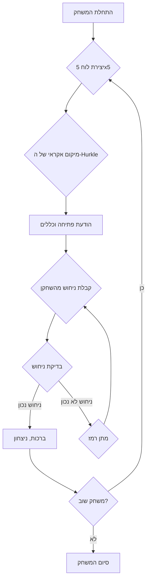

## <algorithm>

1. **התחלת משחק:**
   - התוכנית מברכת את המשתמש ומסבירה את כללי המשחק.
   - לדוגמה: "ברוכים הבאים למשחק HURKLE! החבאתי אובייקט על הלוח, והמשימה שלכם היא לנחש את מיקומו".
   - לוח בגודל 5x5 נוצר (או גודל שצוין על ידי המשתמש).
   - ה-Hurkle ממוקם באופן אקראי על הלוח.
   - לדוגמה: Hurkle נמצא במיקום (3, 2).

2. **לולאת משחק עיקרית:**
   - **תור השחקן:**
     - השחקן מזין קואורדינטות של תא בלוח. לדוגמה, "C3".
     - התוכנית בודקת את המרחק בין הניחוש למיקום של ה-Hurkle.
     - התוכנית נותנת רמזים על סמך המרחק:
       - "Hurkle קרוב" אם הניחוש קרוב (לדוגמה, תא שכנה).
       - "Hurkle רחוק" אם הניחוש רחוק.
       - "ברכות, מצאתם את ה-Hurkle!" אם הניחוש נכון.
       - לדוגמה:
         - ניחוש: C3, Hurkle ב-(3,2) -> "Hurkle קרוב".
         - ניחוש: D4, Hurkle ב-(3,2) -> "Hurkle רחוק".
         - ניחוש: C2, Hurkle ב-(3,2) -> "ברכות, מצאתם את ה-Hurkle!".
   - **מתן רמזים:**
     - התוכנית מנתחת את כל הניחושים ונותנת רמזים.
     - הרמזים יכולים להיות "חם", "קר", "רותח" או "קפוא".
     - לדוגמה:
       - ניחוש קרוב: "חם".
       - ניחוש רחוק: "קר".

3. **סיום משחק:**
   - אם ה-Hurkle נמצא:
     - התוכנית מברכת את השחקן ומספרת לו את מספר הניסיונות.
     - לדוגמה: "ברכות! מצאתם את ה-Hurkle ב-5 ניסיונות!".
     - השחקן נשאל אם הוא רוצה לשחק שוב.
   - אם השחקן בוחר "כן": משחק חדש מתחיל עם מיקום חדש ואקראי ל-Hurkle.
   - אם השחקן בוחר "לא": התוכנית מסיימת.
   - לדוגמה:
     - שחק שוב? (כן/לא) > כן -> משחק חדש מתחיל.
     - שחק שוב? (כן/לא) > לא -> "תודה ששיחקתם!".

## <mermaid>

## <explanation>

**ייבואים (Imports):**
אין ייבוא בחלק הקוד שסופק. עם זאת, ביישום בפועל, ייתכן שיידרשו ייבואים של מודולים כגון `random` ליצירת מיקום אקראי של ה-Hurkle וכן מודולים נוספים עבור ממשק המשתמש (לדוגמה, `tkinter` או `pygame`).

**מחלקות (Classes):**
אין מחלקות בקוד, אבל ביישום מפורט, ייתכן שנשתמש במחלקות:
- `Game`: שתנהל את כל המשחק, כולל יצירת הלוח, מיקום ה-Hurkle, קבלת ניחושים ומתן רמזים.
- `Board`: תייצג את הלוח ותכיל שיטות לטיפול בו.
- `Player`: תייצג את השחקן, כולל קבלת קלט ממנו.

**פונקציות (Functions):**
- `init_game()`: מאתחלת את המשחק, מייצרת את הלוח, וממקמת את ה-Hurkle באופן אקראי.
  - פרמטרים: אין
  - ערך מוחזר: None
  - שימוש: נקראת בתחילת המשחק.
- `get_player_guess()`: מבקשת קלט מהשחקן.
  - פרמטרים: None
  - ערך מוחזר: מחרוזת קלט מהשחקן (לדוגמה, "C3")
  - שימוש: נקראת בכל סיבוב כדי לקבל את הניחוש של השחקן.
- `check_guess(guess, hurkle_location)`: בודקת את הניחוש של השחקן.
  - פרמטרים: `guess` (מחרוזת), `hurkle_location` (זוג קואורדינטות).
  - ערך מוחזר: רמז (מחרוזת) או `True` אם הניחוש נכון.
  - שימוש: נקראת בכל סיבוב לאחר קבלת הניחוש.
- `give_hint(guess, hurkle_location)`: נותנת רמז על בסיס המרחק בין הניחוש למיקום ה-Hurkle.
  - פרמטרים: `guess` (מחרוזת), `hurkle_location` (זוג קואורדינטות).
  - ערך מוחזר: מחרוזת של רמז ("חם", "קר", וכו').
  - שימוש: נקראת על ידי `check_guess`.
- `play_again()`: שואלת אם השחקן רוצה לשחק שוב.
  - פרמטרים: None
  - ערך מוחזר: `True` אם השחקן רוצה לשחק שוב, `False` אחרת.
  - שימוש: נקראת בסוף המשחק.

**משתנים (Variables):**
- `board_size`: גודל הלוח (לדוגמה, 5).
- `hurkle_location`: קואורדינטות של מיקום ה-Hurkle בלוח (לדוגמה, (3, 2)).
- `guesses`: מספר הניחושים של השחקן.
- `game_running`: דגל בוליאני שקובע אם המשחק רץ או לא.

**בעיות אפשריות ותחומים לשיפור:**
- **אימות קלט:** אין אימות קלט של השחקן. יש להוסיף אימות של הקואורדינטות שהשחקן מזין.
- **גודל לוח:** קבוע ל-5x5, יש להוסיף אפשרות לקבוע את הגודל.
- **רמזים:** רמזים בסיסיים מאוד ("חם", "קר"). יש להוסיף רמזים מפורטים יותר על בסיס המרחק.
- **ממשק משתמש:** חסר ממשק משתמש. ניתן להוסיף ממשק משתמש גרפי או ממשק טקסט מתקדם יותר.
- **טיפול בשגיאות:** אין טיפול בשגיאות (לדוגמה, שגיאת קלט). יש להוסיף טיפול בשגיאות.

**שרשרת קשרים עם חלקים אחרים בפרויקט:**
- משחק ה-Hurkle יכול להיות חלק ממערכת משחקים, כאשר כל משחק מיוצג על ידי מחלקה נפרדת.
- ניתן לשתף קוד לממשק משתמש עם משחקים אחרים.
- ניתן להשתמש בקוד משותף לניהול משתמשים או שמירת נתונים (לדוגמה, ניקוד).