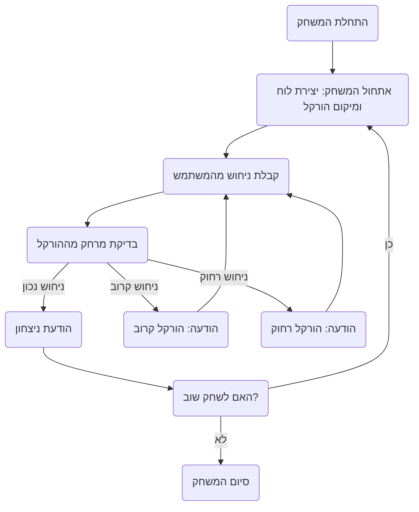

## ניתוח קוד: משחק HURKLE

### <algorithm>
1. **התחלת המשחק:**
   - הצגת הודעת פתיחה והסבר על חוקי המשחק.
   - יצירת לוח משחק בגודל 5x5 (ניתן להתאמה).
   - בחירת מיקום אקראי עבור ה"הורקל" על הלוח.
    - לדוגמה:  לוח 5x5 , הורקל במיקום D3.
   
2. **לולאת משחק:**
   - קבלת קלט מהמשתמש - ניחוש מיקום על הלוח.
     - לדוגמה: המשתמש מזין "B2".
   - בדיקת המרחק בין הניחוש למיקום ההורקל:
     - אם הניחוש זהה למיקום ההורקל:
       - הצגת הודעת ניצחון.
       - שאלה אם המשתמש רוצה לשחק שוב.
         - אם "כן" - חזרה לשלב 1 (משחק חדש).
         - אם "לא" - סיום המשחק.
     - אם הניחוש קרוב להורקל (למשל, משבצת סמוכה):
       - הצגת הודעה "הורקל קרוב".
       - חזרה ללולאת משחק (קבלת ניחוש נוסף).
     - אם הניחוש רחוק מההורקל:
       - הצגת הודעה "הורקל רחוק".
       - חזרה ללולאת משחק (קבלת ניחוש נוסף).
      -דוגמא להצגת מרחק: הורקל ב-D3, קלט B2 -> "הורקל רחוק".
      -דוגמא להצגת מרחק: הורקל ב-D3, קלט D2 -> "הורקל קרוב".
      -דוגמא להצגת מרחק: הורקל ב-D3, קלט D3 -> "ניצחון!".

3. **סיום המשחק:**
   - הצגת הודעת סיום המשחק אם המשתמש בחר שלא לשחק שוב.

### <mermaid>

### <explanation>
- **המשחק HURKLE:**
  - משחק ניחושים בו המשתמש צריך למצוא מיקום נסתר על לוח על ידי קבלת רמזים.
  - הרמזים הם "קרוב" או "רחוק" בהתאם לקרבת הניחוש למיקום הנכון.

- **אלגוריתם:**
    - המשחק מתחיל באתחול: יצירת לוח, מיקום אקראי של ההורקל והצגת הודעת פתיחה.
    - לאחר מכן המשחק רץ בלולאה:
        - המשתמש מנחש מיקום.
        - המערכת בודקת אם הניחוש נכון, קרוב או רחוק.
        - המערכת נותנת רמז בהתאם לבדיקה.
    - כאשר המשתמש מנחש נכון, המשחק שואל אם לשחק שוב.
    - המשחק מסתיים אם המשתמש לא רוצה לשחק שוב.

- **רכיבים:**
    - **אתחול המשחק:** יצירת הלוח והמיקום האקראי הם שלבים חיוניים לפני תחילת המשחק.
    - **לולאת המשחק:** הלולאה מאפשרת למשתמש לנחש עד שהוא פוגע במיקום הנכון.
    - **בדיקת המרחק:** הבדיקה בין הניחוש למיקום הנכון היא הליבה של המשחק והיא המנגנון ליצירת רמזים.
    - **הודעות למשתמש:** הודעות מסייעות למשתמש להבין את מצב המשחק ומספקות לו משוב.

- **שיפורים אפשריים:**
    - אפשרות לבחירת גודל הלוח.
    - אפשרות להגבלת מספר הניסיונות.
    - אפשרות למדדי מרחק מדוייקים יותר (חם, קר).
    - שיפור ממשק המשתמש.

- **שרשרת קשרים:**
    - קובץ זה מתאר את חוקי המשחק HURKLE.
    - קבצי קוד נוספים יידרשו כדי לממש את המשחק בפועל, וישמשו את התיאור הזה.