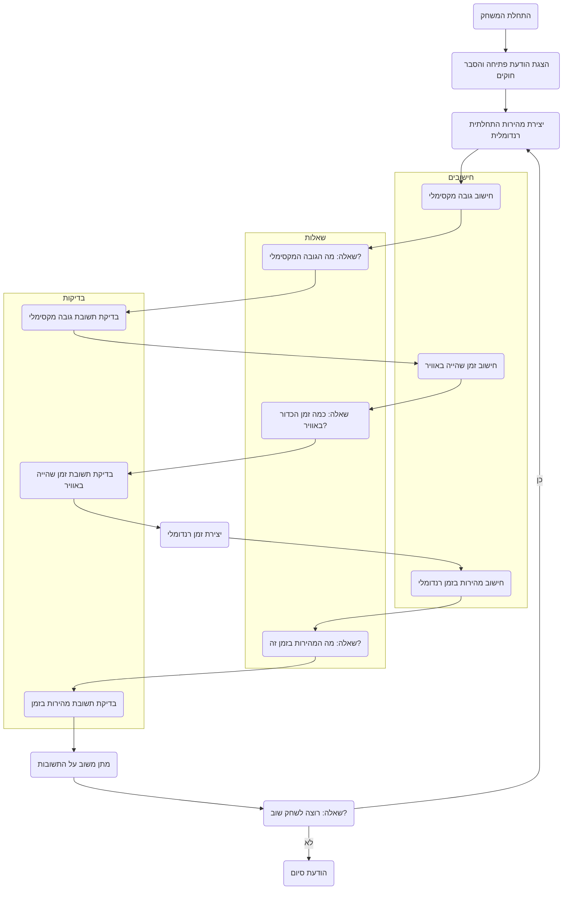

## <algorithm>

1. **התחלת המשחק:**
   - הצגת הודעת פתיחה למשתמש והסבר על חוקי המשחק.
   - יצירת מהירות התחלתית רנדומלית עבור הכדור, לדוגמה: 15 מ"ש.
   - דוגמה:
     ```
     הודעת פתיחה: "ברוכים הבאים למשחק KINEMA!"
     מהירות התחלתית: 15 מ"ש
     ```

2. **מחזור המשחק:**
   - **חישוב גובה מקסימלי:**
     - חישוב הגובה המקסימלי אליו יגיע הכדור באמצעות הנוסחה: `H = V^2 / (2 * g)`, כאשר `V` היא המהירות ההתחלתית ו-`g` הוא תאוצת הכובד (9.8 מ"ש^2).
     - דוגמה:
       - מהירות התחלתית (V): 15 מ"ש
       - תאוצת הכובד (g): 9.8 מ"ש^2
       - גובה מקסימלי (H): 15^2 / (2 * 9.8) = 11.48 מ'
     - קבלת תשובה מהמשתמש והשוואה לתשובה הנכונה.

   - **חישוב זמן שהייה באוויר:**
     - חישוב זמן השהייה באוויר באמצעות הנוסחה: `T = 2 * V / g`.
     - דוגמה:
       - מהירות התחלתית (V): 15 מ"ש
       - תאוצת הכובד (g): 9.8 מ"ש^2
       - זמן שהייה באוויר (T): 2 * 15 / 9.8 = 3.06 שניות.
     - קבלת תשובה מהמשתמש והשוואה לתשובה הנכונה.

   - **חישוב מהירות בזמן מסוים:**
     - יצירת זמן רנדומלי.
     - חישוב המהירות בזמן הרנדומלי באמצעות הנוסחה: `Vt = V - g * t`, כאשר `t` הוא הזמן הרנדומלי.
     - דוגמה:
       - מהירות התחלתית (V): 15 מ"ש
       - תאוצת הכובד (g): 9.8 מ"ש^2
       - זמן רנדומלי (t): 2 שניות
       - מהירות בזמן t (Vt): 15 - (9.8 * 2) = -4.6 מ"ש
     - קבלת תשובה מהמשתמש והשוואה לתשובה הנכונה.

   - **בדיקת תשובות:**
     - בדיקה אם תשובת המשתמש נמצאת בטווח של 15% מהתשובה הנכונה.
     - מתן משוב למשתמש על התשובה.
     - דוגמה:
       - תשובה נכונה: 11.48 מ'
       - תשובת משתמש: 12 מ'
       - משוב: "תשובה קרובה, אך לא מדויקת."

3. **סיום המשחק:**
   - שאלה אם המשתמש רוצה לשחק שוב.
   - אם כן, חזרה לשלב 2.
   - אם לא, הצגת הודעת סיום.
   - דוגמה:
     - משוב: "האם תרצה לשחק שוב? (כן/לא)"
     - אם המשתמש עונה "לא", מוצגת הודעה: "תודה על המשחק, להתראות!".

## <mermaid>


## <explanation>

**ייבואים (Imports):**

בתיאור הקוד לא מוזכרים ייבואים ספציפיים, אך נדרש להשתמש במודול `random` של פייתון לייצור מספרים רנדומליים (למהירות ההתחלתית ולזמן הרנדומלי).
- `random`: משמש ליצירת ערכים רנדומליים כגון מהירות התחלתית של הכדור וזמן לבדיקת מהירות.

**מחלקות (Classes):**
בתיאור הקוד לא מוזכרות מחלקות. המימוש יכול להיות מבוסס על פונקציות בלבד.

**פונקציות (Functions):**
- `init_game()`: פונקציה זו מאתחלת את המשחק, מציגה את ההודעות הראשוניות ומייצרת את המהירות ההתחלתית של הכדור.
    - פרמטרים: אין
    - ערך מוחזר: מהירות התחלתית רנדומלית.
    - מטרה: להתחיל את המשחק ולהכין את המשתנים הראשוניים.

- `calculate_max_height(initial_speed)`: פונקציה זו מחשבת את הגובה המקסימלי אליו יגיע הכדור.
    - פרמטרים: `initial_speed` (מהירות התחלתית).
    - ערך מוחזר: גובה מקסימלי.
    - מטרה: לחשב את הגובה המקסימלי שהכדור מגיע אליו.
    - דוגמה:
     ```python
     initial_speed = 15
     max_height = calculate_max_height(initial_speed) # max_height = 11.47959
     ```

- `calculate_air_time(initial_speed)`: פונקציה זו מחשבת את זמן השהייה באוויר של הכדור.
    - פרמטרים: `initial_speed` (מהירות התחלתית).
    - ערך מוחזר: זמן שהייה באוויר.
    - מטרה: לחשב את הזמן שהכדור נמצא באוויר.
      - דוגמה:
     ```python
     initial_speed = 15
     air_time = calculate_air_time(initial_speed) # air_time = 3.061224
     ```
- `calculate_speed_at_time(initial_speed, time)`: פונקציה זו מחשבת את מהירות הכדור בזמן מסוים.
    - פרמטרים: `initial_speed` (מהירות התחלתית), `time` (זמן רנדומלי).
    - ערך מוחזר: מהירות הכדור בזמן הנתון.
    - מטרה: לחשב את מהירות הכדור בזמן ספציפי.
      - דוגמה:
     ```python
        initial_speed = 15
        time = 2
        speed_at_time = calculate_speed_at_time(initial_speed, time) # speed_at_time = -4.6
    ```
- `check_answer(user_answer, correct_answer)`: פונקציה זו בודקת אם התשובה של המשתמש נמצאת בטווח של 15% מהתשובה הנכונה.
    - פרמטרים: `user_answer` (תשובת המשתמש), `correct_answer` (תשובה נכונה).
    - ערך מוחזר: `True` אם התשובה נכונה, אחרת `False`.
    - מטרה: לבדוק את דיוק התשובה של המשתמש.
       - דוגמה:
     ```python
       user_answer = 12
       correct_answer = 11.47959
       is_correct = check_answer(user_answer, correct_answer) # is_correct = True
    ```
- `play_again()`: פונקציה זו שואלת אם המשתמש רוצה לשחק שוב ומחזירה את תשובתו.
    - פרמטרים: אין
    - ערך מוחזר: "כן" או "לא".
    - מטרה: לאפשר למשתמש לשחק שוב.

**משתנים (Variables):**
- `initial_speed`: מהירות התחלתית של הכדור (מספר ממשי).
- `g`: תאוצת הכובד (9.8 מ/ש^2).
- `max_height`: הגובה המקסימלי שאליו יגיע הכדור (מספר ממשי).
- `air_time`: זמן השהייה באוויר של הכדור (מספר ממשי).
- `random_time`: זמן רנדומלי לבדיקת מהירות הכדור (מספר ממשי).
- `speed_at_time`: מהירות הכדור בזמן הנתון (מספר ממשי).
- `user_answer`: תשובת המשתמש (מספר ממשי).

**בעיות אפשריות ותחומים לשיפור:**
-   **קלט לא תקין:** לא מבוצעת בדיקה של קלט המשתמש. יש להוסיף בדיקה שווידאת שקלט המשתמש הוא מספר.
-   **הצגת תשובות:** יש להציג את התשובות הנכונות עם עיגול מתאים למספרים אחרי הנקודה.
-   **מערכת קושי:** כפי שהוצע בהערות בתיאור, ניתן להוסיף מערכת קושי שמשנה את הפרמטרים הפיזיקליים או מוסיפה מורכבות נוספת.
-   **ממשק משתמש:** ניתן לשפר את ממשק המשתמש (לדוגמא ממשק גרפי) כדי להפוך את המשחק ליותר מעניין.

**שרשרת קשרים:**
-   הקוד עצמו הוא עצמאי, ואין לו קשר לחלקים אחרים בפרויקט בשלב זה. עם זאת, ניתן להוסיף אותו למערכת משחקים גדולה יותר.

בסיכום, הקוד מיישם משחק חינוכי פשוט אך יעיל ללימוד מושגי קינמטיקה. עם זאת, יש מקום לשיפורים בתחום הקלט מהמשתמש, הארגון של הקוד והוספת פיצ'רים נוספים.