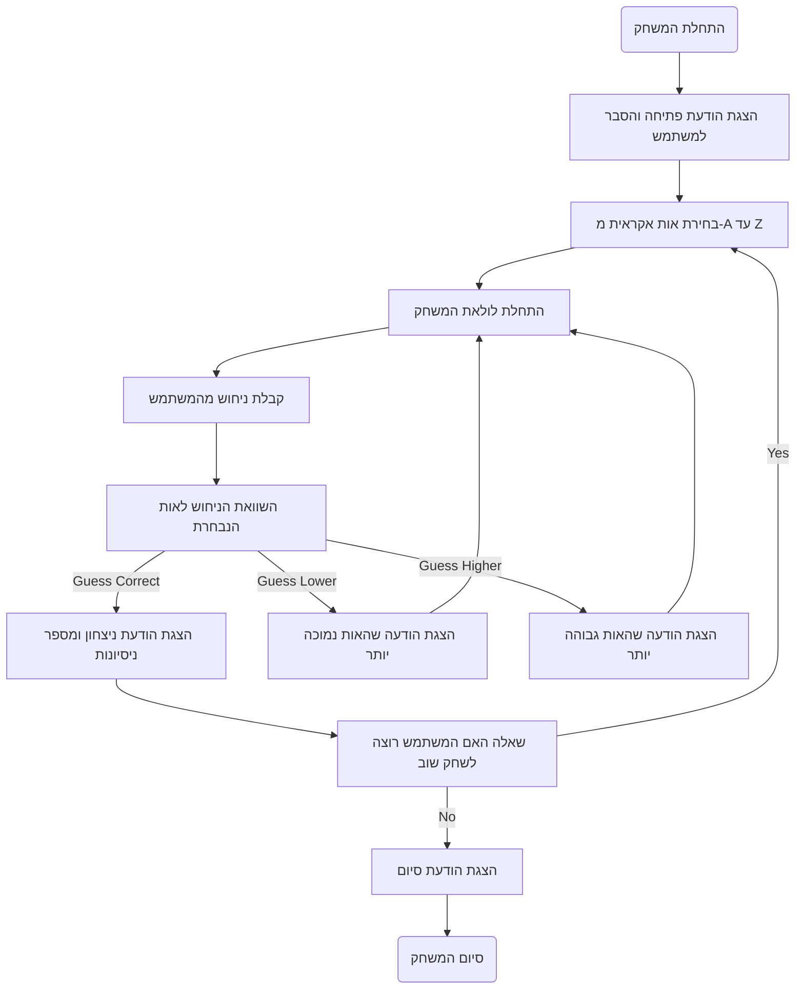

## ניתוח קוד המשחק "LETTER"

### 1. `<algorithm>`:

האלגוריתם של משחק "LETTER" מתואר בתרשים זרימה הבא:

1.  **התחלה**: המשחק מתחיל בהצגת הודעת פתיחה והסבר למשתמש.
    *   דוגמה: "ברוכים הבאים למשחק LETTER! אני חושב על אות מ-A עד Z."

2.  **בחירת אות רנדומלית**: המערכת בוחרת אות אקראית מתוך האותיות A עד Z.
    *   דוגמה: נבחרה האות 'Q'.

3.  **לולאת משחק**:
    *   **קלט משתמש**: המערכת מבקשת מהמשתמש להזין ניחוש.
        *   דוגמה: המשתמש מזין את האות 'M'.
    *   **בדיקת ניחוש**: המערכת משווה את הניחוש לאות הנבחרת.
        *   **אם הניחוש נכון**: המערכת מציגה הודעת ניצחון ומספר ניסיונות.
            *   דוגמה: "ברכות! ניחשת נכון את האות ב-3 נסיונות!".
            *   המשחק שואל אם המשתמש רוצה לשחק שוב.
        *   **אם הניחוש לא נכון**:
            *   **אם הניחוש נמוך מהאות הנבחרת**: המערכת מציגה הודעה שהאות גבוהה יותר.
                *   דוגמה: "האות הנבחרת גבוהה יותר."
            *   **אם הניחוש גבוה מהאות הנבחרת**: המערכת מציגה הודעה שהאות נמוכה יותר.
                *   דוגמה: "האות הנבחרת נמוכה יותר."
            *   המשחק חוזר לשלב **קלט משתמש**.
    *   **המשך משחק**: המשחק נמשך עד שהמשתמש מנחש את האות הנכונה.

4.  **סיום משחק**:
    *   **אם המשתמש רוצה לשחק שוב**: המשחק חוזר לשלב **בחירת אות רנדומלית**.
    *   **אם המשתמש לא רוצה לשחק שוב**: המשחק מסתיים בהודעת סיום.
        *   דוגמה: "תודה ששיחקתם! להתראות."

### 2. `<mermaid>`:

### 3. `<explanation>`:

**ייבואים (Imports):**

*   הקוד המוצג אינו כולל ייבוא מפורש, אך מצוין כי יידרש שימוש במודול `random` של Python לצורך בחירת אות רנדומלית.
    *   הקשר עם חבילות אחרות של `src.` אינו רלוונטי בקוד זה, כיוון שמדובר בתיאור של אלגוריתם, ולא בקוד ממשי.

**מחלקות (Classes):**

*   בתיאור הנוכחי של המשחק לא נעשה שימוש במחלקות.

**פונקציות (Functions):**

*   התיאור אינו כולל פונקציות ספציפיות, אך ניתן להסיק את הפונקציות הבאות:
    *   `start_game()`: פונקציה שמתחילה את המשחק, מציגה את הודעת הפתיחה ומייצרת אות רנדומלית.
    *   `get_user_guess()`: פונקציה שמבקשת מהמשתמש להזין ניחוש ומחזירה אותו.
    *   `compare_guess(guess, random_letter)`: פונקציה שמקבלת את הניחוש ואת האות הרנדומלית, משווה ביניהם ומחזירה הודעה בהתאם (ניחוש נכון, ניחוש גבוה, ניחוש נמוך).
    *   `play_again()`: פונקציה ששואלת את המשתמש האם הוא רוצה לשחק שוב ומחזירה תשובה בוליאנית.
    *   `end_game()`: פונקציה שמסיימת את המשחק ומציגה הודעת סיום.
    *   הפרמטרים של הפונקציות תלויים בהטמעה הספציפית של הפונקציה, אך באופן כללי הם כוללים את הקלט והפלט הנדרשים לצורך ביצוע המשימה שלהן.

**משתנים (Variables):**

*   `random_letter`: משתנה שמכיל את האות הרנדומלית שנבחרה על ידי המערכת (סוג: תו).
*   `guess`: משתנה שמכיל את הניחוש של המשתמש (סוג: תו).
*   `attempts`: משתנה שמכיל את מספר הניסיונות של המשתמש (סוג: מספר שלם).
*   `play_again_response`: משתנה שמכיל את התשובה של המשתמש לשאלה האם הוא רוצה לשחק שוב (סוג: מחרוזת).

**בעיות אפשריות או תחומים לשיפור:**

*   **בדיקת תקינות קלט**: הקוד צריך לכלול בדיקה של קלט המשתמש כדי לוודא שהוא מזין אות אחת בלבד, ושהיא בטווח של A-Z. אם הקלט לא תקין, יש להציג הודעת שגיאה ולבקש קלט מחדש.
*   **היסטוריית ניסיונות**: כדאי להציג למשתמש את היסטוריית הניסיונות שלו (האותיות שהוא ניחש והאם הן גבוהות או נמוכות) כדי לעזור לו לנחש טוב יותר.
*   **בחירת טווח אותיות**: ניתן לשפר את המשחק על ידי מתן אפשרות למשתמש לבחור את טווח האותיות (למשל, מ-A עד M או מ-N עד Z) כדי להגדיל את רמת הקושי.
*   **טבלת שיאים**: ניתן להוסיף טבלת שיאים שכוללת את שמות המשתמשים שהצליחו לנחש את האות במספר הניסיונות המינימלי.

**שרשרת קשרים עם חלקים אחרים בפרויקט:**

*   במקרה של פרויקט מורכב, משחק זה יכול להיות חלק ממודול של משחקי AI.
*   ניתן לאחד את המשחק עם חלקים אחרים בפרויקט, כמו מערכת ניהול משתמשים או מערכת ניקוד.

בנוסף, יש לשים לב שהקוד מתואר בשפה הרוסית. הניתוח לעיל מספק תרגום וניתוח של ההגיון הפנימי של הקוד.