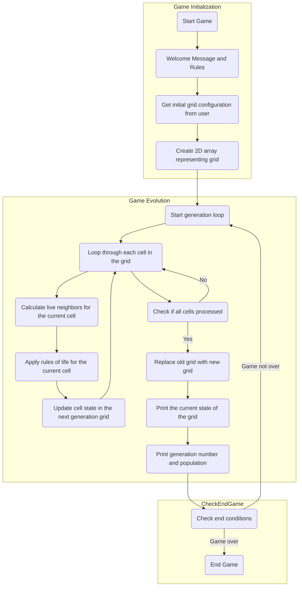

## ניתוח קוד: המשחק "חיים" (Game of Life)

### 1. <algorithm>

**תיאור תהליך העבודה של הקוד:**

1.  **אתחול המשחק:**
    *   הצגת הודעת פתיחה למשתמש והסבר על חוקי המשחק.
    *   קבלת קלט מהמשתמש: תצורה ראשונית של תאים על גבי רשת 24x70, באמצעות סימנים '.' (ריק) ו-'*' (חי).
    *   דוגמה לקלט:
        ```
        ..*...
        .***..
        ..*...
        ```
2.  **הכנת תצורה ראשונית:**
    *   קריאת השורות שהזין המשתמש ויצירת רשת דו-ממדית (לדוגמה, מערך דו-ממדי או רשימה של רשימות).
    *   כל שורה מפוצלת לתאים, כאשר '.' מייצג תא מת ו-'*' מייצג תא חי.
    *   מערך דו-ממדי לדוגמה (ייצוג פנימי):
        ```
        [['.', '.', '*', '.', '.', '.'],
         ['.', '*', '*', '*', '.', '.'],
         ['.', '.', '*', '.', '.', '.']]
        ```
3.  **אבולוציה של הדורות:**
    *   מעבר בלולאה על כל תא ברשת.
    *   חישוב מספר השכנים החיים עבור כל תא.
        *   לדוגמה, עבור התא במיקום `[1, 1]`, ישנם 3 שכנים חיים.
    *   החלת חוקי המשחק:
        *   **תא חי:**
            *   אם יש לו 2 או 3 שכנים חיים, הוא נשאר חי.
            *   אחרת, הוא מת (מתת-אכלוס או צפיפות).
        *   **תא מת:**
            *   אם יש לו בדיוק 3 שכנים חיים, הוא הופך לחי.
    *   דוגמה ליישום חוקים עבור התא במיקום `[1, 1]`:
        *   מספר השכנים החיים = 3, התא נשאר חי.
    *   יצירת דור חדש על סמך התוצאות.
    *   הדפסת הרשת החדשה וספירת מספר התאים החיים.
4.  **הצגת המצב:**
    *   הדפסת המצב הנוכחי של הרשת:
        *   תאים חיים יוצגו כ-*
        *   תאים מתים יוצגו כ-.
    *   הדפסת מספר הדור ומספר התאים החיים בדור הנוכחי.
        *   לדוגמה: `דור: 1, אוכלוסייה: 4`
5.  **סיום המשחק:**
    *   המשחק מסתיים כאשר:
        *   כל התאים מתים.
        *   המצב מתייצב (לא משתנה בין דורות).
        *   התצורה חוזרת על עצמה.
    *   המשתמש יכול לעצור את המשחק ידנית.

### 2. <mermaid>



**הסבר תלויות:**

אין תלויות מיובאות עבור התרשים הזה. התרשים מתאר את הזרימה של לוגיקת המשחק, לא תלויות בקוד.

### 3. <explanation>

**ייבואים (Imports):**

*   אין ייבוא ספציפי המתואר בקוד זה, כיוון שהוא מתמקד בלוגיקה של המשחק ולא בקוד בפועל.

**מחלקות (Classes):**

*   אין מחלקות ספציפיות המוצגות בקוד זה, כיוון שהקוד מתאר את הפונקציונליות ברמה גבוהה.

**פונקציות (Functions):**

*   **אתחול המשחק:**
    *   תפקיד: קבלת קלט ראשוני מהמשתמש והגדרת הרשת הראשונית.
    *   פרמטרים: אין.
    *   ערך מוחזר: מערך דו-ממדי המייצג את הרשת הראשונית.
    *   דוגמה:
        ```python
        def initialize_game():
            print("ברוכים הבאים למשחק החיים!")
            print("הזינו את התצורה הראשונית ('.' לתאים מתים, '*' לתאים חיים):")
            grid = []
            while True:
                try:
                    row = input()
                    grid.append(list(row))
                except EOFError:
                    break
            return grid
        ```
*   **אבולוציה של הדורות:**
    *   תפקיד: חישוב מצב הרשת בכל דור על סמך חוקי המשחק.
    *   פרמטרים: מערך דו-ממדי המייצג את הרשת הנוכחית.
    *   ערך מוחזר: מערך דו-ממדי המייצג את הרשת בדור הבא.
    *   דוגמה:
        ```python
        def evolve_generation(grid):
            rows = len(grid)
            cols = len(grid[0])
            new_grid = [['.' for _ in range(cols)] for _ in range(rows)]
            for i in range(rows):
                for j in range(cols):
                    live_neighbors = count_live_neighbors(grid, i, j)
                    if grid[i][j] == '*':
                        if live_neighbors == 2 or live_neighbors == 3:
                            new_grid[i][j] = '*'
                    elif live_neighbors == 3:
                        new_grid[i][j] = '*'
            return new_grid
        ```
*   **ספירת שכנים חיים:**
    *   תפקיד: ספירת מספר השכנים החיים לתא נתון.
    *   פרמטרים: מערך דו-ממדי, שורת התא, עמודת התא.
    *   ערך מוחזר: מספר השכנים החיים.
    *   דוגמה:
        ```python
        def count_live_neighbors(grid, row, col):
            rows = len(grid)
            cols = len(grid[0])
            count = 0
            for i in range(max(0, row - 1), min(rows, row + 2)):
                for j in range(max(0, col - 1), min(cols, col + 2)):
                    if i == row and j == col:
                        continue
                    if grid[i][j] == '*':
                        count += 1
            return count
        ```
*   **הצגת מצב הרשת:**
    *   תפקיד: הדפסת מצב הרשת הנוכחי, מספר הדור ומספר התאים החיים.
    *   פרמטרים: מערך דו-ממדי, מספר הדור, מספר התאים החיים.
    *   ערך מוחזר: אין.
    *   דוגמה:
        ```python
        def print_grid(grid, generation, population):
            print(f"דור: {generation}, אוכלוסייה: {population}")
            for row in grid:
                print("".join(row))
        ```

**משתנים (Variables):**

*   `grid`: מערך דו-ממדי המייצג את הרשת של המשחק (רשימה של רשימות).
*   `generation`: מספר הדור הנוכחי (מספר שלם).
*   `population`: מספר התאים החיים בדור הנוכחי (מספר שלם).
*   `rows`: מספר השורות ברשת (מספר שלם).
*   `cols`: מספר העמודות ברשת (מספר שלם).
*   `live_neighbors`: מספר השכנים החיים של תא (מספר שלם).

**בעיות אפשריות ותחומים לשיפור:**

*   **גודל הרשת קבוע:** המערכת מוגבלת לרשת של 24x70, ויש לשקול לאפשר למשתמש להגדיר את גודל הרשת.
*   **טיפול בקצה הרשת:** הקוד אינו תומך ברשת אינסופית, והתאים בקצוות עשויים להתנהג באופן שונה. יש לשקול פתרון לטיפול זה, לדוגמה, על ידי יצירת רשת "טורואידית" בה הקצוות מתחברים.
*   **קלט משתמש:** הקוד לא כולל בדיקת קלט תקין מהמשתמש. יש להוסיף בדיקות לוודא שהקלט מכיל רק נקודות וכוכביות, ושהשורות הן בגודל הנכון.
*   **יציאה מהלולאה:** כרגע, המשחק ממשיך כל עוד לא מתקיימים תנאי הסיום. יש לשקול להוסיף אפשרות עצירה ידנית על ידי המשתמש.
*   **ויזואליזציה:** הקוד מציג את הרשת באמצעות טקסט. יש לשקול שימוש בספריות גרפיות כדי להציג את הרשת בצורה ויזואלית יותר.

**שרשרת קשרים עם חלקים אחרים בפרויקט:**

*   **ממשק משתמש:** הקוד מתאר את לוגיקת המשחק עצמו, אך הוא צריך ממשק משתמש שיאפשר למשתמש להזין את הקלט הראשוני ולראות את ההתקדמות.
*   **אפשרויות קונפיגורציה:** יש לשקול להוסיף אפשרויות קונפיגורציה נוספות, לדוגמה, הגדרת תבניות התחלה.
*   **ספריות חיצוניות:** יש לשקול להשתמש בספריות חיצוניות לצורך ויזואליזציה או תמיכה בקלט משתמש.

הקוד מספק תיאור מפורט של המשחק "חיים", כולל התיאור הכללי, חוקי המשחק, הוראות יישום, דוגמאות, מגבלות ושיפורים אפשריים. התיאור מספק את הבסיס ליישום המשחק בצורה מובנית.