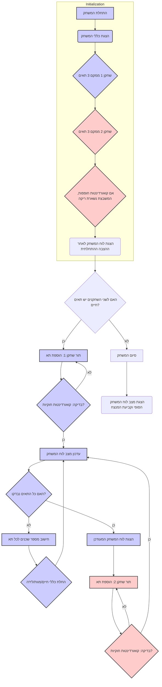

## ניתוח קוד: LIFE-2 (משחק החיים לשני שחקנים)

### <algorithm>
האלגוריתם מתאר את ההיגיון של משחק "LIFE-2", שהיא גרסה מותאמת לשני שחקנים של משחק החיים הקלאסי.

1.  **התחלת המשחק (Initialization):**
    -   הצגת הודעת פתיחה עם הסבר על המשחק וכלליו.
        *   דוגמה: "ברוכים הבאים ל-LIFE-2! שני שחקנים ימקמו תאים..."
    -   כל שחקן ממקם 3 תאים התחלתיים על ידי הזנת קואורדינטות.
        *   דוגמה: שחקן 1: (1,2), (2,3), (3,3). שחקן 2: (2,2), (3,2), (4,4).
    -   אם שני שחקנים מנסים למקם תא באותה משבצת, המשבצת נשארת ריקה.
    -   מצב לוח המשחק לאחר ההצבה ההתחלתית מוצג.

2.  **תהליך המשחק העיקרי (Main Game Loop):**
    -   **לולאה:** כל עוד לשני השחקנים יש תאים חיים, המשחק ממשיך.
    -   **הוספת תא:** כל שחקן מוסיף תא אחד בכל תור.
        *   דוגמה: שחקן 1 מזין (4,3).
        -   אם הקואורדינטות שהוזנו אינן חוקיות (למשל מחוץ ללוח המשחק או משבצת תפוסה), תתבקש הזנה מחדש.
    -   **עדכון לוח המשחק:** לאחר כל תור של שחקן:
        -   כל תא בלוח המשחק נבדק, כאשר לכל תא יש 8 שכנים.
        -   **חוקי חיים:**
            -   **הישרדות:** תא נשאר בחיים אם יש לו 2 או 3 שכנים.
                *   דוגמה: תא ב(2,2) עם 3 שכנים נשאר בחיים.
            -   **מוות:** תא מת אם יש לו פחות מ-2 שכנים או יותר מ-3 שכנים.
                *   דוגמה: תא ב(1,2) עם שכן אחד מת.
            -   **לידה:** אם תא ריק מוקף ב-3 שכנים, הוא הופך לתא חי.
                *   אם רוב השכנים הם משחקן 1, התא יהיה `*`.
                *   אם רוב השכנים הם משחקן 2, התא יהיה `#`.
                *   דוגמה: תא ריק ב(4,5) מוקף 3 שכנים משחקן 2 והופך ל`#`.
        -   לוח המשחק המעודכן מוצג למשתמש.

3.  **סיום המשחק (Game Over):**
    -   המשחק מסתיים כאשר לאחד השחקנים לא נשארו תאים חיים.
    -   תוצאת המשחק הסופית מוצגת, כולל מצב לוח המשחק הסופי והמנצח.
        *   דוגמה: "שחקן 2 השמיד את כל התאים של שחקן 1! המנצח: שחקן 2!"

4.  **שרשרת הנתונים:**
    -   קלט מהמשתמש (קואורדינטות של תאים) -> עדכון מצב לוח המשחק -> בדיקת תנאי חיים/מוות/לידה של תאים -> עדכון לוח המשחק -> פלט למשתמש (לוח משחק מעודכן)

### <mermaid>

**ניתוח תלויות:**

*   אין תלויות מיובאות. האלגוריתם מתאר את ההיגיון של המשחק עצמו ואינו משתמש בספריות חיצוניות.

### <explanation>

**ייבואים (Imports):**

*   אין ייבוא. מכיוון שהתיאור הוא אלגוריתם, אין כאן שימוש בייבוא של ספריות חיצוניות.

**מחלקות (Classes):**

*   אין מחלקות. התיאור הנוכחי מתמקד באלגוריתם ובזרימת הנתונים ואינו דורש שימוש במחלקות.

**פונקציות (Functions):**

*   אין הגדרה מפורשת של פונקציות, אבל ניתן לזהות פעולות שניתן להפוך לפונקציות.
    *   **`InitializeGame()`:** תפקידה להציג את כללי המשחק, לאפשר לשחקנים למקם את התאים ההתחלתיים שלהם ולהציג את לוח המשחק הראשוני.
    *   **`PlayerTurn(player)`:** לוקחת כקלט את השחקן הנוכחי, מאפשרת לו להזין קואורדינטות של תא, בודקת שהן חוקיות ומבצעת את עדכון התא במידה וניתן.
    *   **`UpdateBoard()`:** מעדכנת את לוח המשחק בהתאם לחוקי החיים, המוות והלידה. הפונקציה צריכה לעבור על כל תא, לחשב את מספר השכנים שלו ולעדכן את התא בהתאם.
    *   **`CheckWinCondition()`:** בודקת האם אחד השחקנים איבד את כל התאים שלו.
    *   **`DisplayBoard()`:** מציגה את לוח המשחק למשתמש.

**משתנים (Variables):**

*   **`board`**: מערך או רשימה דו-מימדית המייצגת את לוח המשחק. הערכים יכולים להיות:
    *   `'.'`: תא ריק.
    *   `'*'`: תא של שחקן 1.
    *   `'#'`: תא של שחקן 2.
*   **`currentPlayer`**: מציין את תורו של איזה שחקן כרגע (`1` או `2`).
*   **`player1_cells`**: סופר את מספר התאים שנותרו לשחקן 1.
*   **`player2_cells`**: סופר את מספר התאים שנותרו לשחקן 2.
*   **`rows`, `cols`**: משתנים המייצגים את מספר השורות והעמודות של הלוח (במקרה זה 5).
*   **`row`, `col`**: משתנים שמייצגים את הקואורדינטות (שורה ועמודה) של התא ששחקן בוחר.

**הסברים מפורטים:**

*   **ייבואים:** מכיוון שאין שימוש בספריות חיצוניות, אין ייבוא מיוחד. אם רוצים ליישם את המשחק בפועל, יהיה צורך ביבוא ספריות מתאימות כמו `pygame` אם מעוניינים בממשק גרפי.
*   **מחלקות:** אין שימוש במחלקות, אך ניתן היה להוסיף מחלקות כמו `Game`, `Player` או `Cell` לטובת ארגון טוב יותר של הקוד.
*   **פונקציות:** הפונקציות שהוזכרו מהוות חלק מהותי במימוש של המשחק, ומאפשרות לבצע פעולות מוגדרות היטב בצורה מודולרית וקלה לקריאה.
*   **משתנים:** המשתנים מהווים את מצב המשחק ומשמשים לאחסון מידע ולקבלת החלטות במהלך המשחק.

**בעיות אפשריות ותחומים לשיפור:**

1.  **קוד גמיש:** הקוד הנוכחי מגביל את הלוח ל-5x5. עדיף לאפשר ללוח להיות בגדלים שונים.
2.  **אימות קלט:** יש לשפר את אימות הקלט כדי למנוע שגיאות. צריך לוודא שהקואורדינטות שהוזנו הן מספרים שלמים ובטווח הנכון.
3.  **ממשק משתמש:** כרגע, המשחק פועל דרך שורת הפקודה. הוספה של ממשק גרפי תהפוך אותו למשחק מהנה יותר.
4.  **בינה מלאכותית:** ניתן להוסיף שחקן מחשב בסיסי כדי לשפר את החוויה.
5.  **ארגון קוד:** הקוד צריך להיות מחולק לפונקציות ו/או מחלקות לטובת ארגון וקריאות.
6.  **תגובה לשגיאות:** יש לטפל במצבים בהם המשתמש מכניס קלט לא חוקי (למשל, לא מספר או מספר מחוץ לטווח) בצורה טובה יותר, למשל ע"י מתן הודעת שגיאה ברורה ובקשה לקלט חוזר.

**שרשרת קשרים עם חלקים אחרים בפרויקט:**

*   **`gs` (הגדרות גלובליות):** כרגע אין שימוש בהגדרות גלובליות (אין `import header`), אבל אם היה, ניתן היה להשתמש בהגדרות אלו כדי לקבוע גודל הלוח, סמלים של שחקנים, וכדומה.

**סיכום:**

הניתוח הזה מציע הבנה מעמיקה של אלגוריתם משחק "LIFE-2", כולל תרשים זרימה מפורט והסברים על כל רכיב. כמו כן, הוצגו נקודות אפשריות לשיפור וקשרים עם חלקי פרויקט פוטנציאליים.