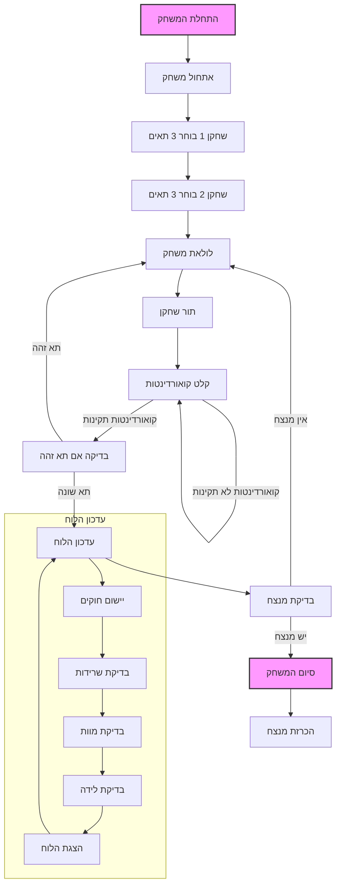

## <algorithm>
הקוד מתאר את כללי המשחק "חיים 2" (LIFE-2), גרסה מותאמת אישית של משחק החיים הקלאסי עבור שני שחקנים. המשחק מתנהל על לוח 5x5, כאשר כל שחקן מסומן בתו שונה: `*` לשחקן הראשון ו-`#` לשחקן השני. מטרת המשחק היא לחסל את כל תאי החיים של היריב באמצעות כללי משחק החיים.

1. **אתחול המשחק**:
    - הצגת הודעת פתיחה והסבר על חוקי המשחק.
        - לדוגמה: "ברוכים הבאים ל-LIFE-2! מטרת המשחק היא לחסל את תאי היריב."
    - כל שחקן בוחר 3 תאי התחלה על ידי הזנת קואורדינטות.
       - לדוגמה, שחקן 1 בוחר את הקואורדינטות (1,2), (2,3), (3,3), ושחקן 2 בוחר את הקואורדינטות (2,2), (3,2), (4,4).

2. **תהליך המשחק**:
    - **מיקום תאים**:
        - כל שחקן בתורו מוסיף תא אחד למשחק על ידי הזנת קואורדינטות.
          - לדוגמה, שחקן 1 בוחר את הקואורדינטות (4,3).
        - אם קואורדינטות לא חוקיות מוזנות (מחוץ ללוח או תא תפוס), המערכת מבקשת להזין קואורדינטות מחדש.
        - אם שני השחקנים בוחרים את אותו תא, התא נשאר ריק.
    - **עדכון הלוח**:
        - לאחר כל מהלך, הלוח מתעדכן לפי חוקי משחק החיים:
            - תא שורד: תא נשאר בחיים אם יש לו 2 או 3 שכנים חיים.
            - תא מת: תא מת אם יש לו פחות מ-2 או יותר מ-3 שכנים חיים.
            - תא נולד: תא ריק הופך לתא חי אם יש לו בדיוק 3 שכנים חיים. סוג התא הנולד ( `*` או `#` ) נקבע לפי הרוב של שכנים.
    - **מהלכי משחק**: השחקנים ממשיכים להוסיף תאים בתורות.

3. **סיום המשחק**:
    - המשחק מסתיים כאשר לאחד השחקנים אין יותר תאים חיים על הלוח.
    - המערכת מכריזה על המנצח.

## <mermaid>

**ניתוח התלויות ב-mermaid**:
- **flowchart TD**: הכרזה על תרשים זרימה מלמעלה למטה.
- **Start, Init, Player1_Init, Player2_Init, GameLoop, PlayerTurn, InputCoord, CheckSameCell, UpdateBoard, CheckWinner, End, DeclareWinner**: שמות הצמתים בתרשים. כל אחד מייצג שלב או פעולה בתהליך המשחק. שמות אלו משקפים את הפונקציונליות של כל שלב, כגון `InputCoord` לקבלת קלט קואורדינטות מהשחקן, או `UpdateBoard` לעדכון הלוח בהתאם לחוקי המשחק.
- **CheckSameCell -- תא זהה --> GameLoop**: קו המייצג זרימת נתונים בין פעולות. במקרה הזה, אם השחקנים בוחרים את אותו תא, התהליך חוזר לתחילת הלולאה.
- **subgraph "עדכון הלוח"**: הגדרה של תת-גרף, המאפשר ליצור מבנה היררכי בתרשים.
- **style Start fill:#f9f,stroke:#333,stroke-width:2px**: קביעת סגנון לצומת.

## <explanation>

**ייבואים (Imports)**:
- אין ייבוא מפורש בקוד הזה, מכיוון שזה תיאור מילולי של משחק ולא קוד פייתון. עם זאת, אם הקוד היה מיושם בפועל, הוא עשוי לייבא ספריות כמו `random` ליצירת מהלכים אוטומטיים של מחשב, או ספריות גרפיות כמו `pygame` אם רוצים ליצור ממשק משתמש גרפי.

**מחלקות (Classes)**:
- אין שימוש במחלקות בתיאור זה, אך במימוש קוד פייתון, ייתכן שיהיה שימוש במחלקה כדי לייצג את הלוח, שחקנים, או כללי משחק, לניהול מצב המשחק.

**פונקציות (Functions)**:
- אין הגדרה של פונקציות ספציפיות, אבל באופן כללי, פונקציות ישמשו למטרות הבאות:
    - `initialize_game()`: לאתחול משחק חדש, הגדרת לוח משחק ריק והודעות פתיחה.
    - `place_cell(player, row, col)`: למקם תא של שחקן במיקום נתון, תוך בדיקה אם הקואורדינטות תקינות.
    - `update_board()`: עדכון הלוח בהתאם לחוקי משחק החיים, חישוב מצב התאים לאחר כל מהלך.
    - `check_winner()`: לבדוק אם אחד השחקנים ניצח על ידי בדיקה אם נותרו תאים מהשחקן השני.
    - `display_board()`: להציג את לוח המשחק לאחר כל מהלך.

**משתנים (Variables)**:
- `board`: רשימה דו-ממדית או מערך שייצג את לוח המשחק.
- `players`: משתנה שיחזיק מידע על השחקנים (למשל, סימן שחקן, שם).
- `current_player`: משתנה שיצביע על השחקן בתורו.
- `rows`, `cols`: משתנים שיחזיקו את מימדי הלוח.
- `cell_status`: משתנה שיחזיק מידע לגבי מצב התאים (`*`, `#`, `.`)
- `coordinates`: משתנה שיחזיק קואורדינטות של תא.

**בעיות אפשריות או תחומים לשיפור**:
- **קלט לא תקין**: יש צורך בטיפול בטעויות בזמן קלט קואורדינטות, כמו הכנסת אותיות במקום מספרים או קואורדינטות מחוץ לטווח הלוח.
- **קוד לא ברור**: ניתן לפצל את הלוגיקה לפונקציות קטנות יותר וברורות יותר, מה שיקל על תחזוקת הקוד.
- **ממשק משתמש**: ניתן להוסיף ממשק משתמש גרפי כדי להפוך את המשחק ליותר ידידותי למשתמש.
- **בינה מלאכותית**: ניתן להוסיף מצב משחק נגד מחשב.
- **הגדרת גודל הלוח**: כרגע הלוח הוא בגודל קבוע (5x5). ניתן לאפשר לשחקנים לבחור גודל לוח שונה.

**שרשרת קשרים עם חלקים אחרים בפרויקט**:
- אם המשחק היה ממומש בפייתון, הוא יכול להיות חלק מפרויקט גדול יותר, כמו אוסף של משחקי מחשב קטנים. הקוד יכול לכלול יצירת לוגיקה משותפת בין משחקים שונים (ניהול מצב, תצוגה, קלט) ולכן תידרש ארכיטקטורה מתאימה.