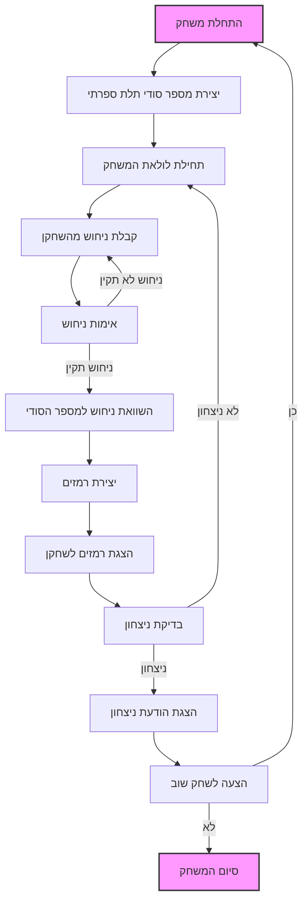

## <algorithm>

1. **התחלת משחק:**
   - המחשב מייצר מספר תלת ספרתי רנדומלי ללא ספרות חוזרות.
     - דוגמה: `394`
2. **לולאת משחק ראשית:**
   - **תור השחקן:**
     1. בקשת קלט מהשחקן להזנת מספר תלת ספרתי.
     2. בדיקת תקינות הקלט:
        - הקלט חייב להיות בן שלוש ספרות.
        - הספרות לא יכולות לחזור על עצמן.
     3. השוואת המספר של השחקן עם המספר הסודי.
   - **מתן רמזים:**
     - עבור כל ספרה במספר של השחקן:
       - אם הספרה תואמת בערך ובמיקום: הוסף "Fermi".
       - אם הספרה תואמת רק בערך: הוסף "Pico".
       - אם הספרה לא תואמת: אל תוסיף דבר.
     - אם לא נוספו רמזים, החזר "Bagels".
   - הצגת הרמזים לשחקן.
3. **בדיקת ניצחון:**
   - אם המספר של השחקן תואם למספר הסודי:
     - הצגת הודעת ניצחון וציון מספר הניסיונות.
     - דוגמה: "ברכות! ניחשת את המספר 394 ב-2 ניסיונות!"
   - אם המספר לא נוחש, המשך במשחק.
4. **סיום משחק:**
   - לאחר ניחוש נכון או חריגה ממגבלת ניסיונות (למשל 20), הצע התחלת משחק חדש.
     - דוגמה: "האם תרצה לשחק שוב? (כן/לא)"

## <mermaid>

## <explanation>

**ייבואים (Imports):**
   אין ייבוא בסקריפט הזה. זה תיאור של משחק ולא קוד בפועל. אם היה קוד, ייבוא היה משמש לייבא פונקציות או מחלקות אחרות.

**מחלקות (Classes):**
   אין מחלקות בסקריפט הזה. אם היה קוד, מחלקות היו משמשות לארגון נתונים ופונקציונליות קשורה.

**פונקציות (Functions):**
   אין פונקציות בסקריפט הזה, זה תיאור של משחק ולא קוד בפועל.
    - אם היה קוד, היו מספר פונקציות כמו:
      - `generate_secret_number()`: מייצרת מספר תלת ספרתי סודי.
      - `get_player_guess()`: מקבלת ניחוש מהשחקן.
      - `validate_guess(guess)`: בודקת תקינות הניחוש.
      - `compare_guess(secret, guess)`: משווה ניחוש למספר הסודי ויוצרת רמזים.
      - `display_clues(clues)`: מציגה את הרמזים לשחקן.
      - `check_win(secret, guess)`: בודקת אם השחקן ניצח.
      - `play_again()`: שואלת את השחקן אם לשחק שוב.

**משתנים (Variables):**
   בסקריפט זה אין משתנים גלובליים, אבל בדוגמת הקוד המלא יכללו משתנים כמו:
    - `secret_number` (int): המספר הסודי שנוצר על ידי המחשב.
    - `player_guess` (int): הניחוש של השחקן.
    - `clues` (str): הרמזים שהמחשב נותן לשחקן ("Fermi", "Pico", "Bagels").
    - `attempts` (int): מספר הניסיונות שהשחקן ביצע.
    - `max_attempts` (int): מספר הניסיונות המקסימלי המותר.

**בעיות אפשריות או תחומים לשיפור:**
   - **טיפול בקלט שגוי:** כרגע מוגדר שקלט שגוי יוביל לבקשת קלט חוזרת, אך אין טיפול מפורט בסוגי השגיאות השונים.
   - **מצב "הדרכה":** ניתן להוסיף אפשרות לראות את המספר הסודי בסוף כל משחק.
   - **רמות קושי:** ניתן ליישם רמות קושי שונות המשנות את מהירות הצגת הרמזים.
   - **מגבלת ניסיונות:** מומלץ להגדיר את מגבלת הניסיונות המקסימלית בצורה ברורה ולקשר אותה לשיטת הסיום של המשחק.
   - **חזרות בספרות:** יש לוודא שהמספר הסודי אינו כולל חזרות של ספרות.

**שרשרת קשרים עם חלקים אחרים בפרויקט:**
   אם המשחק היה חלק מפרויקט גדול יותר, ניתן היה לקשר אותו עם:
   - **ממשק משתמש:** לטיפול בקלט ופלט ויזואלי.
   - **מערכת ניהול משחקים:** לניהול מספר משחקים, שיאים, ועוד.
   - **מודול הגדרות:** לניהול הגדרות משחק כמו קושי ומספר ניסיונות.

הסקריפט הנוכחי הוא בעיקר תיאורי. לצורך מימוש מלא, נדרש קוד בשפת תכנות כמו פייתון, תוך שימוש בכל ההסברים שפורטו כאן.