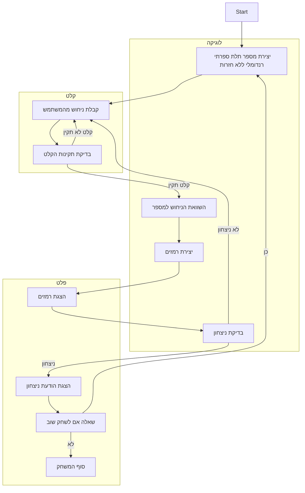

## <algorithm>

1.  **התחלת המשחק:**
    *   המחשב בוחר מספר תלת ספרתי רנדומלי ללא ספרות חוזרות.
        *   לדוגמה: 394
2.  **לולאת משחק:**
    *   **קבלת ניחוש מהמשתמש:**
        1.  קבלת קלט מהמשתמש - מספר תלת ספרתי.
            *   לדוגמה: 123
        2.  בדיקת תקינות הקלט:
            *   בדיקה שהקלט הוא מספר תלת ספרתי.
            *   בדיקה שאין ספרות חוזרות.
        3.  אם הקלט אינו תקין, בקש קלט חדש מהמשתמש.
    *   **השוואה למספר המחשב והפקת רמזים:**
        1.  עבור כל ספרה בניחוש של המשתמש:
            *   אם הספרה זהה לזו שבמספר המחשב גם בערך וגם במיקום, הוסף את הרמז "Fermi".
            *   אם הספרה זהה לזו שבמספר המחשב רק בערך, הוסף את הרמז "Pico".
        2.  אם לא נוספו רמזים, הוסף את הרמז "Bagels".
        3. הצגת הרמזים למשתמש.
        *   לדוגמה:
            *   קלט: 123, מספר המחשב: 394, פלט: Pico
            *   קלט: 394, מספר המחשב: 394, פלט: Fermi Fermi Fermi
            *   קלט: 678, מספר המחשב: 394, פלט: Bagels
3.  **בדיקת ניצחון:**
    *   אם הניחוש של המשתמש זהה למספר המחשב:
        *   הצגת הודעת ניצחון עם מספר הניסיונות.
            *   לדוגמה: "ברכות! ניחשת את המספר 394 ב-2 ניסיונות!"
    *   אחרת, המשך את המשחק.
4.  **סיום המשחק:**
    *   אם המשתמש ניחש את המספר או אם מספר הניסיונות עבר את המקסימום המותר:
        *   שאל את המשתמש האם לשחק שוב.
            *   לדוגמה: "האם תרצה לשחק שוב? (כן/לא)"
        *   אם כן, התחל משחק חדש.
        *   אם לא, סיים את המשחק.

## <mermaid>

## <explanation>

**ייבואים (Imports):**
לא קיימים ייבואים בקוד זה מכיוון שמדובר בתיאור מילולי של משחק ולא בקוד ממשי. אם היינו מממשים את הקוד בפועל, סביר להניח שהיינו מייבאים ספריות כמו `random` ליצירת מספרים רנדומליים.

**מחלקות (Classes):**
אין מחלקות בקוד זה. אם היינו מממשים את המשחק, ייתכן שהיינו יוצרים מחלקה בשם `Game` שתאחסן את הלוגיקה של המשחק, או מחלקה בשם `Player` לייצוג השחקן.

**פונקציות (Functions):**
אין פונקציות בקוד זה. אם היינו מממשים את המשחק, היינו יוצרים פונקציות כמו:

*   `generate_secret_number()`: יוצרת מספר רנדומלי תלת ספרתי ללא ספרות חוזרות.
*   `get_player_guess()`: מקבלת ניחוש מהמשתמש ובודקת את תקינותו.
*   `compare_numbers(secret_number, guess)`: משווה את הניחוש למספר הסודי ומחזירה רמזים.
*   `check_win(secret_number, guess)`: בודקת אם המשתמש ניצח.
*   `play_game()`: מנהלת את כל מהלך המשחק.

**משתנים (Variables):**
אין משתנים מוצהרים בקוד זה. אם היינו מממשים את הקוד, היו משתנים כמו:
*   `secret_number`: המספר הסודי שהמחשב יצר (מסוג מחרוזת או רשימה של ספרות).
*   `guess`: הניחוש של המשתמש (מסוג מחרוזת או רשימה של ספרות).
*   `hints`: הרמזים שנוצרו עבור הניחוש (מסוג מחרוזת).
*   `attempts`: מספר הניסיונות של השחקן (מסוג מספר שלם).

**הסברים מפורטים:**
הקוד מספק תיאור מפורט של משחק "באגלס" (Bagles). המשחק מורכב משלבים מוגדרים היטב: אתחול, קבלת קלט מהמשתמש, יצירת רמזים, בדיקת ניצחון וסיום המשחק.

**בעיות אפשריות או תחומים לשיפור:**

*   **טיפול בשגיאות:** הקוד מציין כי השחקן צריך להזין קלט תקין, אך אין פירוט לגבי אופן הטיפול בשגיאות (למשל, אם הקלט אינו מספר, או אם יש ספרות חוזרות).
*   **פונקציונליות נוספת:** הקוד מציע תכונות נוספות כמו מצב למידה ודרגות קושי, אך אינו מפרט את יישומן.
*   **חוסר במימוש קונקרטי:** הקוד אינו מספק מימוש קונקרטי בשפת תכנות, לכן הוא אינו ניתן להרצה או לבדיקה.

**שרשרת קשרים עם חלקים אחרים בפרויקט:**
הקוד הנוכחי עומד בפני עצמו ואינו קשור ישירות לחלקים אחרים בפרויקט. עם זאת, אם הקוד היה מיושם בפרויקט גדול יותר, הוא היה יכול להיות חלק ממערכת של משחקי AI, כאשר כל משחק ממומש כמחלקה נפרדת.
בנוסף, אפשר לחבר אותו למערכת ניהול משתמשים ששומרת היסטוריית משחקים וסטטיסטיקות.