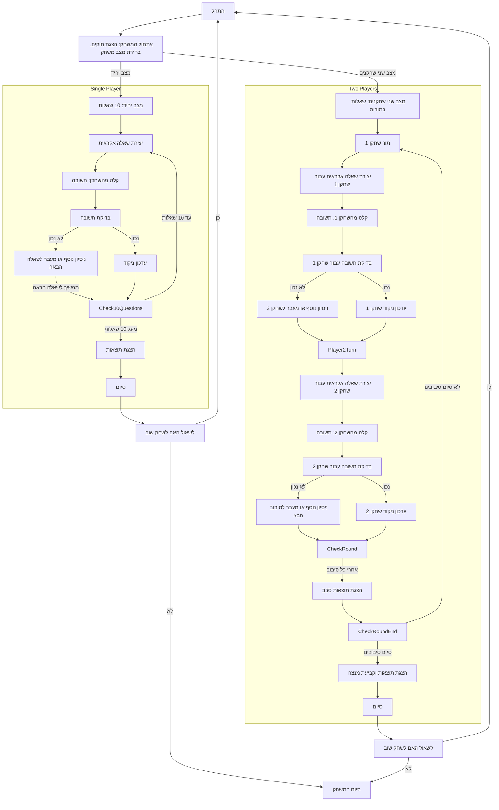

## <algorithm>

האלגוריתם של המשחק LITQZ מתואר בפירוט בשלבים הבאים:

1. **אתחול המשחק:**
   - המשחק מציג הודעת פתיחה ושם המשחק.
   - המשחק מסביר את חוקי המשחק לשחקן.
   - השחקן בוחר בין מצב יחיד לשני שחקנים.
     - **דוגמה:**
       ```
       Welcome to LITQZ!
       You will be asked intellectual questions.
       Your task is to answer correctly in the fewest attempts.
       You can play alone or compete with another player. Good luck!
       Choose a game mode: 1 - Single Player, 2 - Two Players
       ```

2. **תהליך המשחק העיקרי:**
   - המשחק מייצר שאלות באופן אקראי מתוך קטגוריות קבועות (לוגיקה, מתמטיקה, ידע כללי).
     - **דוגמאות:**
       - כמה זה 5 + 7?
       - מה כבד יותר, ק"ג ברזל או ק"ג נוצה?
       - מהי בירת צרפת?
   - השחקן מזין תשובה לשאלה.
   - המשחק בודק את התשובה:
     - אם התשובה נכונה: המשחק מעדכן את הניקוד ומציג הודעה שהתשובה נכונה.
     - אם התשובה שגויה: המשחק נותן הזדמנות נוספת או מעביר לשאלה הבאה.
   - ניקוד וניסיונות:
     - כל ניסיון שגוי מוריד מהניקוד לשאלה.
     - השחקן יכול לדלג על השאלה, אך יאבד את כל הנקודות לשאלה זו.
     - **דוגמה:**
       - שאלה: "כמה זה 8 כפול 6?"
       - שחקן מזין: "48"
       - הודעה: "תשובה נכונה! קיבלת 10 נקודות."

3. **מצבי משחק:**
   - **מצב יחיד:**
     - השחקן עונה על 10 שאלות.
     - בסוף המשחק, המשחק מציג את הניקוד הסופי של השחקן.
   - **מצב שני שחקנים:**
     - השחקנים עונים על שאלות בתורות.
     - אחרי כל סבב, המשחק מציג את הניקוד של שני השחקנים.
     - **דוגמה:**
       - מצב שני שחקנים:
          - שחקן 1: "כמה זה 8 כפול 6?" - מזין "48" - נכון, מקבל 10 נקודות
          - שחקן 2: "מהי בירת יפן?" - מזין "טוקיו" - נכון, מקבל 10 נקודות
          - ניקוד לאחר הסיבוב: שחקן 1: 10, שחקן 2: 10

4. **סיום המשחק:**
   - המשחק מציג את התוצאות.
   - מכריז על המנצח (במצב שני שחקנים).
   - המשחק שואל אם השחקן רוצה לשחק שוב.
     - אם כן - המשחק מתחיל מחדש.
     - אם לא - המשחק נגמר.
     - **דוגמה:**
       ```
       Game over! Your results:
       Player 1: 85 points
       Player 2: 72 points
       Winner: Player 1!
       Play again? (yes/no):
       ```

## <mermaid>



### ניתוח תלויות מיובאות (אין):
במקרה הזה, אין תלויות מיובאות מכיוון שהקוד הוא תיאור של המשחק ולא קוד מימוש בפועל. עם זאת, תיאור המשחק משתמש ברעיונות כמו מחלקות, פונקציות, משתנים, אקראיות ואינטראקציה עם המשתמש, אבל הם לא מומשו בצורה של קוד עם ייבוא.

## <explanation>

**ייבואים (Imports):**

אין ייבוא בפועל בקוד הזה, מפני שזה רק תיאור מילולי של משחק, ולא קוד מימוש. אם המשחק היה ממומש בקוד פייתון, היו צריכים להיות ייבואים כמו `random` ליצירת שאלות אקראיות.

**מחלקות (Classes):**

אין מחלקות מוגדרות בטקסט הזה. מחלקות היו יכולות לשמש לייצוג של שחקנים, שאלות, או מצבי המשחק אם זה היה קוד.

**פונקציות (Functions):**

אין פונקציות מוגדרות בטקסט, אך ניתן להסיק את הפונקציות שהיו נחוצות אם זה היה קוד:
   - `init_game()`: לאתחול המשחק והצגת ההוראות.
   - `generate_question()`: לייצר שאלה אקראית מתוך קטגוריות שונות.
   - `get_player_answer()`: לקבל את תשובת השחקן.
   - `check_answer()`: לבדוק את נכונות התשובה ולעדכן ניקוד.
   - `single_player_mode()`: לנהל את המשחק במצב יחיד.
   - `two_player_mode()`: לנהל את המשחק במצב שני שחקנים.
   - `display_results()`: להציג את התוצאות הסופיות.

**משתנים (Variables):**

   - `game_mode`: משתנה שמכיל את מצב המשחק (יחיד/שני שחקנים).
   - `questions`: רשימה או מילון המכילים שאלות ותשובות.
   - `current_question`: השאלה הנוכחית המוצגת לשחקן.
   - `player_score`: משתנה שמכיל את הניקוד של השחקן (או השחקנים במצב שני שחקנים).
   - `attempts`: מספר הניסיונות ששחקן ביצע לשאלה הנוכחית.
   - `num_questions`: מספר השאלות במשחק במצב יחיד.
   - `current_round`: מספר הסיבוב הנוכחי במשחק עם שני שחקנים.

**בעיות אפשריות או תחומים לשיפור:**

   - **קלט לא תקין:** המשחק לא מספק טיפול לקלט לא תקין (לדוגמה, אותיות במקום מספרים).
   - **מגוון שאלות:** רשימת השאלות היא סטטית ומוגבלת, והמשחק יכול להפוך משעמם לאחר זמן.
   - **מערכת ניקוד פשוטה:** מערכת הניקוד מאוד פשוטה וניתן לשפר אותה על ידי הוספת גורמי קושי שונים.
   - **קשיים:** המשחק אינו מציע רמות קושי שונות, וזה יכול להיות בעייתי עבור שחקנים ברמות שונות.
   - **ממשק משתמש:** התוצאות מודפסות לקונסול, וזה לא ממשק משתמש נוח.

**שרשרת קשרים עם חלקים אחרים בפרויקט:**
במידה והקוד היה חלק מתוכנה גדולה יותר, ניתן היה לדמיין את הקשרים הבאים:
 - קשר למודול של שאלות, היכן ששאלות מוגדרות ומאוחסנות.
 - קשר למודול של שחקנים, שמנהל את נתוני השחקנים, כגון שמות וניקוד.
 - קשר למודול של ממשק משתמש, שמציג את המשחק בצורה ויזואלית.
 - קשר למודול של ניהול משחקים, שמנהל את זרימת המשחק, מצבים, ומשתנים גלובאליים.

בסופו של דבר, התיאור של המשחק הוא בסיסי, אבל הוא מספק מסגרת טובה למימוש המשחק באמצעות קוד.