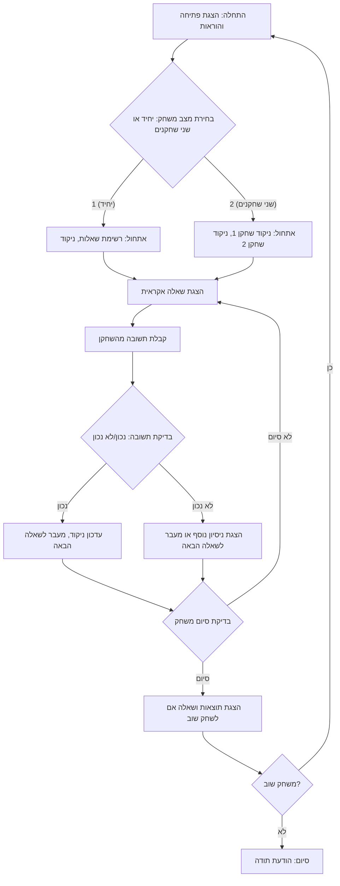

## הוראה:

נתח את הקוד שסופק בפירוט והסבר את הפונקציונליות שלו. התשובה צריכה לכלול שלושה חלקים:

1.  **<algorithm>**:
    תאר את תהליך העבודה של הקוד בתרשים זרימה צעד-אחר-צעד.
    *   הוסף דוגמאות לכל בלוק לוגי.
    *   הצג את הזרימה של נתונים בין פונקציות, מחלקות או שיטות.

2.  **<mermaid>**:
    כתוב את קוד התרשים בפורמט `mermaid`.
    *   נתח והסבר את כל התלויות המיובאות ביצירת התרשים.
    **חשוב!**: ודא שכל שמות המשתנים בתרשים `mermaid` הם בעלי משמעות ותיאור. שמות כמו `A`, `B`, `C` אסורים!

    **בנוסף**:
    אם הקוד כולל את השורה `import header`, הוסף תרשים זרימה בפורמט `mermaid` המתאר את `header.py`:
    ```mermaid
    flowchart TD
        Start --> Header[<code>header.py</code><br> קביעת שורש הפרויקט]

        Header --> import[ייבוא הגדרות גלובליות: <br><code>from src import gs</code>]
    ```

3.  **<explanation>**:
    ספק הסברים מפורטים:
    *   **ייבואים (Imports)**: המטרה שלהם והקשר שלהם עם חבילות `src.` אחרות.
    *   **מחלקות (Classes)**: התפקיד שלהן, המאפיינים, השיטות והאינטראקציה עם חלקים אחרים בפרויקט.
    *   **פונקציות (Functions)**: הפרמטרים, הערכים המוחזרים, המטרה ודוגמאות לשימוש.
    *   **משתנים (Variables)**: הסוג והשימוש שלהם.
    *   ציין בעיות אפשריות או תחומים לשיפור.

בנוסף, צור שרשרת קשרים עם חלקים אחרים בפרויקט (אם רלוונטי).

הדבר מבטיח ניתוח מקיף ומובנה של הקוד.
## פורמט התשובה: `.md` (markdown)
**סוף ההוראה**
```markdown
# ניתוח קוד: LITQZ - משחק חידון לוגיקה ואינטלקט

## 1. <algorithm>

**תרשים זרימה של המשחק LITQZ:**

1.  **התחלה:**
    *   הצגת הודעת פתיחה וכללי המשחק.
    *   דוגמה: "ברוכים הבאים ל-LITQZ! ענו על שאלות אינטלקטואליות."

2.  **בחירת מצב משחק:**
    *   הצגת אפשרויות למשתמש לבחור בין מצב שחקן יחיד למצב שני שחקנים.
    *   קלט מהמשתמש: "1" עבור שחקן יחיד, "2" עבור שני שחקנים.
    *   דוגמה:
        *   "בחר מצב משחק: 1. שחקן יחיד 2. שני שחקנים"
        *   קלט: "2"

3.  **אתחול המשחק:**
    *   אתחול משתנים נדרשים (כגון ניקוד, מספרי שאלות וכו').
    *   בהתאם למצב הנבחר:
        *   מצב שחקן יחיד: יצירת רשימת שאלות.
        *   מצב שני שחקנים: אתחול ניקוד עבור כל שחקן.

4.  **לולאת משחק (לכל סיבוב):**
    *   **הצגת שאלה:**
        *   בחירה אקראית של שאלה מקטגוריות שונות.
        *   דוגמה: "כמה זה 5 + 7?".
    *   **קבלת תשובה מהשחקן:**
        *   המתנה לקלט מהמשתמש.
        *   דוגמה: קלט: "12".
    *   **בדיקת תשובה:**
        *   השוואה בין התשובה שהוזנה לבין התשובה הנכונה.
        *   דוגמה: השוואה בין קלט "12" לתשובה הנכונה של השאלה.
    *   **עדכון ניקוד/נסיונות:**
        *   אם התשובה נכונה, הוספת נקודות.
        *   אם התשובה שגויה, ניסיון נוסף או מעבר לשאלה הבאה.
        *   אפשרות דילוג על שאלה (מאפס את הנקודות של השאלה).

5.  **בדיקת סיום משחק:**
    *   בדיקה אם מספר השאלות הגיע לסוף או שהמשחק הסתיים באופן אחר (לדוגמה, מספר נסיונות נגמר).
    *   אם המשחק לא הסתיים, חזור לשלב 4.

6.  **סיום המשחק:**
    *   הצגת תוצאות המשחק.
    *   דוגמה: "המשחק הסתיים! שחקן 1: 85 נקודות, שחקן 2: 72 נקודות. שחקן 1 ניצח!"
    *   שאלה אם לשחק שוב.
        *   אם "כן", חזור לשלב 1.
        *   אם "לא", סיום המשחק.
    *   הודעת סיום.
        *   דוגמה: "תודה ששיחקתם!"

**זרימת נתונים:**

*   **קלט מהמשתמש:** בחירת מצב משחק, תשובות לשאלות.
*   **פלט למשתמש:** הודעות פתיחה, כללי משחק, שאלות, משוב על תשובות, תוצאות.
*   **נתונים פנימיים:** רשימת שאלות, ניקוד שחקנים, ספירת נסיונות.

## 2. <mermaid>



**ניתוח תלויות:**

אין תלויות מיובאות בקוד זה, מכיוון שהוא מתאר את הלוגיקה של המשחק ברמה קונספטואלית ולא ברמת מימוש קוד. התרשים מתאר את זרימת הפעולות והנתונים במשחק, ללא תלות בספריות חיצוניות או מודולים ספציפיים.

## 3. <explanation>

**הסברים מפורטים:**

*   **ייבואים (Imports):** אין ייבואים מכיוון שזהו תיאור קונספטואלי של המשחק. במימוש קוד, ייבוא ספריות כמו `random` (לבחירה אקראית של שאלות) וייתכן ספריות נוספות לעיבוד קלט/פלט יהיה נדרש.
*   **מחלקות (Classes):** אין שימוש במחלקות כאן. במימוש קוד, ייתכן שיהיה שימוש במחלקות לייצוג שחקן, שאלה, או משחק.
*   **פונקציות (Functions):** אין הגדרה של פונקציות ספציפיות, אך הפונקציונליות כוללת:
    *   **אתחול המשחק:** קביעת מצב המשחק, אתחול רשימת שאלות, ניקוד וכו'.
    *   **הצגת שאלה:** בחירת שאלה רנדומלית והצגתה למשתמש.
    *   **קבלת תשובה:** קליטת קלט מהמשתמש.
    *   **בדיקת תשובה:** השוואת התשובה שהוזנה לתשובה הנכונה.
    *   **עדכון ניקוד:** הוספה/הפחתה של נקודות בהתאם לתשובה.
    *   **בדיקת סיום משחק:** בדיקה אם כל השאלות הושלמו או שהמשחק הסתיים.
    *   **הצגת תוצאות:** הצגת ניקוד וסיכום המשחק.
*   **משתנים (Variables):**
    *   `gameMode` (סוג: מספר שלם): מציין את מצב המשחק (1 - שחקן יחיד, 2 - שני שחקנים).
    *   `questions` (סוג: רשימה): רשימת שאלות ואפשרויות תשובה.
    *   `currentQuestion` (סוג: מספר שלם): מציין את השאלה הנוכחית.
    *   `player1Score` (סוג: מספר שלם): ניקוד שחקן 1.
    *   `player2Score` (סוג: מספר שלם): ניקוד שחקן 2.
    *   `attempts` (סוג: מספר שלם): מספר הנסיונות לכל שאלה.

**בעיות אפשריות ושיפורים:**

*   **אחסון השאלות:** השאלות מאוחסנות כרגע בתוך הקוד. עדיף לשמור אותן במסד נתונים או בקובץ חיצוני כדי להקל על הוספה, שינוי או הסרה של שאלות.
*   **ממשק משתמש:** הממשק הנוכחי הוא טקסטואלי בלבד, וניתן לשפר אותו על ידי הוספת ממשק גרפי.
*   **מנגנון התשובה:** יש לשפר את מנגנון בדיקת התשובות כך שיהיה סלחני יותר לטעויות כתיב.
*   **מנגנון הדירוג:** להוסיף מנגנון דירוג שונה, כמו דירוג על סמך זמן התגובה ורמת קושי.
*   **ניהול משתמשים:** להוסיף מנגנון ניהול משתמשים שיאפשר לשמור את ההיסטוריה של המשחקים וההישגים.

**שרשרת קשרים עם חלקים אחרים בפרויקט:**
במידה והמשחק היה חלק מפרויקט גדול יותר, יכולים להיות קשרים עם חלקים כמו:
* **מערכת ניהול משתמשים:** לאימות משתמשים ולשמירת נתונים אישיים.
* **מערכת ניהול תוכן:** לניהול השאלות והתשובות במשחק.
* **ממשק משתמש גרפי:** ליצירת חווית משתמש טובה יותר.
* **מסד נתונים:** לאחסון נתוני משתמשים, שאלות ותוצאות משחק.

המשחק עצמו, בהצגתו הקונספטואלית, אינו תלוי בקבצים אחרים בפרויקט. עם זאת, מימושו עשוי להיות תלוי בחלקים נוספים של הפרויקט (לדוגמא, קובץ שמכיל את השאלות, או מודול שיוצר תקשורת עם מסד נתונים).
```