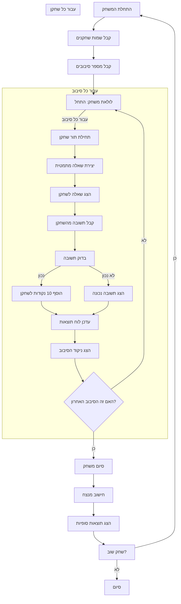

## <algorithm>

1. **התחלת המשחק:**
   - הדפסת הודעת פתיחה וכללי המשחק.
     * דוגמה: "ברוכים הבאים למשחק MATHDI - דו קרב מתמטי!"
   - קבלת שמות השחקנים.
     * דוגמה: "שחקן 1, הכנס את שמך: אליס"
   - קבלת מספר הסיבובים הרצוי.
     * דוגמה: "הכנס את מספר הסיבובים: 5"
2. **לולאת משחק (לכל סיבוב):**
   - **לכל שחקן:**
     - **יצירת שאלה מתמטית:**
       - בחירה אקראית של סוג פעולה (חיבור, חיסור, כפל, חילוק).
       - יצירת שני מספרים אקראיים בהתאם לסוג הפעולה.
       * דוגמה: חיבור: "25 + 12"
     - הצגת השאלה לשחקן.
     - קבלת תשובה מהשחקן.
     - **בדיקת תשובה:**
       - אם התשובה נכונה:
         - הוספת 10 נקודות לשחקן.
         - הדפסת הודעה "תשובה נכונה! הרווחת 10 נקודות."
       - אם התשובה לא נכונה:
         - הדפסת התשובה הנכונה.
         - הדפסת הודעה "תשובה שגויה, התשובה הנכונה היא X."
     - עדכון ופלט של ניקוד השחקנים בסיום הסיבוב.
       * דוגמה: "תוצאות לאחר סיבוב 1: אליס: 10 נקודות, בוב: 10 נקודות"
3. **סיום המשחק:**
   - קביעת המנצח לפי הניקוד הגבוה.
     - אם יש תיקו, הדפסת הודעה על תיקו.
   - הדפסת תוצאות סופיות של המשחק.
     * דוגמה: "תוצאות סופיות: אליס: 30 נקודות, בוב: 40 נקודות. המנצח הוא בוב!"
   - הצעה לשחק שוב או לסיים את המשחק.

## <mermaid>

התרשים מתאר את זרימת הפעולות במשחק MATHDI. כל מלבן מייצג שלב בתהליך, והחצים מראים את זרימת השליטה בין השלבים. התרשים מתחיל בקבלת נתוני השחקנים ומסתיים בהכרזת המנצח והאפשרות לשחק שוב. ישנן לולאות המשחק והתור של כל שחקן, וכן טיפול בתשובות נכונות או שגויות.

## <explanation>

**ייבואים (Imports)**:
   - אין ייבוא ישירות מהקוד, אך בהערת מימוש מצוין שיהיה צורך בשימוש במודול `random` ליצירת מספרים אקראיים ופעולות מתמטיות, ושימוש בלולאות ותנאים לעיבוד המשחק ובפונקציות ליצירת שאלות ולחישוב ניקוד.
   - מודול `random` הוא חלק מספריות הסטנדרט של פייתון ואין צורך להתקין אותו. הוא משמש ליצירת מספרים פסאודו-אקראיים שיהיו בשימוש ליצירת שאלות שונות בכל סיבוב.

**מחלקות (Classes)**:
   - לא קיימות מחלקות בקוד המופשט, אך אפשר היה ליישם את המשחק עם מחלקות:
    -   `Player`: ייצוג שחקן, עם שדות שם וניקוד.
    -   `Game`: ייצוג המשחק, עם שיטות כמו `play_round()`, `generate_question()`, `check_answer()` ו-`announce_winner()`.

**פונקציות (Functions)**:
   - לא מוגדרות פונקציות בקוד, אך ניתן ליישם את הפונקציות הבאות:
   - `generate_question(round_number)`:
        - פרמטר: מספר סיבוב (לצורך הגדלת קושי אופציונלית).
        - ערך מוחזר: מחרוזת המייצגת שאלה מתמטית (לדוגמה: "12 * 7").
        - מטרה: יוצרת שאלה מתמטית אקראית.
        - דוגמה: `generate_question(1)` מחזירה "15 + 25", `generate_question(5)` יכולה להחזיר "125 * 23".
    - `check_answer(question, answer)`:
        - פרמטרים: מחרוזת השאלה, תשובת השחקן.
        - ערך מוחזר: `True` אם התשובה נכונה, אחרת `False`.
        - מטרה: בודקת האם תשובת השחקן נכונה.
        - דוגמה: `check_answer("10 + 5", 15)` מחזירה `True`, `check_answer("10 * 5", 10)` מחזירה `False`.
    - `calculate_score(player_score, is_correct)`:
        - פרמטרים: הניקוד הנוכחי של השחקן, האם התשובה נכונה (Boolean).
        - ערך מוחזר: הניקוד המעודכן.
        - מטרה: מעדכנת את הניקוד של השחקן בהתאם לתשובה.
        - דוגמה: `calculate_score(10, True)` מחזירה 20, `calculate_score(10, False)` מחזירה 10.
    - `announce_winner(player1_score, player2_score, player1_name, player2_name)`:
        - פרמטרים: ניקוד השחקנים, שמות השחקנים.
        - ערך מוחזר: אין.
        - מטרה: מכריזה על המנצח או על תיקו.
        - דוגמה: `announce_winner(30, 40, "אליס", "בוב")` מדפיסה "הזוכה הוא בוב!".

**משתנים (Variables)**:
    - `player1_name`, `player2_name`: מחרוזות המכילות את שמות השחקנים.
        - שימוש: קלט משתמשים, הצגת שמות במהלך המשחק.
    - `rounds_number`: מספר שלם המכיל את מספר הסיבובים במשחק.
        - שימוש: הגדרת מספר הסיבובים, שימוש בלולאת משחק.
    - `player1_score`, `player2_score`: מספרים שלמים המכילים את ניקוד השחקנים.
        - שימוש: מעקב אחר ניקוד במהלך המשחק, קביעת מנצח.
    - `current_round`: מספר שלם המייצג את הסיבוב הנוכחי.
        - שימוש: מעקב אחר התקדמות הסיבובים.
   - `question`: מחרוזת שמכילה את השאלה המתמטית הנוכחית.
       - שימוש: אחסון והצגת השאלה לשחקן.
   - `player_answer`: משתנה המכיל את תשובת השחקן כקלט.
       - שימוש: קבלת קלט ממשתמש ובדיקה.
   - `correct_answer`: משתנה המכיל את התשובה הנכונה לשאלה.
       - שימוש: בדיקת התשובה של השחקן והצגתה אם לא צדק.

**בעיות אפשריות או תחומים לשיפור:**
- טיפול בשגיאות קלט מהמשתמש (למשל, קלט שאינו מספר).
- אפשרות להגדיר רמת קושי משתנה למשחק.
- הוספת תכונות נוספות כמו טיימר, טבלת שיאים ומצב משחק מול המחשב.
- שיפור הממשק עם המשתמש והצגת הודעות ברורות יותר.
- הגבלת טווח המספרים המשמשים בחישובים כדי למנוע מספרים גדולים מדי או שברים לא נוחים.

**שרשרת קשרים עם חלקים אחרים בפרויקט:**
- קובץ זה יכול להיות קשור לקבצים אחרים בספריית `src/endpoints/ai_games/101_basic_computer_games` בכך שהוא חלק ממימוש של משחק מחשב פשוט.
- יתכן שיהיה צורך לשמור את ההגדרות של המשחק בקובץ תצורה גלובלי בספריית `src`, למרות שזה לא מצוין בקוד.
- כדי לעקוב אחרי הביצועים של המשתמש, ניתן לשלב את המשחק במנגנון רישום נתונים של `src`.

הקוד מתאר משחק מתמטי פשוט לשני שחקנים. ניתן להרחיב ולשפר אותו על ידי הוספת פיצ'רים נוספים וטיפול בשגיאות שונות.