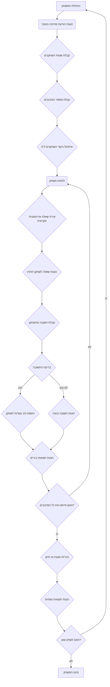
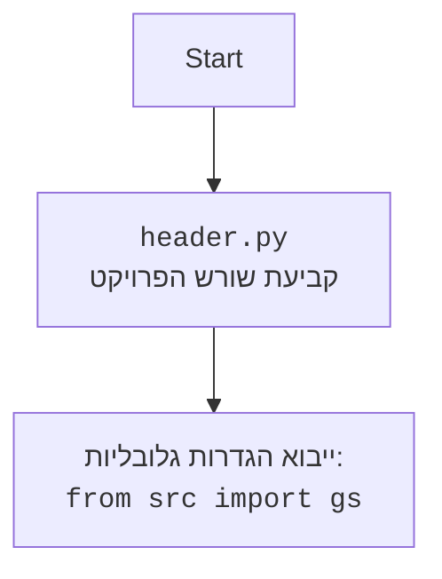

## <algorithm>

1. **אתחול המשחק**:
   - הצגת הודעת פתיחה והסבר על כללי המשחק.
     *דוגמה*: "ברוכים הבאים ל-MATHDI - דו קרב מתמטי! שני שחקנים יתחרו על פתרון בעיות מתמטיות."
   - קבלת שמות השחקנים.
     *דוגמה*: "שחקן 1, אנא הזן את שמך: " > אליס
   - קבלת מספר הסיבובים מהמשתמש.
     *דוגמה*: "הזן את מספר הסיבובים: " > 5
   - הגדרת משתנים לאחסון ניקוד השחקנים, שמתחילים ב-0.
     *דוגמה*: `player1_score = 0`, `player2_score = 0`.
2. **לולאת משחק (סיבובים)**:
   - לולאה הרצה מספר הפעמים כפי שהוגדר מספר הסיבובים.
   - **ייצור שאלה**:
     - בחירת פעולה אריתמטית אקראית (+, -, *, /).
     - יצירת מספרים אקראיים בהתאם לפעולה (כדי לא ליצור חלוקה באפס).
     *דוגמה*: אם הפעולה היא חיבור, יוצרים שני מספרים אקראיים בין 1 ל-20. אם הפעולה היא חילוק, יוצרים מחלק ואז מכפלה של המחלק הזה במספר אחר.
     - הצגת השאלה לשחקן התורן.
   - **קבלת תשובה מהשחקן**:
     - קבלת תשובה מהשחקן (כקלט מספרי).
   - **בדיקת התשובה**:
     - בדיקה האם התשובה נכונה.
       - אם נכון: הוספת 10 נקודות לניקוד השחקן.
       - אם לא נכון: הצגת התשובה הנכונה.
     - הצגת תוצאות הביניים (ניקוד השחקנים לאחר סיבוב).
       *דוגמה*: "תוצאות אחרי סיבוב 1: אליס: 10 נקודות, בוב: 0 נקודות"
3. **סיום המשחק**:
   - סיום הלולאה.
   - הכרזת מנצח (או תיקו) בהתאם לניקוד השחקנים.
   - הצגת תוצאות סופיות.
     *דוגמה*: "תוצאות סופיות: אליס: 20 נקודות, בוב: 10 נקודות. המנצח הוא: אליס!"
   - שאילת השחקנים האם הם מעוניינים לשחק שוב.
     - אם כן - חוזרים לשלב 1.
     - אם לא - תודה וסיום המשחק.

## <mermaid>

## <explanation>

**ייבואים (Imports):**
אין ייבוא מוגדר בקוד המדובר. עם זאת, המקטע האחרון מרמז כי ייתכן ויעשה שימוש במודול `random` לצרכי יצירת שאלות אקראיות ובחירת פעולות אריתמטיות. כמו כן, ייתכן ייבוא פנימי ממודול `src` בשם `gs` עבור הגדרות גלובליות.

**מחלקות (Classes):**
אין מחלקות המוגדרות ישירות בקוד המדובר. המשחק יכול להיות מיוצג באמצעות פונקציות בלבד, אבל במידה ונדרש הרחבה בעתיד, כדאי לשקול שימוש במחלקות. לדוגמה, מחלקה לכל שחקן עם מידע כמו שם וניקוד.

**פונקציות (Functions):**
- `init_game()`: אחראית לאתחול המשחק, כולל קבלת שמות שחקנים ומספר הסיבובים.
- `generate_question()`: יוצרת שאלה מתמטית אקראית (חיבור, חיסור, כפל, חילוק) ומחזירה את השאלה והתשובה הנכונה.
- `check_answer(user_answer, correct_answer)`: בודקת את התשובה שהזין השחקן מול התשובה הנכונה, מחזירה `True` אם נכון, `False` אחרת.
- `play_round(player_name, question, correct_answer)`: מנהלת את תור השחקן. מציגה את השאלה, קולטת את התשובה, בודקת ומעדכנת ניקוד.
- `end_game(player1_score, player2_score)`: מסיימת את המשחק, מכריזה על המנצח או על תיקו ומציגה את התוצאות הסופיות.

**משתנים (Variables):**
- `player1_name`, `player2_name`: מחזיקים את שמות השחקנים.
- `num_rounds`: מספר הסיבובים שהמשחק יכיל.
- `player1_score`, `player2_score`: מחזיקים את הניקוד של כל שחקן במהלך המשחק.
- `question`: מחזיק את השאלה שנוצרה בסיבוב.
- `correct_answer`: התשובה הנכונה לשאלה.
- `user_answer`: התשובה שהזין השחקן.

**בעיות אפשריות או תחומים לשיפור:**
1. **טיפול בקלט שגוי**: כרגע, המערכת לא מטפלת בקלט שאינו מספרי. יש להוסיף טיפול בשגיאות קלט.
2. **מניעת חלוקה באפס**: בעת יצירת שאלות חלוקה, יש להוסיף בדיקה כדי למנוע חלוקה באפס.
3. **רמת קושי**: רמת הקושי של השאלות לא משתנה במהלך המשחק. אפשר להוסיף מערכת לשינוי רמת קושי עם התקדמות המשחק.
4. **עיצוב ממשק**: ממשק המשתמש הוא טקסטואלי בלבד, אפשר להוסיף ממשק גרפי או לשפר את הפלט הטקסטואלי.
5. **הגבלת זמן**: להוסיף הגבלת זמן לכל שאלה.

**שרשרת קשרים עם חלקים אחרים בפרויקט:**
- קבצים אחרים בתוך ספריית `src` יכולים לספק שירותים כמו ניהול משתמשים, שמירת שיאים או הגדרות תצורה.
- קובץ `header.py` קובע את שורש הפרויקט ומייבא הגדרות גלובליות.
- ייתכן שימוש במודול `gs` מתוך `src` לקבלת הגדרות ומשתנים גלובליים עבור המשחק.