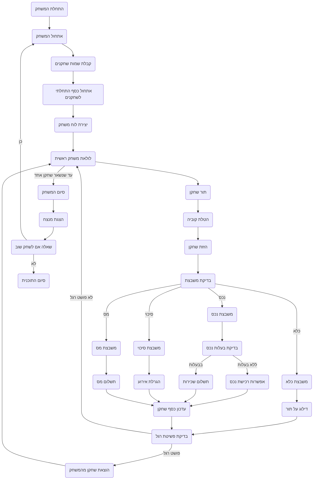

## ניתוח קוד: משחק MNOPLY (מונופול מיני)

### 1. <algorithm>

האלגוריתם מתאר את תהליך המשחק "MNOPLY", גרסה מופשטת של מונופול. להלן תרשים זרימה מפורט שלבי הפעולה:

1.  **אתחול המשחק:**
    *   הצגת הודעת פתיחה והסבר על כללי המשחק.
    *   קבלת שמות שחקנים (2-4 שחקנים) מהמשתמש.
        *   *דוגמא:* קלט שמות השחקנים: "אנה", "דוד", "רותם".
    *   אתחול סכום כסף התחלתי לכל שחקן (למשל, 1500$).
        *   *דוגמא:* לכל שחקן (אנה, דוד, רותם) יש 1500$.
    *   יצירת לוח משחק עם תאים מוגדרים (נכסים, סיכוי, מס, כלא).
        *   *דוגמא:* לוח משחק: \[נכס, סיכוי, מס, נכס, כלא, נכס, סיכוי, מס, נכס, ...].

2.  **מהלך המשחק:**
    *   לולאה ראשית: המשחק נמשך עד שנותר רק שחקן אחד עם כסף.
    *   **תור שחקן:**
        *   כל שחקן בתורו מבצע את הפעולות הבאות:
            *   הטלת קוביה (מספר רנדומלי 1-6).
                *   *דוגמא:* שחקן אנה מטילה 5.
            *   הזזת השחקן על הלוח בהתאם לתוצאת הקוביה.
                *   *דוגמא:* אנה מתקדמת 5 תאים.
            *   בדיקה איזו משבצת הגיע אליה השחקן.
            *   **פעולה בהתאם לסוג המשבצת:**
                *   **נכס:**
                    *   אם הנכס לא בבעלות, לשאול את השחקן האם רוצה לרכוש.
                        *   *דוגמא:* אם אנה הגיעה לנכס "רחוב הגפן" ושואלים אותה האם לקנות אותו.
                    *   אם השחקן קנה, עדכן את מצב בעלות הנכס ועדכן את סכום הכסף של השחקן.
                        *  *דוגמא:* אנה קונה את "רחוב הגפן" והסכום שלה יורד מ-1500 ל-1300.
                    *   אם הנכס בבעלות שחקן אחר, השחקן משלם שכירות לבעל הנכס.
                        *  *דוגמא:* דוד מגיע ל"רחוב הגפן" שקנתה אנה ומשלם לה 100$.
                *   **סיכוי:**
                    *   הגרלת אירוע רנדומלי.
                        *   *דוגמא:* קבלת 200$ או הפסד 100$
                    *   עדכון סכום כסף של השחקן בהתאם לאירוע.
                        *   *דוגמא:* אנה מקבלת 200$ נוספים.
                *   **מס:**
                    *   השחקן משלם סכום קבוע.
                        *   *דוגמא:* אנה משלמת 50$ מס.
                *   **כלא:**
                    *   השחקן מדלג על התור הבא.
                        *   *דוגמא:* אנה מדלגת על תורה הבא.
            *   בדיקה אם השחקן פשט את הרגל: אם סכום הכסף קטן או שווה ל-0 - השחקן יוצא מהמשחק.
        *   *דוגמא:* אם אנה לא מצליחה לשלם את המס או השכירות היא מפסידה.

3.  **סיום המשחק:**
    *   כאשר נשאר רק שחקן אחד עם כסף:
        *   הכרזת השחקן המנצח.
            *   *דוגמא:* אנה היא המנצחת!
    *   שאילת המשתמש האם לשחק שוב.
        *   *דוגמא:* האם תרצו לשחק שוב? (כן/לא)

4.  **סיום התוכנית:**
    *  הודעת סיום משחק.

### 2. <mermaid>

**ניתוח תלויות `mermaid`:**

תרשים הזרימה נוצר באמצעות כלי `mermaid` שאינו תלוי בייבוא. `mermaid` מאפשר לייצר תרשימי זרימה מקוד טקסטואלי. אין תלות בחבילות או מודולים אחרים.

### 3. <explanation>

**ייבוא:**
אין ייבוא בסקריפט התיאורי, אך הוא מציין שימוש ב:

*   `random`: משמש להטלת קוביה רנדומלית ולהגרלת אירועים.
*   `lists`: ישמשו לאחסון מידע על תאי לוח המשחק.

**מחלקות:**
אין הגדרה של מחלקות.

**פונקציות:**
אין הגדרה של פונקציות. המשחק מתואר באופן טקסטואלי שלבי פעולה.

**משתנים:**
*   `players`: רשימה של שמות השחקנים.
*   `player_money`: מילון המאחסן את סכום הכסף של כל שחקן.
*   `board`: רשימה המתארת את לוח המשחק, כאשר כל איבר הוא סוג המשבצת.
*   `current_player`: השחקן הנוכחי בתור.
*   `dice_roll`: תוצאת הטלת הקוביה (מספר רנדומלי).
*   `tile_type`: סוג המשבצת בה עצר השחקן.
*   `tile_owner`: בעל הנכס (אם יש).
*   `event`: האירוע שנקרה לשחקן כאשר נופל על סיכוי.

**הסברים נוספים:**

*   **תהליך המשחק:** המשחק מתבצע בלולאה ראשית שרצה עד שנשאר רק שחקן אחד עם כסף. בכל תור, שחקן מטיל קוביה, מתקדם על הלוח, ומבצע פעולה בהתאם לסוג המשבצת. המשחק מסתיים כאשר כל השחקנים פשטו רגל מלבד אחד.
*   **בעיות אפשריות:**
    *   התיאור לא כולל טיפול בטעויות קלט מהמשתמש, כמו הכנסת מספר שחקנים לא חוקי.
    *   התיאור חסר פרטים לגבי ניהול מלאי הנכסים וקביעת שכר הדירה.
    *   אין טיפול בסיטואציות מורכבות כמו כניסה לכלא, יציאה ממנו וכו'.
    *   התיאור לא מפרט על סוגי האירועים השונים שיכולים להתרחש במקרה של סיכוי.
*   **תחומים לשיפור:**
    *   יצירת מבנה נתונים מפורט לניהול לוח המשחק, נכסים, ושחקנים.
    *   הוספת טיפול בשגיאות קלט.
    *   הוספת אירועים מגוונים.
    *   הוספת רכיבים מתקדמים כגון קניית בתים/בתי מלון, מכירת נכסים וכו'.
    *   יישום אלגוריתם לניהול שכירות.
*   **שרשרת קשרים:** התיאור הזה הוא תיאור עצמאי של משחק בסיסי. אין בו קשרים ישירים לחלקים אחרים בפרויקט.

**סיכום:**
התיאור מספק הנחיות מפורטות כיצד לממש משחק "מונופול מיני". הוא מתמקד בתהליך הכללי של המשחק, תוך התעלמות מחלקים טכניים ספציפיים של המימוש. עם זאת, תיאור זה מספק בסיס טוב להתחלת פיתוח המשחק בפועל.