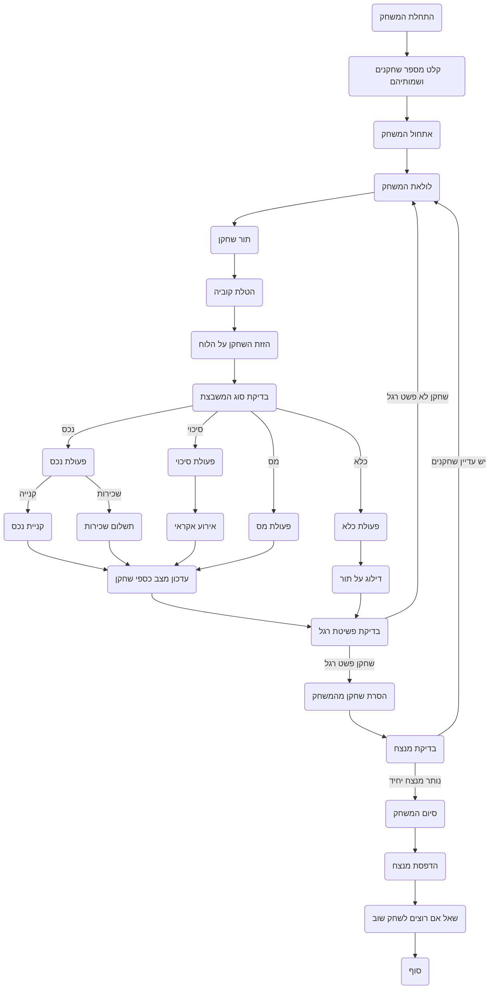

## ניתוח קוד: MNOPLY (מיני-מונופול)

### 1. <algorithm>

**תרשים זרימה של המשחק MNOPLY:**

1.  **התחלת המשחק:**
    *   הדפס הודעת פתיחה והסבר על הכללים.
    *   קבל את מספר השחקנים (2-4).
    *   קבל את שמות השחקנים.
    *   אתחל את סכום הכסף ההתחלתי לכל שחקן (לדוגמה, 1500$).
    *   הגדר את לוח המשחק (לדוגמה, 20 משבצות מסוגים שונים).
        *   דוגמה: `players = [{"name": "Anna", "money": 1500}, {"name": "Ivan", "money": 1500}]`
        *   דוגמה: `board = ["property", "chance", "tax", "jail", ...]`

2.  **לולאת המשחק:** (לולאה עד שנשאר רק שחקן אחד)
    *   **תור שחקן:**
        *   גלגל קוביה (מספר אקראי בין 1 ל-6).
        *   הזז את השחקן על הלוח במספר המשבצות שהוגרל בקוביה.
        *   בדוק את סוג המשבצת בה נמצא השחקן:
            *   **נכס:**
                *   אם המשבצת לא בבעלות של אף שחקן, שאל אם השחקן רוצה לקנות אותה.
                *   אם המשבצת בבעלות של שחקן אחר, השחקן צריך לשלם דמי שכירות לבעל הנכס.
            *   **סיכוי:**
                *   הגרל אירוע אקראי (קבל כסף, הפסד כסף, התקדמות, נסיגה).
            *   **מס:**
                *   שלם מס קבוע.
            *   **כלא:**
                *   השחקן מדלג על התור הבא שלו.
    *   **בדוק אם יש שחקנים שפשטו רגל:**
        *   אם לשחקן אין כסף, הוא יוצא מהמשחק.
    *   הצג את מצב השחקנים והכסף שלהם.
        *   דוגמה: `print("Anna: 1800$, Ivan: 1200$")`

3.  **סיום המשחק:**
    *   אם נשאר רק שחקן אחד, הכרז עליו כמנצח.
    *   שאל אם רוצים לשחק שוב.
        *   דוגמה: `print("הזוכה: אנה")`
        *   דוגמה: `play_again = input("האם לשחק שוב? (כן/לא)")`

**זרימת נתונים:**

*   המשתמש מכניס את מספר השחקנים ושמותיהם בתחילת המשחק.
*   המערכת מאתחלת את השחקנים, סכום הכסף שלהם ואת הלוח.
*   בכל תור, מגרילים מספר באמצעות קוביה, ומעדכנים את מיקום השחקן בלוח.
*   האינטראקציה עם המשבצת (קנייה, תשלום שכר דירה, אירוע סיכוי, תשלום מס, כלא) משפיעה על מצב הכסף של השחקנים.
*   אם לשחקן אין מספיק כסף, הוא יוצא מהמשחק (מפסיד).
*   בסיום המשחק, המערכת מכריזה על הזוכה.

### 2. <mermaid>

**הסבר על התלויות ב-mermaid:**

*   אין תלויות מיובאות, מכיוון שהתרשים מתאר את הלוגיקה של המשחק, ולא קוד ספציפי.
*   כל השמות בתרשים הם בעלי משמעות ומתארים פעולות או מצבים במשחק.

### 3. <explanation>

**הסברים מפורטים:**

*   **ייבואים (Imports):**
    *   אין ייבוא מפורש בקוד שסופק. המשחק משתמש בתיאור פשוט של האופן שבו יש להטמיע את המשחק.
    *   אם היינו מממשים את המשחק בפועל בפייתון, היינו משתמשים בספריות כמו `random` ליצירת מספרים אקראיים (קוביה ואירועים) וייתכן שספריות נוספות לתצוגה גרפית או לניהול נתוני משתמשים.

*   **מחלקות (Classes):**
    *   אין שימוש במחלקות בקוד שסופק. ביישום אמיתי היינו יכולים ליצור מחלקות עבור `Player` (שחקן), `Property` (נכס) ו- `Board` (לוח המשחק). מחלקות יכולות להכיל תכונות כמו שם שחקן, כסף, מיקום בלוח, מחיר נכס וכו', וגם שיטות לביצוע פעולות (קנייה, תשלום וכו').

*   **פונקציות (Functions):**
    *   הקוד מתאר באופן לוגי פעולות שיהפכו לפונקציות ביישום. לדוגמה:
        *   `initialize_game()`: לאתחול המשחק, קליטת שחקנים, קביעת סכום התחלתי ואתחול הלוח.
        *   `roll_dice()`: להגרלת מספר אקראי בין 1 ל-6.
        *   `move_player(player, dice_roll)`: להזזת שחקן על הלוח.
        *   `check_cell(player, cell)`: לבדיקה של סוג המשבצת והפעלת הפעולה המתאימה (קנייה, תשלום שכירות, אירוע, מס).
        *   `buy_property(player, property)`: לקניית נכס.
        *   `pay_rent(player, property_owner, property)`: לתשלום שכירות.
        *   `handle_chance(player)`: לביצוע אירוע אקראי.
        *   `pay_tax(player)`: לגביית מס.
        *   `check_bankrupt(player)`: לבדיקה אם שחקן פשט רגל.
        *   `check_winner()`: לבדיקה אם יש מנצח.
        *   `print_winner(winner)`: להדפסת שם המנצח.

*   **משתנים (Variables):**
    *   `players`: רשימה של שחקנים (מילונים המכילים שם וכסף).
    *   `board`: רשימה של סוגי המשבצות בלוח.
    *   `player_turn`: משתנה המצביע על השחקן הנוכחי.
    *   `dice_roll`: המספר שהוגרל בקוביה.
    *   `cell`: המשבצת בה נמצא השחקן.
    *   `money`: סכום הכסף של כל שחקן.
    *   משתנים נוספים עבור עלויות, שכירות וכו'.

**שרשרת קשרים:**

הקוד מתאר משחק מונופול מינימליסטי. ניתן לראות את הקשרים בין הפונקציות והמשתנים השונים:

*   המשחק מתחיל באיחול המשתנים.
*   הלולאה המרכזית מנהלת את התורות של השחקנים, באמצעות קריאות לפונקציות לוגיות (הטלת קוביה, תזוזה, בדיקה).
*   פעולות השחקן משפיעות ישירות על מצב הכסף שלו, ועל מצב הנכסים השונים בלוח.
*   בסופו של דבר, המשחק מסתיים כאשר נשאר רק שחקן אחד שלא פשט את הרגל.

**בעיות אפשריות ותחומים לשיפור:**

*   **גמישות:** הקוד מגביל את מספר השחקנים ואת גודל הלוח.
*   **אינטראקציה:** אין מימוש של ממשק משתמש ידידותי.
*   **מורכבות:** המשחק פשוט יחסית וניתן להוסיף לו תכונות מורכבות יותר (בתי מלון, מסחר בין שחקנים, ועוד).
*   **אבטחה:** אין טיפול שגיאות מספק (למשל, קלט שגוי מהמשתמש).
*   **קוד:** הקוד אינו כתוב כקוד ממשי, אלא תיאור לוגי בלבד, כך שקשה להתייחס לתחומים ספציפיים לשיפור.

**שיפורים אפשריים:**

*   הגדלת מספר השחקנים והמשבצות בלוח.
*   הוספת אפשרות לקנות בתים או מלונות.
*   הוספת מערכת מסחר בין השחקנים.
*   הוספת תמיכה למשחק מרובה משתתפים ברשת.
*   שימוש בממשק משתמש גרפי.
*   הוספת טיפול שגיאות ואימות נתונים.

הניתוח המקיף הזה אמור לתת הבנה ברורה של האופן שבו משחק המונופול המינימליסטי הזה עובד, ומה ניתן לשפר בו.