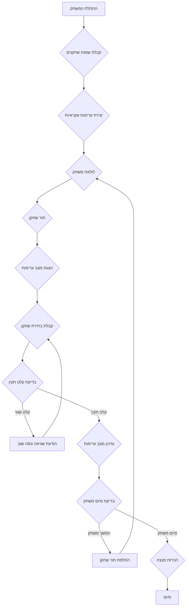

## ניתוח קוד המשחק "נים"

### <algorithm>
1. **התחלת המשחק:**
   - הצגת הודעת פתיחה והסבר על חוקי המשחק.
   - קבלת שמות השחקנים.
   - יצירת מספר אקראי של ערימות (לדוגמה, 3-5).
   - יצירת מספר אקראי של אבנים בכל ערימה (לדוגמה, 5-15).
   - דוגמה:
     - שמות השחקנים: "אליס", "בוב"
     - מספר ערימות: 3
     - ערימה 1: 7 אבנים, ערימה 2: 5 אבנים, ערימה 3: 10 אבנים

2. **לולאת משחק:**
   - לולאה שמתבצעת עד שאין יותר אבנים בערימות.
     - **תור שחקן:**
       - הצגת מצב הערימות הנוכחי.
       - קבלת בחירת השחקן:
         - מספר ערימה.
         - מספר אבנים שיש לקחת.
       - דוגמה:
         - תור אליס:
           - מצב ערימות: ערימה 1: 7, ערימה 2: 5, ערימה 3: 10
           - בחירה: ערימה 2, 3 אבנים.
     - **בדיקת תקינות קלט:**
       - אם מספר הערימה לא חוקי או אם מספר האבנים גדול יותר ממה שקיים בערימה, תוצג הודעת שגיאה והשחקן יתבקש לנסות שוב.
       - דוגמה:
         - תור אליס:
           - מצב ערימות: ערימה 1: 7, ערימה 2: 5, ערימה 3: 10
           - בחירה שגויה: ערימה 2, 10 אבנים
           - הודעת שגיאה: "מספר האבנים גדול יותר ממה שקיים בערימה 2"
     - **עדכון מצב הערימות:**
       - אם הקלט תקין, מספר האבנים שנבחרו יוסרו מהערימה המתאימה.
       - דוגמה:
         - תור אליס:
           - מצב ערימות: ערימה 1: 7, ערימה 2: 5, ערימה 3: 10
           - בחירה: ערימה 2, 3 אבנים
           - מצב ערימות מעודכן: ערימה 1: 7, ערימה 2: 2, ערימה 3: 10
     - **החלפת שחקן:**
       - מעבר לתור של השחקן הבא.

3. **סיום המשחק:**
   - אם אין יותר אבנים בערימות, הכרז על המפסיד (השחקן שלקח את האבן האחרונה).
   - דוגמה:
       - לאחר מספר תורות, נותרה אבן אחת בלבד.
       - שחקן "בוב" לוקח את האבן האחרונה.
       - הכרזה: "המנצח הוא אליס"

### <mermaid>

### <explanation>
**1. ייבואים (Imports):**
  - אין ייבואים בקוד הזה. המשחק מוסבר בפרוזה. אם היינו מממשים אותו בקוד, היינו צריכים לעשות ייבוא לחבילות כמו `random` (ליצירת מספרים אקראיים) וייתכן שחבילות נוספות לטיפול בקלט/פלט, אבל לא נדרש לזה כאן.

**2. מחלקות (Classes):**
   - אין מחלקות בקוד הזה. הקוד המתואר מספיק פשוט כדי שיתבצע רק באמצעות פונקציות משנה בתוך פונקציה ראשית (אם היה מומש).

**3. פונקציות (Functions):**
  - אין פונקציות בקוד הזה, אך ניתן לחלק את התהליך לפונקציות הבאות:
    - `initialize_game()`:  
      - תפקיד: אתחול המשחק, קבלת שמות שחקנים, יצירת ערימות אקראיות.
      - פרמטרים: אין.
      - ערך מוחזר: רשימה של שמות שחקנים, רשימה של ערימות (רשימה של מספרים המייצגים את מספר האבנים בכל ערימה).
      - דוגמה: `initialize_game()` מחזירה: `['אליס', 'בוב'], [[7, 5, 10]]`
    - `print_piles(piles)`:
      - תפקיד: הצגת מצב הערימות.
      - פרמטרים: `piles` - רשימה של ערימות (רשימה של מספרים המייצגים את מספר האבנים בכל ערימה).
      - ערך מוחזר: אין (הפונקציה מדפיסה לפלט).
      - דוגמה: `print_piles([7, 5, 10])` מדפיסה: "ערימה 1: 7, ערימה 2: 5, ערימה 3: 10".
    - `get_player_choice(player_name, piles)`:
      - תפקיד: קבלת בחירת השחקן (מספר ערימה ומספר אבנים) ובדיקת תקינות הקלט.
      - פרמטרים: `player_name` (שם השחקן), `piles` (מצב הערימות).
      - ערך מוחזר: מספר ערימה (int), מספר אבנים (int) או `None` במקרה של קלט לא תקין.
      - דוגמה: `get_player_choice("אליס", [7, 5, 10])` יכול להחזיר `(2, 3)` או `None` (אם יש שגיאת קלט).
    - `update_piles(piles, pile_number, stones_to_take)`:
      - תפקיד: עדכון מצב הערימות לאחר בחירת השחקן.
      - פרמטרים: `piles` (רשימת הערימות), `pile_number` (מספר הערימה שנבחרה), `stones_to_take` (כמות האבנים שנלקחו).
      - ערך מוחזר: רשימת הערימות המעודכנת.
      - דוגמה: `update_piles([7, 5, 10], 2, 3)` מחזירה: `[7, 2, 10]`
    - `check_game_over(piles)`:
      - תפקיד: בדיקה האם המשחק הסתיים (אם אין יותר אבנים בערימות).
      - פרמטרים: `piles` (רשימת הערימות).
      - ערך מוחזר: `True` אם המשחק נגמר, `False` אחרת.
      - דוגמה: `check_game_over([0, 0, 0])` מחזירה `True` , `check_game_over([7, 0, 0])` מחזירה `False`.
    - `announce_winner(player_name)`:
      - תפקיד: הכרזה על המנצח.
      - פרמטרים: `player_name` (שם השחקן המנצח).
      - ערך מוחזר: אין (הפונקציה מדפיסה לפלט).
      - דוגמה: `announce_winner("אליס")` מדפיסה "המנצח הוא אליס".

**4. משתנים (Variables):**
  - `players`: רשימה המכילה את שמות השחקנים (מחרוזות).
  - `piles`: רשימה של מספרים שלמים, המייצגים את כמות האבנים בכל ערימה.
  - `current_player`: אינדקס (מספר שלם) של השחקן הנוכחי ברשימת השחקנים.
  - `pile_number`: מספר שלם המייצג את מספר הערימה שנבחרה על ידי השחקן.
  - `stones_to_take`: מספר שלם המייצג את כמות האבנים שהשחקן מעוניין לקחת מהערימה.

**5. בעיות אפשריות ושיפורים:**
  - **טיפול בשגיאות קלט**: הקוד הנוכחי אינו מטפל בכל סוגי השגיאות האפשריות (כגון קלט לא מספרי). יש ליישם בדיקות קלט נוספות.
  - **ממשק משתמש**: ממשק המשתמש הוא טקסטואלי בלבד. ניתן להוסיף ממשק גרפי לשיפור חווית המשתמש.
  - **קוד ניתן להרחבה**: ניתן להרחיב את המשחק ע"י הוספת רמות קושי שונות (אלגוריתם משחק נגד מחשב) ואפשרויות משחק שונות.
  - **אופטימיזציה**: אפשר לעשות אופטימיזציה בייצוג הנתונים וגם בדרך שבה מנוהלת הלוגיקה של המשחק.

**שרשרת קשרים:**
המשחק עצמו מבודד, ולא תלוי ישירות בחלקים אחרים של הפרויקט, אלא אם כן יחליטו לאחסן את תוצאות המשחקים.