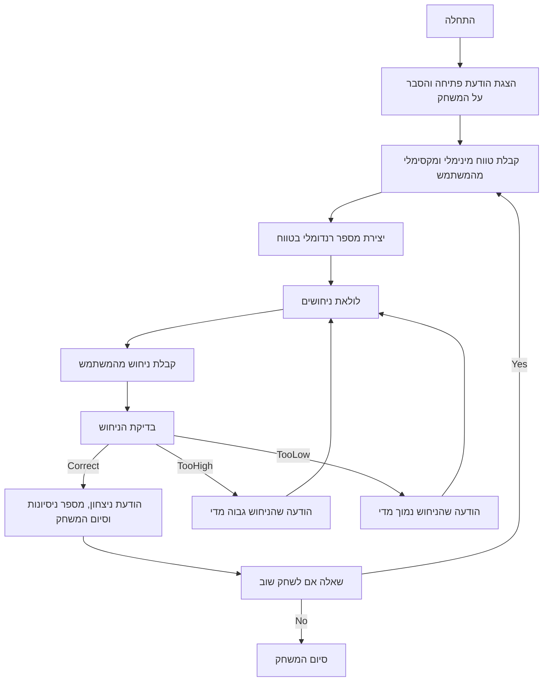

## ניתוח קוד המשחק "NUMBER" (נחש את המספר)

### 1. **<algorithm>**

1.  **התחלה:**
    *   הצגת הודעת פתיחה למשתמש, הסברת חוקי המשחק.
    *   דוגמה: "ברוכים הבאים למשחק NUMBER! אני אחשוב על מספר, ואתה תצטרך לנחש אותו."
2.  **קביעת טווח:**
    *   בקשה מהמשתמש להזין את הערך המינימלי והמקסימלי של הטווח.
    *   דוגמה: "הזן את הערך המינימלי לטווח: 1", "הזן את הערך המקסימלי לטווח: 100"
3.  **יצירת מספר רנדומלי:**
    *   התוכנית בוחרת מספר רנדומלי בתוך הטווח שנקבע.
    *   דוגמה: אם הטווח הוא בין 1 ל-100, המספר יכול להיות 42.
4.  **לולאת ניחושים:**
    *   **קלט:** בקשת קלט מהמשתמש לנחש מספר.
        *   דוגמה: "הזן את ניחושך:"
    *   **בדיקה:**
        *   אם המספר שהוזן זהה למספר הרנדומלי:
            *   הצגת הודעת ניצחון למשתמש.
            *   הצגת מספר הניסיונות שלקח לו לנחש.
            *   סיום המשחק.
            *   דוגמה: "כל הכבוד! ניחשת את המספר 42 ב-5 נסיונות!"
        *   אם המספר שהוזן גדול מהמספר הרנדומלי:
            *   הודעה למשתמש שהמספר גדול מהמספר הרנדומלי.
            *   חזרה ללולאת הניחושים.
            *   דוגמה: "המספר שלך גדול יותר מהמספר הנכון. נסה שוב."
        *   אם המספר שהוזן קטן מהמספר הרנדומלי:
            *   הודעה למשתמש שהמספר קטן מהמספר הרנדומלי.
            *   חזרה ללולאת הניחושים.
            *   דוגמה: "המספר שלך קטן יותר מהמספר הנכון. נסה שוב."
    *   **ספירת ניסיונות:** בכל ניסיון, התוכנית סופרת את מספר הניסיונות שבוצעו.
5.  **סיום:**
    *   אפשרות למשתמש לשחק שוב.
        *   אם המשתמש בוחר לשחק שוב, התוכנית חוזרת לשלב 2.
        *   אם המשתמש בוחר לא לשחק שוב, התוכנית מסיימת.

### 2.  **<mermaid>**

### 3.  **<explanation>**

*   **ייבואים (Imports):**
    *   הקוד המתואר אינו משתמש בייבוא מפורש של מודולים, אך הוא מזכיר את המודול `random` לשימוש ביצירת מספר רנדומלי.
    *   השימוש במודול `random` הוא נפוץ במשחקים מסוג זה לצורך יצירת מספר אקראי שיש לנחש אותו.

*   **מחלקות (Classes):**
    *   לא מוגדרות מחלקות בקוד המתואר. הוא מבוסס על פונקציונליות פרוצדורלית.

*   **פונקציות (Functions):**
    *   הקוד המתואר אינו כולל הגדרות פונקציות מפורשות, אך הפונקציונליות שלו מפורטת בצעדים.
        *   **פונקציית `game_loop` (לדוגמה):**
            *   **פרמטרים:** אין פרמטרים מוגדרים.
            *   **ערך מוחזר:** אין ערך מוחזר, הפונקציה מנהלת את זרימת המשחק.
            *   **מטרה:** להריץ את המשחק מההתחלה ועד הסוף, כולל קבלת קלט מהמשתמש, בדיקת הניחוש, הצגת הודעות וסיום המשחק.
            *   **דוגמה לשימוש:** הפונקציה נקראת ברגע שהמשחק מתחיל.
        *   **פונקציית `get_user_input_guess` (לדוגמה):**
            *   **פרמטרים:** אין פרמטרים מוגדרים.
            *   **ערך מוחזר:** מספר (הניחוש של המשתמש).
            *   **מטרה:** לקבל את הניחוש של המשתמש.
            *   **דוגמה לשימוש:** נקראת בתוך הלולאה של המשחק כדי לקבל קלט חדש מהמשתמש.
        *   **פונקציית `check_guess` (לדוגמה):**
            *   **פרמטרים:** `guess` (ניחוש המשתמש), `secret_number` (המספר הרנדומלי).
            *   **ערך מוחזר:** `True` אם הניחוש נכון, `False` אחרת.
            *   **מטרה:** לבדוק אם הניחוש נכון, גדול או קטן מהמספר הרנדומלי.
            *   **דוגמה לשימוש:** נקראת כדי לבדוק את הניחוש של המשתמש.

*   **משתנים (Variables):**
    *   `min_range`: סוג `int`, הערך המינימלי של טווח המספרים (לדוגמה, 1).
    *   `max_range`: סוג `int`, הערך המקסימלי של טווח המספרים (לדוגמה, 100).
    *   `secret_number`: סוג `int`, המספר האקראי שהתוכנית בחרה.
    *   `guess`: סוג `int`, הניחוש של המשתמש.
    *   `attempts`: סוג `int`, מספר הניסיונות של המשתמש לנחש את המספר.

*   **בעיות אפשריות ותחומים לשיפור:**
    *   **טיפול בשגיאות קלט:** הקוד צריך לטפל במקרים בהם המשתמש מזין קלט לא חוקי (למשל, אותיות במקום מספרים).
    *   **ממשק משתמש:** ניתן לשפר את חוויית המשתמש על ידי הוספת הודעות ברורות יותר, תפריטים ואפשרויות.
    *   **רישום שיאים:** הוספת טבלת שיאים יכולה לעודד תחרות ולשפר את ערך המשחק.
    *   **רמות קושי:** הוספת רמות קושי שונות על ידי שינוי טווחי המספרים (קל, בינוני, קשה).

*  **שרשרת קשרים עם חלקים אחרים בפרויקט:**
  *  בהקשר זה, הקוד הוא עצמאי ואינו קשור באופן ישיר לחלקים אחרים בפרויקט מלבד הצורך האפשרי בשירותים גלובליים להדפסה או קליטת קלט, אשר אינם מפורטים כאן.
  *  ניתן לראות שהקוד יכול להתממשק עם מערכת ניהול שיאים, או משחקים אחרים במסגרת האפליקציה.

בסיכום, הקוד מתאר משחק פשוט לנחש מספר, אך ניתן לשפר אותו על ידי הוספת תכונות נוספות ושיפור הטיפול בשגיאות ואינטראקציית המשתמש.