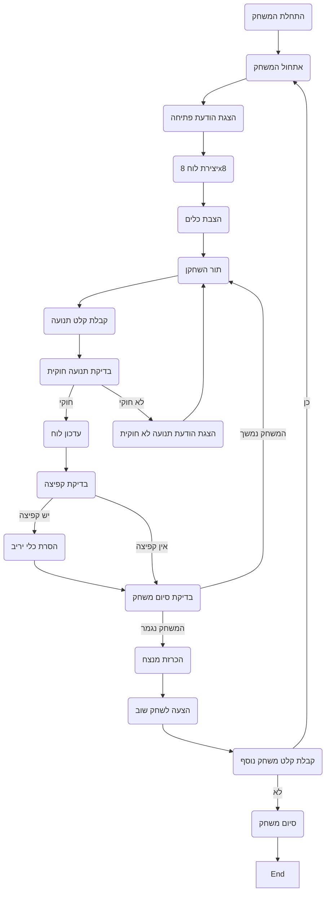

## <algorithm>

1. **התחלת המשחק:**
    - הצגת הודעת פתיחה וכללי המשחק למשתמש.
    - יצירת לוח משחק סטנדרטי 8x8.
    - הצבת כלי משחק (שחור ולבן) בשני צידי הלוח.
    - דוגמה:
        ```
        הודעה: "ברוכים הבאים ל-ICHECK! המטרה שלכם היא להוריד כמה שיותר כלים של היריב."
        לוח: לוח 8x8 ריק עם כלים מוצבים בתחילת המשחק
        ```
2. **תהליך משחק:**
   - תור השחקן:
        - קבלת קלט מהמשתמש - בחירת כלי ומיקום תנועה.
        - בדיקה האם התנועה חוקית:
            - תנועה רק באלכסון.
            - קפיצה מעל כלי יריב מותרת והיא מסירה את כלי היריב.
            - כלי לא יכול לעבור למקום תפוס.
        - אם התנועה חוקית:
            - עדכון הלוח וביצוע התנועה.
            - הסרת כלי היריב אם הייתה קפיצה.
        - אם התנועה לא חוקית:
            - הודעה על טעות וקבלת קלט מחדש.
   - הסרת כלים:
        - כאשר שחקן קופץ מעל כלי יריב, כלי זה יוסר מהלוח.
        - דוגמה: אם כלי לבן קופץ מעל כלי שחור, הכלי השחור מוסר.
   - סיום המשחק:
        - בדיקה האם לאחד השחקנים אין יותר כלים.
        - בדיקה האם לאחד השחקנים אין יותר אפשרויות תנועה.
        - הכרזת מנצח.
        - דוגמה: אם לשחקן השחור נגמרו הכלים, השחקן הלבן מנצח.
3. **סיום המשחק:**
   - הצעה לשחק משחק נוסף.
   - קבלת קלט - כן או לא.
   - אם "כן", חוזרים לשלב 1.
   - אם "לא", תודה על המשחק.

   **זרימת נתונים:**
     - קלט: מיקום כלי ומיקום תנועה (A1 B2)
     - פלט: הודעות משחק, עדכוני לוח, הודעת ניצחון.
     - פונקציות: בדיקת תנועה חוקית, עדכון לוח, הסרת כלים.

## <mermaid>



**ניתוח תלויות:**
- אין תלויות מיובאות.

## <explanation>

**ייבואים:**
- אין ייבוא. הקוד אינו משתמש בספריות חיצוניות או מודולים נוספים. הוא מתבסס על לוגיקה בסיסית בלבד.

**מחלקות:**
- אין מחלקות. הקוד מתבסס על פונקציות ומשתנים גלובליים.

**פונקציות:**
- **אין פונקציות מוגדרות בקוד עצמו**. כל הפונקציונליות מתוארת בצעדים בטקסט.
    - **InitializeGame()** - יוזם את המשחק, מציג הודעות פתיחה, יוצר לוח ומציב כלים.
    - **PlayerTurn()** - מקבל תור משחק, קולט קלט מהשחקן וקורא לבדיקת חוקיות התנועה.
    - **ValidateMove()** - בודק האם התנועה חוקית בהתאם לכללים (אלכסון, קפיצה, מיקום פנוי).
    - **UpdateBoard()** - מעדכן את מצב הלוח בהתאם לתנועה.
    - **CheckForJump()** - בודק האם בוצעה קפיצה מעל כלי יריב.
    - **RemoveOpponentPiece()** - מסיר כלי יריב מהלוח.
    - **CheckGameEnd()** - בודק אם המשחק הסתיים (לשחקן אחד אין כלים או תנועות אפשריות).
    - **DeclareWinner()** - מכריז על מנצח.
    - **PlayAgain()** - מציע לשחק שוב.
    - **GetPlayAgainInput()** - קולט קלט - האם לשחק שוב או לא.

**משתנים:**
- **board** - מייצג את לוח המשחק (מערך או רשימה).
- **pieces** - מייצג את מיקום הכלים על הלוח.
- **currentPlayer** - מייצג את השחקן הנוכחי (לבן או שחור).
- **move** - מייצג את התנועה שהשחקן ביצע (קואורדינטות).
- **isGameOver** - משתנה בוליאני שמסמן אם המשחק נגמר.

**הסברים נוספים:**
- **מגבלות אפשריות:** הקוד מתאר משחק בסיסי, ולכן לא כולל תכונות כמו המלכה (כלי שמגיע לקצה הלוח), משחק מול מחשב או ממשק גרפי.
- **שיפורים מומלצים:** הוספת אפשרות למלכה, AI למשחק מול מחשב, ממשק גרפי לשיפור חווית המשתמש.

**שרשרת קשרים:**
- הקוד אינו מתחבר ישירות לחלקים אחרים בפרויקט, מכיוון שהוא תיאור של משחק בסיסי. עם זאת, הוא יכול לשמש כבסיס לפיתוח משחק שלם עם חלקים נוספים כמו ממשק משתמש, AI, ורשת.