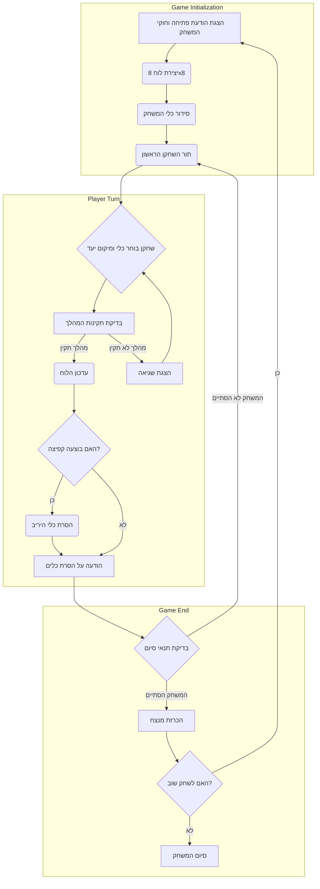

## <algorithm>

1.  **התחלת המשחק:**
    *   הצגת הודעת פתיחה עם חוקי המשחק.
    *   יצירת לוח משחק 8x8.
    *   סידור כלי המשחק (שחור ולבן) בצדדים מנוגדים של הלוח.
    *   המשחק מתחיל כאשר תור השחקן הראשון.

2.  **מהלך שחקן:**
    *   השחקן בוחר כלי משחק ונקודת יעד על הלוח.
    *   **דוגמה:** השחקן בוחר את הכלי במיקום A1 ורוצה להזיז אותו למיקום B2.
    *   התוכנית בודקת אם המהלך תקין:
        *   הכלי נע באלכסון בלבד.
        *   אם בדרך יש כלי של היריב, השחקן מבצע קפיצה.
        *   הכלי לא יכול לנוע למיקום תפוס.
    *   אם המהלך תקין, התוכנית מעדכנת את הלוח (מעבירה את הכלי ומוחקת כלי של יריב אם היה קפיצה).
    *   אם המהלך לא תקין, השחקן מתבקש לנסות שוב.
        *   **דוגמה:** אם השחקן מנסה להזיז כלי למיקום לא חוקי (למשל, למיקום שאינו אלכסוני) או למיקום תפוס, מוצגת הודעת שגיאה.

3.  **הסרת כלים:**
    *   אם השחקן קפץ מעל כלי של היריב, הכלי של היריב מוסר מהלוח.
        *   **דוגמה:** אם השחקן קופץ מעל כלי במיקום C3, הכלי הזה מוסר מהלוח.
    *   התוכנית מודיעה כמה כלים הוסרו.

4.  **בדיקת תנאי סיום:**
    *   המשחק מסתיים אם:
        *   לאחד השחקנים אין יותר כלים על הלוח.
        *   אין לשחקן מהלכים אפשריים.
    *   התוכנית מכריזה על המנצח.

5.  **סיום המשחק:**
    *   התוכנית שואלת אם השחקן רוצה לשחק שוב.
    *   אם כן, מתחילים משחק חדש (חזרה לשלב 1).

## <mermaid>

## <explanation>

**ייבואים (Imports):**
אין ייבוא (imports) בקוד הזה, מכיוון שהוא מתאר את תהליך המשחק ולא קוד בפועל.

**מחלקות (Classes):**
אין מחלקות בקוד הזה, מכיוון שהוא מתאר את תהליך המשחק ולא קוד בפועל.

**פונקציות (Functions):**
הקוד מתאר פונקציות לוגיות שיידרשו במימוש, אבל לא מספק את הפונקציות עצמן. לדוגמה:
*   **`initialize_game()`:** פונקציה שתבצע את שלב 1 (האתחול), יצירת הלוח, סידור הכלים והצגת חוקי המשחק.
*   **`player_turn()`:** פונקציה המבצעת את שלב 2 (מהלך שחקן) ומקבלת קלט מהשחקן לגבי המהלך.
*   **`is_move_valid()`:** פונקציה המבצעת את בדיקת תקינות המהלך. היא מקבלת את המיקום הנוכחי של הכלי והמיקום הרצוי, ומוודאת שהמהלך אפשרי מבחינת חוקי המשחק.
*   **`update_board()`:** פונקציה המעדכנת את הלוח לאחר מהלך תקין.
*   **`remove_opponent_piece()`:** פונקציה שמסירה כלי יריב מהלוח כאשר בוצעה קפיצה.
*   **`check_end_conditions()`:** פונקציה שבודקת אם המשחק הסתיים ואם כן, מחזירה את המנצח.
*   **`play_again()`:** פונקציה השואלת את השחקן האם ברצונו לשחק שוב.

**משתנים (Variables):**
*   **`board`:** משתנה שייצג את לוח המשחק. זה יכול להיות רשימה דו-ממדית או מערך דו-ממדי.
*   **`white_pieces`:** משתנה שמכיל את מיקומי כלי המשחק הלבנים.
*   **`black_pieces`:** משתנה שמכיל את מיקומי כלי המשחק השחורים.
*   **`current_player`:** משתנה ששומר את תורו של השחקן הנוכחי (לבן או שחור).
*   **`move_from`:** משתנה שיכיל את קואורדינטות הכלי שהשחקן בוחר להזיז.
*   **`move_to`:** משתנה שיכיל את הקואורדינטות של היעד שהשחקן בוחר להזיז את הכלי אליו.

**בעיות אפשריות ותחומים לשיפור:**
*   **קלט לא תקין:** הקוד לא מטפל באופן ישיר בקלט לא תקין מהשחקן. יש להוסיף בדיקות קלט, ולוודא שקלט הקואורדינטות הוא בתבנית הנכונה (למשל, A1 B2).
*   **ממשק משתמש:** הקוד הנוכחי הוא טקסטואלי ולא מכיל ממשק משתמש גרפי. כדאי להוסיף ממשק משתמש גרפי כדי להפוך את המשחק לידידותי יותר.
*   **קוד קשה לשינוי:** הקוד הנוכחי הוא תיאור של הלוגיקה הבסיסית, אבל לא מורכב באופן מודולרי. כדאי לחלק את הקוד לפונקציות, כך שיהיה קל לשנות ולהרחיב אותו בהמשך.
*   **משחק מול מחשב:** אין תמיכה במשחק נגד מחשב. כדאי להוסיף מצב משחק כזה.
*   **אפשרות של דמקה:** חסרה האפשרות שכאשר כלי מגיע לקצה הלוח הוא הופך לדמקה.
*   **תחזוקה:** חסרה התייחסות לשיפור התחזוקה, בדיקות אוטומטיות וסגנונות קוד אחידים.

**שרשרת קשרים עם חלקים אחרים בפרויקט:**
*   קובץ זה מהווה את המסמך הראשי לחוקי המשחק "ICHECK".
*   הוא ישמש כמדריך למפתחים שירצו ליצור את המשחק בפועל, אך לא כולל קוד ממשי.
*   לכן אין קשר ישיר למסמכי קוד אחרים בפרויקט, אלא אם מסמכי קוד אחרים יתבססו על מסמך זה.