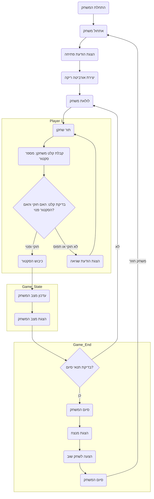

## ניתוח קוד המשחק "ORBIT"

### 1. <algorithm>
**תיאור תהליך העבודה:**
1. **אתחול המשחק:**
   - מציג הודעת פתיחה ומסביר את כללי המשחק.
   - יוצר אורביטה (רשימה או מערך) המורכבת מ-12 סקטורים. כל סקטור מיוצג כמצב פנוי או כבעל על ידי שחקן מסוים.
   - **דוגמה:** `orbit = ['free'] * 12`

2. **לולאת משחק עיקרית:**
    - חוזר על הפעולות הבאות עד להשגת תנאי סיום (ניצחון או מקסימום מהלכים).
    
    3.  **תור שחקן:**
         -   הודעה לשחקן המבקשת את מספר הסקטור אותו רוצה לכבוש (בין 1 ל-12).
         -   **דוגמה:** `player_input = input("בחר סקטור (1-12): ")`
         -   בדיקה: האם הקלט הוא מספר תקין, והאם הסקטור פנוי.
         -   אם הסקטור פנוי, סמן אותו כשייך לשחקן הנוכחי.
         -  אם הסקטור תפוס, הודעה לשחקן שהסקטור תפוס ובקשה לבחור שוב.
         -  **דוגמה:** `if orbit[sector-1] == 'free': orbit[sector-1] = current_player`
          
    4.  **עדכון מצב המשחק:**
         -   עדכן את מונה הסקטורים השייכים לכל שחקן.
         -   הצג את מצב האורביטה הנוכחי, סקטור אחר סקטור, וציין אם הוא פנוי או שייך לאחד השחקנים.
         -   **דוגמה:** `for i, sector in enumerate(orbit): print(f'סקטור {i+1}: {sector}')`
    
    5. **בדיקת תנאי סיום:**
        - בדוק אם אחד השחקנים כבש רוב מהסקטורים (למשל, 7 מתוך 12).
        - בדוק אם מספר המהלכים המקסימלי הגיע.
        - אם אחד התנאים מתקיים, צא מהלולאה.

3.  **סיום המשחק:**
    - הכרז על המנצח (בהתאם למספר הסקטורים שנכבשו).
    -  הצע אפשרות לשחק שוב או לסיים.
    - **דוגמה:** `print("המשחק הסתיים! המנצח הוא שחקן" + winner)`
    
**זרימת הנתונים:**
- הקלט מהשחקן (בחירת סקטור) משמש לעדכון מצב האורביטה.
- מצב האורביטה משמש לקביעת הזוכה ולהצגה למשתמש.
- מונה סקטורים שכבשו השחקנים משמש לקביעת הזוכה.

### 2. <mermaid>


### 3. <explanation>

**ייבואים (Imports):**
אין ייבוא בפסאודו קוד. בפועל, לא נדרשים ייבואים מיוחדים עבור משחק פשוט זה.

**מחלקות (Classes):**
אין מחלקות בקוד הפסאודו. הקוד ממוקד בפונקציונליות בסיסית.

**פונקציות (Functions):**
* אין פונקציות מוגדרות בקוד הפסאודו, אך ניתן להגדיר פונקציות לארגון הקוד (למשל, פונקציה לביצוע תור שחקן, פונקציה לבדיקת סיום משחק).
* דוגמה לפונקציה:
  ```python
  def handle_player_turn(orbit, current_player):
      while True:
          sector = int(input(f"שחקן {current_player}, בחר סקטור (1-12): "))
          if 1 <= sector <= 12 and orbit[sector - 1] == 'free':
              orbit[sector - 1] = current_player
              return
          else:
              print("בחירה לא חוקית, נסה שוב.")
  ```

**משתנים (Variables):**

*   `orbit` - רשימה המייצגת את האורביטה, כאשר כל תא מייצג סקטור ויכול להיות פנוי או שייך לשחקן.
*   `current_player` - משתנה המציין את השחקן הנוכחי.
*   `sector` - משתנה המייצג את מספר הסקטור שהשחקן בוחר.
*   `winner` - משתנה המייצג את השחקן המנצח.

**בעיות אפשריות:**

*   הקוד לא מטפל בקלט שאינו מספר (למשל, אותיות במקום מספרים).
*   אין בדיקות שגיאה מפורטות מספיק.
*   המשחק יכול להיות משופר על ידי הוספת ממשק משתמש גרפי (GUI).

**שיפורים:**
- הוספת פונקציות לקוד תגרום לו להיות יותר מודולרי וקריא.
- יצירת פונקציית בדיקת קלט תאפשר טיפול שגיאות טוב יותר.
- שימוש ב - enums למצבים של הסקטורים  (לדוגמה, `FREE`, `PLAYER_1`, `PLAYER_2`).
- ניתן ליישם מצב משחק נגד המחשב.
- שיפור ממשק המשתמש (GUI).

**קשרים עם חלקים אחרים בפרויקט (אם רלוונטי):**
במידה ומשחק זה הוא חלק מפרויקט גדול יותר, ניתן לחבר אותו למודולים אחרים (למשל, מודול גרפי, מודול ניהול משתמשים, מודול לשמירת נתונים וכו').