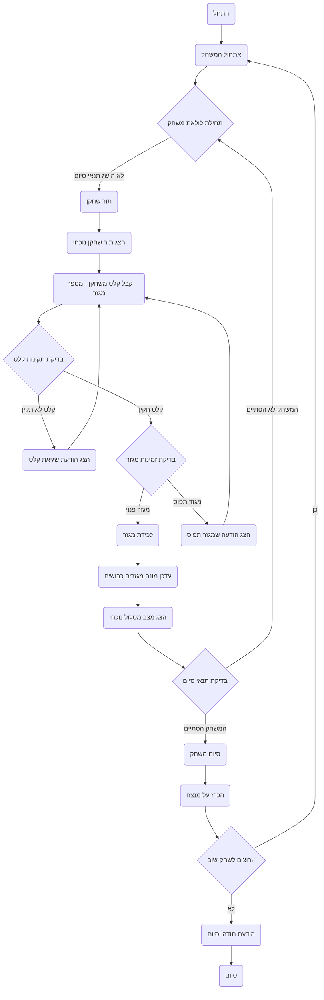

## ניתוח קוד המשחק "Orbit"

### <algorithm>

1.  **אתחול המשחק**:
    *   הדפסת הודעת פתיחה והסבר על כללי המשחק.
        *   דוגמה: "ברוכים הבאים ל-ORBIT! עליכם לכבוש כמה שיותר מגזרים במסלול סביב הכוכב."
    *   יצירת מסלול משחק המורכב מ-12 מגזרים. כל מגזר מסומן כפנוי בשלב זה.
    *   הגדרת תור השחקנים (שחקן 1 ושחקן 2).
    *   הגדרת מונה מקסימלי של סיבובים (למשל, 20).

2.  **לולאת המשחק הראשית**:
    *   כל עוד לא הושג תנאי סיום (אחד השחקנים כבש רוב מגזרים או הושג מספר הסיבובים המקסימלי):
        *   **תור שחקן**:
            *   הצגת תור השחקן הנוכחי.
                *   דוגמה: "תור שחקן 1."
            *   קבלת קלט מהשחקן - מספר מגזר אותו הוא מעוניין לכבוש (בין 1 ל-12).
                *   דוגמה: "הכנס מספר מגזר (1-12):"
            *   **בדיקת תקינות קלט**:
                *   בדיקה שהקלט הוא מספר בטווח הנכון. אם לא, הדפסת הודעת שגיאה ובקשה לקלט מחדש.
                    *   דוגמה: "קלט לא תקין, אנא הכנס מספר בין 1 ל-12."
                *   בדיקה האם המגזר שנבחר פנוי.
            *   **לכידת מגזר**:
                *   אם המגזר פנוי, סימון המגזר כשייך לשחקן הנוכחי.
                    *   דוגמה: "מגזר 5 נכבש על ידי שחקן 1."
                *   עדכון מונה המגזרים שנכבשו על ידי השחקן הנוכחי.
                *   אם המגזר תפוס, הדפסת הודעה לשחקן לבחור מגזר אחר.
                     *   דוגמה: "מגזר זה תפוס, אנא בחר מגזר אחר."
            *  הצגת מצב המסלול הנוכחי.
                *   דוגמה:
                    ```
                      מצב המסלול הנוכחי:
                      מגזר 1: שחקן 1
                      מגזר 2: שחקן 2
                      מגזר 3: פנוי
                      ...
                    ```
        *   **בדיקת תנאי סיום**:
            *   בדיקה האם אחד השחקנים כבש יותר ממחצית המגזרים.
            *   בדיקה האם הושג מספר הסיבובים המקסימלי.

3.  **סיום המשחק**:
    *   הכרזה על המנצח בהתאם לתנאי הסיום שהושג.
        *   דוגמה: "המשחק הסתיים! שחקן 1 ניצח עם 7 מגזרים כבושים."
    *   שאלה האם השחקנים רוצים לשחק שוב.
    *   אם "כן", חזרה לשלב 1.
    *   אם "לא", סיום המשחק והדפסת הודעת תודה.

### <mermaid>



### <explanation>

*   **ייבואים (Imports)**:
    *   אין ייבוא מפורש בקוד התאורי הזה. יישום בפועל בשפת תכנות (כגון פייתון) עשוי לכלול ייבוא של מודולים סטנדרטיים (כגון `random` או `time`) או מודולים חיצוניים.
*   **מחלקות (Classes)**:
    *   אין שימוש במחלקות בקוד התאורי. אם המשחק ימומש בפייתון או בשפה אחרת מונחית עצמים, ייתכן שיהיו מחלקות לייצוג של שחקנים, המסלול, והמגזרים.
*   **פונקציות (Functions)**:
    *   הקוד התאורי מתאר את לוגיקת המשחק כסדרת צעדים, ולא כפונקציות מפורשות. במימוש בפועל, יהיו מספר פונקציות, למשל:
        *   `initialize_game()`: מאתחלת את המשחק, יוצרת את המסלול, מגדירה את השחקנים, ומאפסת את המונים.
        *   `display_game_rules()`: מציגה את חוקי המשחק.
        *   `get_player_input()`: מקבלת קלט משחקן ומבצעת עליו ולידציה (בדיקה שהקלט תקין).
        *   `capture_sector(player, sector)`: מעדכנת את סטטוס המגזר כ"תפוס" ומקצה אותו לשחקן.
        *   `display_orbit_status()`: מציגה את המצב הנוכחי של המסלול.
        *   `check_game_end()`: בודקת האם תנאי הסיום הושגו.
        *   `announce_winner()`: מכריזה על המנצח.
        *   `play_again()`: שואלת את השחקנים האם הם רוצים לשחק שוב.
*   **משתנים (Variables)**:
    *   `orbit`: רשימה או מערך המייצגים את המסלול, כאשר כל איבר מייצג מגזר ומכיל את זהותו של השחקן שכבש אותו (או "פנוי").
    *   `players`: רשימה או מערך המכילים מידע על השחקנים (למשל, מספר שחקן או שם, מספר מגזרים כבושים).
    *   `current_player`: משתנה שמציין את תורו של איזה שחקן כרגע.
    *   `max_turns`: מספר הסיבובים המקסימלי המותר במשחק.
    *   `sectors_per_player`: מערך שמייצג את מספר המגזרים שנכבשו על ידי כל שחקן.

*   **בעיות אפשריות ושיפורים**:
    *   **טיפול בשגיאות**: הקוד צריך לטפל בשגיאות קלט בצורה טובה יותר (למשל, אם השחקן מכניס טקסט במקום מספר).
    *   **ממשק משתמש**: ממשק משתמש טקסטואלי הוא בסיסי; אפשר לשפר את הממשק על ידי שימוש בממשק גרפי.
    *   **מורכבות**: משחק בסיסי אך ניתן להוסיף לו מורכבות:
        *   אפשרות "לכבוש מחדש" מגזר שכבר נכבש על ידי יריב, מה שמוסיף אלמנט אסטרטגי.
        *   אפשרות לשחק נגד מחשב ברמת קושי משתנה.
        *   הוספת כוח מיוחד למגזרים, או מגזרים מיוחדים.

*   **שרשרת קשרים עם חלקים אחרים בפרויקט**:
    *   אם קוד המשחק הזה הוא חלק מפרויקט גדול יותר, הוא עשוי לקיים אינטראקציה עם:
        *   מודולים של ממשק משתמש גרפי (GUI).
        *   מודול המטפל בחיבור לרשת למשחק מרובה משתתפים.
        *   מודול המטפל בבינה מלאכותית למשחק נגד המחשב.
        *   מערכת ניהול תוכן (CMS) ליצירת משחקים מותאמים אישית.