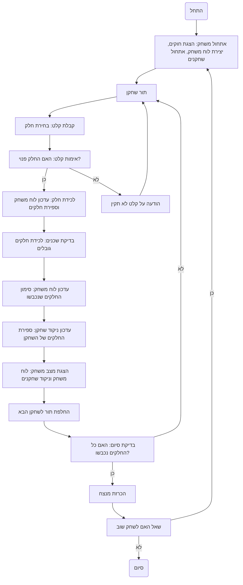

## ניתוח קוד: משחק פיצה

### 1. <algorithm>

1. **התחלת המשחק:**
   - הצג הודעת פתיחה והסבר על חוקי המשחק.
   - צור ייצוג לוח משחק הפיצה (8 חלקים).
   - אתחל משתנים לניהול שחקנים (2 שחקנים), מספר החלקים שכל שחקן לקח ומי השחקן הנוכחי.

   *דוגמה:*
   ```
   הודעת פתיחה: "ברוכים הבאים למשחק פיצה!..."
   לוח משחק: [0, 0, 0, 0, 0, 0, 0, 0] (0 = חלק פנוי)
   שחקן 1: 0 חלקים, שחקן 2: 0 חלקים, תור: שחקן 1
   ```
2. **לולאת משחק:**
   - כל עוד יש חלקים פנויים:
      - תור השחקן הנוכחי:
         - בקש מהשחקן להזין את מספר החלק שהוא רוצה לקחת (1-8).
         - בדוק אם החלק פנוי. אם לא, בקש מהשחקן לבחור חלק אחר.
         - אם החלק פנוי, סמן את החלק כשייך לשחקן הנוכחי.
         - בדוק אם החלק שנבחר גובל בחלקים שכבר נכבשו על ידי השחקן. אם כן, קח את כל החלקים הגובלים.
         - עדכן את מונה החלקים של השחקן הנוכחי.
         - הצג את מצב לוח המשחק הנוכחי ואת כמות החלקים של כל שחקן.
         - החלף את התור לשחקן הבא.

   *דוגמה:*
   ```
   שחקן 1 בוחר חלק 3: לוח משחק [0, 0, 1, 0, 0, 0, 0, 0]
   שחקן 1: 1 חלק, שחקן 2: 0 חלקים
   תור: שחקן 2
   שחקן 2 בוחר חלק 4: לוח משחק [0, 0, 1, 2, 0, 0, 0, 0]
   שחקן 1: 1 חלק, שחקן 2: 1 חלק
   תור: שחקן 1
   שחקן 1 בוחר חלק 2: לוח משחק [0, 1, 1, 2, 0, 0, 0, 0]
   שחקן 1: 2 חלקים, שחקן 2: 1 חלק
   תור: שחקן 2
   ```
3. **סיום המשחק:**
   - לאחר שכל החלקים נכבשו, הכרז על המנצח (השחקן עם הכי הרבה חלקים).
   - שאל אם השחקנים רוצים לשחק שוב. אם כן, חזור לצעד 1.

   *דוגמה:*
   ```
   "המשחק נגמר! שחקן 1 ניצח עם 5 חלקים!"
   "האם לשחק שוב? (כן/לא)"
   ```
4. **זרימת נתונים:**
   - קלט: מספר החלק שנבחר (מ-1 עד 8).
   - פלט: לוח משחק מעודכן, ספירת חלקים של כל שחקן, הודעה על השחקן המנצח.
   - נתונים המועברים בין שלבים: לוח משחק, ספירת חלקים, תור השחקן הנוכחי.

### 2. <mermaid>



אין תלויות מיובאות עבור הקוד הזה. התרשים מתאר את הלוגיקה של המשחק: הוא מתחיל באתחול המשחק, ממשיך בלולאה של תורות שחקן, בדיקת קלט, לכידת חלקים, בדיקת סיום המשחק והכרזת המנצח. התרשים מציג בצורה ברורה את כל הפעולות השונות ואת זרימת השליטה ביניהן. כל משתנה בתרשים בעל משמעות, כגון "אתחול משחק", "תור שחקן", "קבלת קלט", "בדיקת סיום" וכן הלאה.

### 3. <explanation>

**ייבואים (Imports)**
- אין ייבואים בקוד הזה מכיוון שהוא תיאור טקסטואלי של המשחק, ולא קוד ממשי. אם היה קוד, היינו מצפים לראות ייבוא של ספריות רלוונטיות (למשל, `random` לערבוב חלקים או `graphics` לגרפיקה).

**מחלקות (Classes)**
- אין מחלקות בקוד הזה, מכיוון שהוא מציג תיאור של משחק ולא מימוש קוד בפועל. בקוד ממשי, היינו יכולים לצפות למחלקות כמו `PizzaBoard`, `Player`, `GameManager`. המחלקות היו אחראיות לאחסון מצב המשחק, ניהול שחקנים וביצוע לוגיקת המשחק.

**פונקציות (Functions)**
- בקוד הזה אין פונקציות. אם היה קוד, היינו יכולים למצוא פונקציות כמו `init_game()`, `player_turn()`, `validate_input()`, `capture_piece()`, `update_board()`, `update_score()`, `check_end()`, `declare_winner()`.
   - `init_game()` - אתחול המשחק.
   - `player_turn()` - לביצוע תור שחקן.
   - `validate_input()` - לאימות שהקלט של השחקן תקין.
   - `capture_piece()` - לתפיסת חלק ועדכון הלוח.
   - `update_board()` - לעדכון לוח המשחק.
   - `update_score()` - לעדכון ניקוד השחקן.
   - `check_end()` - לבדיקה האם המשחק הסתיים.
   - `declare_winner()` - להכרזה על המנצח.

**משתנים (Variables)**
- אין הגדרה מפורשת של משתנים, אבל ניתן להסיק את קיומם מתוך תיאור התהליך:
    - `pizza_board`: מערך או רשימה שמייצגים את לוח המשחק (לדוגמה: `[0, 0, 0, 0, 0, 0, 0, 0]` - כאשר 0 מייצג חלק פנוי ו- 1, 2 וכו' מייצגים חלק שנכבש על ידי שחקן).
    - `player1_score`: מספר החלקים ששחקן 1 תפס.
    - `player2_score`: מספר החלקים ששחקן 2 תפס.
    - `current_player`: מציין איזה שחקן משחק כעת.
    - `input_piece`: הקלט של השחקן (מספר החלק).

**בעיות אפשריות ותחומים לשיפור**
1. **אימות קלט:**
   - הקוד מציין שצריך לבדוק אם הקלט של השחקן הוא בטווח הנכון (1-8) ושהחלק פנוי.
2. **לוגיקת לכידה:**
   - הקוד מזכיר את לכידת החלקים הגובלים, אך לא מפרט בדיוק את האלגוריתם. יש צורך לוודא שאלגוריתם זה מיושם נכון.
3. **ממשק משתמש:**
    - הקוד לא כולל ממשק גרפי. אפשר לשפר זאת בעזרת ספרייה גרפית כמו `pygame`.
4. **שיפורי משחק:**
   - ניתן להוסיף אופציות מתקדמות כמו אפשרות לתקוף חלקים של היריב, אפשרות לשחק נגד המחשב.
5. **ארגון קוד:**
   - בקוד אמיתי, מומלץ לחלק את הקוד לפונקציות כדי לשפר את הקריאות והתחזוקה.

**שרשרת קשרים**
- הקוד יכול להיות חלק ממערכת משחקי AI.
- הוא יכול להיות קשור למערכת ניהול משחקים של פרויקט גדול יותר, כאשר קיימות מחלקות ושירותים לניהול שחקנים, ניקוד, והצגת גרפיקה.
- קוד זה יכול להיות מקושר גם למערכת המשתמשת ב-API לפעולות משחק מורכבות.