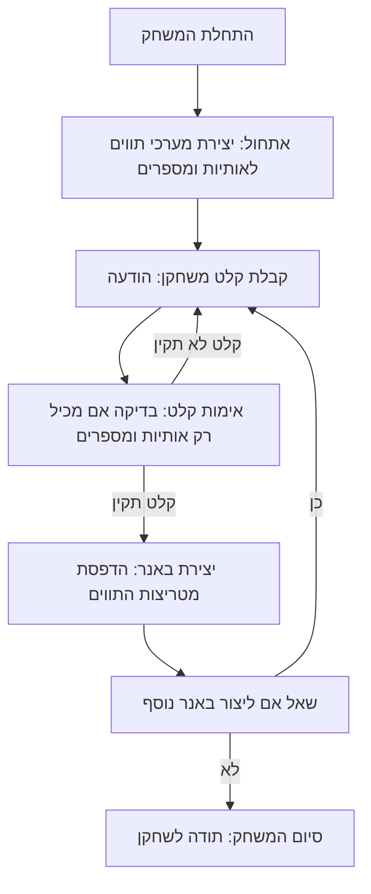

## <algorithm>
1. **אתחול משחק:**
   - הגדר מערכי תווים עבור כל אות באלף-בית (A-Z) וספרות (0-9).
     - לדוגמה, `A` יכולה להיות מיוצגת על ידי:
       ```
       *   *
       *   *
       *****
       *   *
       *   *
       ```
     - כל אות מיוצגת כמטריצת תווים (למשל, 5 שורות על 5 עמודות).
2. **לולאה ראשית של המשחק:**
   - בקש מהשחקן להזין הודעה.
     - לדוגמה, `HELLO`.
   - עבור כל אות בהודעה:
     - מצא את מטריצת התווים המתאימה.
       - לדוגמה, עבור `H`, מטריצה מתאימה תוחזר.
     - עבור כל שורה במטריצת התווים:
       - הדפס את השורה.
       - הוסף רווחים בין האותיות.
   - לאחר שהודפס הבאנר, שאל את השחקן האם הוא מעוניין ליצור באנר נוסף.
   - אם התשובה חיובית, חזור ללולאה הראשית.
   - אחרת, סיים את המשחק.
3. **עיבוד קלט שחקן:**
   - וודא שהקלט מכיל רק אותיות וספרות (ללא רווחים או תווים מיוחדים).
   - אם הקלט לא תקין, בקש מהשחקן להזין שוב.
4. **יצירת באנר:**
   - עבור כל אות בהודעה, מצא את מטריצת התווים המתאימה.
   - הדפס כל שורה של מטריצת התווים עבור כל האותיות בהודעה.
   - הוסף רווחים בין האותיות כדי שהקריאות תהיה טובה יותר.
5. **סיום המשחק:**
   - לאחר הצגת הבאנר, שאל את השחקן אם הוא רוצה ליצור עוד באנר.
   - אם כן, חזור לתחילת הלולאה, אחרת, סיים את המשחק.

## <mermaid>


## <explanation>
**ייבואים (Imports):**
אין ייבוא מפורש בקוד שסופק. הקוד מתאר את הלוגיקה של המשחק, לא מימוש קוד ספציפי. במימוש בפועל, ייתכן שיהיה צורך לייבא ספריות מסוימות, כמו למשל ספריות לטיפול בקלט/פלט, או ספריות גרפיות להצגת הבאנר באופן ויזואלי יותר, אך אלה לא מופיעים כאן.

**מחלקות (Classes):**
אין מחלקות מוגדרות בקוד. הקוד מתאר אלגוריתם ללא מימוש אובייקטי. בפועל, ניתן לממש את הלוגיקה בתוך פונקציות או בתוך מחלקה שמייצגת את המשחק.

**פונקציות (Functions):**
הקוד לא כולל פונקציות מוגדרות, אלא מתאר את הלוגיקה צעד אחר צעד. בפועל, פונקציות יכולות להיות:
   - `initialize_banner_chars()` - לאתחול מטריצות התווים עבור כל אות ומספר.
   - `get_player_input()` - לקבל קלט מהשחקן.
   - `validate_input(input)` - לבדוק אם הקלט תקין.
   - `create_banner(message)` - ליצור ולהדפיס את הבאנר על בסיס הודעה.
   - `ask_play_again()` - לשאול את השחקן האם הוא רוצה לשחק שוב.

**משתנים (Variables):**
משתנים עיקריים יהיו:
   - `banner_chars` - מערך או מילון שמכיל את מטריצות התווים עבור כל אות ומספר.
   - `message` - הקלט של השחקן (טקסט).
   - `play_again` - תשובה של השחקן אם הוא רוצה לשחק שוב (בוליאני או טקסט).
   - `rows` - משתנה ללולאה שמדפיסה שורות של מטריצות תווים

**בעיות אפשריות ושיפורים:**
   - **טיפול בתווים לא תקינים:** כרגע, הקוד מציין רק שעל הקלט להכיל אותיות ומספרים, אך אין טיפול מפורש בתווים אחרים. צריך להוסיף לוגיקה לטיפול במקרה של תו שאינו חלק ממערך האותיות המוגדר.
   - **קריאות קוד:** ניתן להוסיף פונקציות כדי לפצל את הקוד לחלקים קטנים וקריאים יותר.
   - **אינטראקציה עם משתמש:** ההודעות למשתמש אינן ברורות מספיק. צריך לשפר את ההודעות ואת ממשק המשתמש.
   - **גמישות:** יש להוסיף אפשרות למשתמש לבחור את הגודל של האותיות (למשל, 5X5, 7X7, וכו'), ואת התווים שמרכיבים אותן.

**קשרים עם חלקים אחרים בפרויקט:**
המשחק הזה הוא משחק בפני עצמו, ואינו תלוי בחלקים אחרים בפרויקט. עם זאת, הוא יכול להיות חלק מחבילה גדולה יותר של משחקי AI, וניתן ליצור ממשק משותף לקלט ופלט של כל המשחקים.