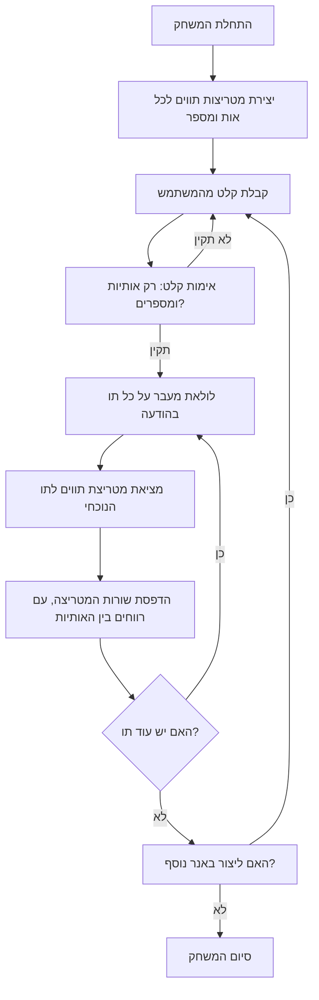

## <algorithm>

1. **התחלת המשחק:**
   - יצירת מערכים דו-ממדיים של תווים עבור כל אות (A-Z) ומספר (0-9). לדוגמה, האות "A" יכולה להיות מיוצגת על ידי מטריצה של תווי כוכבית (`*`) ורווחים.
   ```
     A:
     *
    * *
   *****
  *     *
 *       *
   ```

2. **לולאה ראשית:**
   - בקשה מהמשתמש להזין הודעה ליצירת הבאנר.
   - בדיקה שהקלט מכיל רק אותיות ומספרים (ללא רווחים ותווים מיוחדים).
      - אם הקלט לא תקין, בקש מהמשתמש להזין שוב.
   - לכל תו בהודעה:
      - מציאת המטריצה המתאימה של התווים עבור התו הנוכחי.
      - הדפסת כל שורה של המטריצה, כאשר מתווספים רווחים בין האותיות כדי לשפר את הקריאות.
   - שאלה את המשתמש אם הוא רוצה ליצור באנר נוסף.
     - אם כן, חזור לשלב 2.
     - אם לא, סיום המשחק.

3. **דוגמה לזרימת נתונים:**
   - **קלט:** המשתמש מזין את המילה "HELLO".
   - **עיבוד:**
     - המערכת מחפשת את המטריצות של התווים עבור H, E, L, L, O.
     - כל שורה של המטריצות מודפסת, כאשר בין האותיות מתווספים רווחים.
   - **פלט:**
   ```
   H   H EEEEE L     L     OOOO
   H   H E     L     L     O    O
   HHHHH EEEEE L     L     O    O
   H   H E     L     L     O    O
   H   H EEEEE LLLLL LLLLL OOOO
   ```

## <mermaid>


## <explanation>

**1. ייבואים (Imports):**
   - בקוד זה אין ייבוא של חבילות חיצוניות. כל הפונקציונליות נכללת בתוך הקוד עצמו.

**2. מחלקות (Classes):**
   - אין שימוש במחלקות בקוד זה.

**3. פונקציות (Functions):**
   - אין פונקציות מוגדרות בקוד זה. הפונקציונליות של המשחק ממומשת ישירות בלולאה הראשית.

**4. משתנים (Variables):**
   - לא מוגדרים משתנים גלובליים. המשתנים (לדוגמה, הודעת הקלט מהמשתמש, מטריצות התווים) מנוהלים באופן מקומי בלולאה.

**הסברים נוספים:**

- **מטריצות תווים:**
   - המטריצות הן מבני נתונים המאחסנים את התווים שמרכיבים כל אות ומספר. לדוגמה, מטריצה לייצוג האות "A" תהיה מטריצה דו-ממדית של תווים כגון כוכבית ורווחים.
   - כל אות מיוצגת על ידי מערך דו-ממדי שמתאר את צורתה בפורמט טקסטואלי.

- **אימות קלט:**
   - שלב האימות חשוב כדי לוודא שהקלט מהמשתמש מכיל רק תווים שניתן לייצג כבאנר, כלומר אותיות ומספרים.

- **לולאה ראשית:**
   - הלולאה הראשית שולטת בכל זרימת המשחק, מבקשת קלט, מעבדת אותו ומדפיסה את הבאנר.

- **בעיות אפשריות ושיפורים:**
    - הקוד יכול להיות יותר מודולרי אם יחולק לפונקציות. למשל, פונקציה ליצירת מטריצות האותיות, פונקציה לאימות קלט ופונקציה להדפסת הבאנר.
    - הקוד כרגע תומך רק באותיות ומספרים. אפשר להרחיב את התמיכה כך שתכלול גם תווים מיוחדים או סמלים.
    - ניתן לשפר את עיצוב הבאנר, לדוגמה להוסיף אפשרויות נוספות כמו שינוי סוג התווים שמרכיבים את האותיות.

**שרשרת קשרים עם חלקים אחרים בפרויקט:**
- קוד זה עומד בפני עצמו ולא תלוי בקבצים אחרים בפרויקט. עם זאת, ניתן להשתמש בקוד זה כחלק ממשחק גדול יותר, לדוגמה, משחק שבו המשתמש יכול ליצור בבאנרים למטרות שונות.