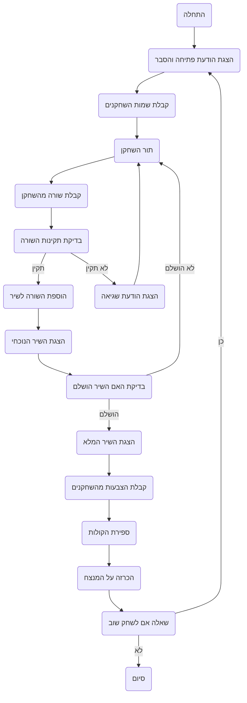

## ניתוח קוד המשחק "POETRY"

### 1. <algorithm>

המשחק "POETRY" הוא משחק יצירת שירה שבו שחקנים מוסיפים שורות לסירוגין עד לסיום השיר.
להלן תרשים הזרימה של תהליך המשחק:

1.  **התחלה:**
    *   הצג הודעת פתיחה והסבר על כללי המשחק.
        *   דוגמה: "ברוכים הבאים למשחק POETRY! הוסיפו שורות לסירוגין ליצירת שיר."
    *   קבל את שמות השחקנים.
        *   דוגמה: "הכנס את שם השחקן הראשון: אליס", "הכנס את שם השחקן השני: בוריס"

2.  **לולאת משחק:**
    *   לכל שחקן, בתורו:
        *   בקש מהשחקן להכניס שורה.
            *   דוגמה: "אליס, תורך. הכניסי שורה:"
        *   בדוק האם השורה תואמת את הכללים (אורך, חריזה, נושא).
            *   דוגמה: בדיקה אם אורך השורה קצר מ-50 תווים.
        *   אם השורה תואמת את הכללים, הוסף אותה לשיר.
            *   דוגמה: השורה "עץ עומד ביער" מתווספת לרשימת השורות.
        *   אם השורה לא תואמת, הצג הודעת שגיאה ובקש מהשחקן לנסות שוב.
            *   דוגמה: "השורה לא עומדת בכללים. נסי שוב."
        *   הצג את השיר הנוכחי.
            *   דוגמה:
              ```
              השיר הנוכחי:
              1. עץ עומד ביער,
              2. שמש זורחת בשמיים.
              ```
    *   בדוק האם השיר הושלם (מספר השורות הנדרש).
        *   דוגמה: אם צריך 4 שורות והגיעו ל-4, השיר הושלם.
    *   אם השיר לא הושלם, חזור לתחילת הלולאה.

3.  **סיום השיר:**
    *   הצג את השיר המלא.
        *   דוגמה:
          ```
          השיר המלא:
          1. עץ עומד ביער,
          2. שמש זורחת בשמיים,
          3. ציפור מצייצת בשמחה,
          4. רוח נושבת בעדינות.
          ```
    *   בקש מהשחקנים להצביע לשורה הטובה ביותר.
        *   דוגמה: "הצביעו לשורה הטובה ביותר (הכניסו את מספר השורה)"
    *   ספור את הקולות לכל שורה.
        *   דוגמה: שורה 1 קיבלה 2 קולות, שורה 2 קיבלה 0.
    *   הכרז על המנצח (השורה שקיבלה הכי הרבה קולות).
        *   דוגמה: "המנצח הוא שורה 1: 'עץ עומד ביער'!"

4.  **משחק חוזר:**
    *   שאל את השחקנים אם הם רוצים לשחק שוב.
        *   דוגמה: "האם תרצו לשחק שוב? (כן/לא)"
    *   אם כן, חזור להתחלה.
    *   אם לא, הצג הודעת סיום תודה.
        *   דוגמה: "תודה ששיחקתם!"

זרימת הנתונים:
*   קלט משמות השחקנים ושורות השיר מהמשתמש.
*   רשימת השורות מתעדכנת בכל הוספה של שורה.
*   קולות השחקנים נקלטות לאחר השלמת השיר.
*   התוצאות מוצגות למשתמש בסוף המשחק.

### 2. <mermaid>

**ניתוח תלויות:**

אין תלויות יבוא בסיסיות מכיוון שהקוד הזה אינו קוד של ממש, אלא תיאור של לוגיקה המשחק. התרשים `mermaid` מציג את זרימת הפעולות של המשחק. אין תלויות נוספות לתרשים זה.

### 3. <explanation>

**ייבואים (Imports):**

בתיאור הקוד הזה אין שימוש בייבוא. הוא מתאר את הלוגיקה של המשחק ברמה גבוהה ואין בו קוד ממשי. לכן אין כאן ייבוא של ספריות או מודולים.

**מחלקות (Classes):**

אין מחלקות בתיאור הקוד הזה. ביישום של המשחק בפועל, ייתכן שימוש במחלקות כדי לארגן את הקוד (למשל מחלקה לניהול שחקנים, מחלקה לניהול שיר).

**פונקציות (Functions):**

בתיאור זה, לא מופיעות פונקציות ספציפיות. ביישום של המשחק בפועל, יהיו פונקציות למטרות הבאות:

*   `init_game()`: לאתחל את המשחק, להציג הודעות פתיחה ולקבל שמות שחקנים.
*   `get_player_input(player_name)`: לקבל שורה משחקן ספציפי.
*   `validate_line(line)`: לבדוק אם השורה תקינה לפי כללי המשחק.
*   `add_line_to_poem(line)`: להוסיף את השורה לרשימת שורות השיר.
*   `display_poem()`: להציג את השיר הנוכחי.
*   `is_poem_complete()`: לבדוק האם השיר הושלם.
*   `get_votes()`: לקבל הצבעות מהשחקנים.
*   `count_votes()`: לספור את הקולות.
*   `declare_winner()`: להכריז על המנצח.
*   `play_again()`: לשאול אם השחקנים רוצים לשחק שוב.

**משתנים (Variables):**

*   `players` (רשימה): רשימה של שמות השחקנים.
*   `poem_lines` (רשימה): רשימה של שורות השיר.
*   `current_player` (מחרוזת): שם השחקן הנוכחי.
*   `votes` (מילון): מילון המכיל את ההצבעות (מספר שורה כמפתח, מספר קולות כערך).
*   `num_lines` (מספר): מספר השורות הרצוי בשיר.
*   `line` (מחרוזת): השורה הנוכחית שהוכנסה על ידי השחקן.

**בעיות אפשריות ותחומים לשיפור:**

*   **בדיקת חוקים:** בדיקת החוקים (חריזה, נושא) לא מפורטת כאן ודורשת יישום נוסף.
*   **טיפול בשגיאות:** יש צורך בטיפול בשגיאות בסיסיות, למשל, אם השחקן מכניס מספר שאינו חוקי בהצבעה.
*   **ממשק משתמש:** יש לשקול להוסיף ממשק משתמש גרפי (GUI) כדי להפוך את המשחק לידידותי יותר.
*   **אפשרות מול מחשב:** יש להוסיף אפשרות לשחק מול המחשב כדי לאפשר לשחקן יחיד לשחק.
*   **בחירת נושא:**  יש לתת לשחקנים אפשרות לבחור נושא לשיר.

**קשרים עם חלקים אחרים בפרויקט:**

בשלב זה, אין קשרים עם חלקים אחרים בפרויקט מכיוון שמדובר בתיאור של משחק ללא קוד קונקרטי. במידה והקוד ייושם, יהיו קשרים עם מודולים אחרים בפרויקט, למשל, מודולים האחראים על ניהול משחקים, שמירת נתונים וכו'.

בסיכום, הקוד מתאר את המשחק "POETRY" בצורה מפורטת הכוללת את שלבי המשחק, חוקים והדגמות. יש צורך להוסיף קוד ממשי כדי ליישם את המשחק.