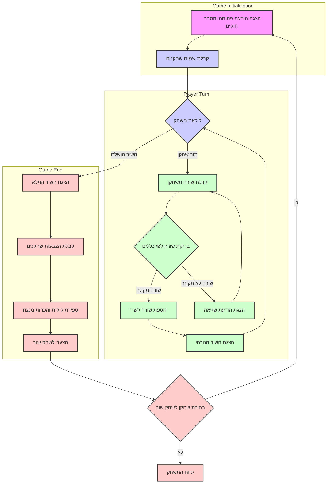

## ניתוח קוד: משחק "POETRY"

### <algorithm>
1. **התחלת המשחק:**
   - הצגת הודעת פתיחה והסבר על חוקי המשחק.
   - קבלת שמות השחקנים.

2. **לולאת משחק:**
   - כל שחקן בתורו מוסיף שורה לשיר.
   - בדיקה:
     - האם השורה עומדת בכללים (אורך, חרוז, נושא)?
     - אם לא, מוצגת הודעת שגיאה והשחקן מנסה שוב.
   - הצגת השיר הנוכחי.
   - סיום הלולאה כאשר השיר הושלם (למשל, 4 שורות).

3. **סיום משחק:**
   - הצגת השיר המלא.
   - הצבעה: כל שחקן מצביע לשורה המועדפת עליו.
   - ספירת קולות והכרזת המנצח.
   - שחקן יכול לבחור לשחק שוב.

**דוגמאות:**

- **התחלה:**
    - הודעה: "ברוכים הבאים לPOETRY! כל שחקן מוסיף שורה לשיר."
    - קלט: שמות שחקנים "אליס" ו"בוב".
- **מהלך שחקן:**
    - קלט: שורה "הירח זורח בשמים".
    - בדיקה: האם השורה תקינה? (כן)
    - עדכון: הוספת השורה לשיר.
- **סיום:**
   - הצגת שיר: "הירח זורח בשמים, הכוכבים נוצצים בלילה..."
    - קלט: הצבעות "1, 2"
    - פלט: הכרזת מנצח - בהתאם לספירת הקולות.

**זרימת נתונים:**
1. קלט שמות שחקנים -> משתנה שמות שחקנים
2. קלט שורה -> בדיקה -> הוספה לרשימת שורות השיר
3. רשימת שורות השיר -> הצגה
4. רשימת שורות השיר -> קלט הצבעות -> ספירת קולות -> הכרזת מנצח

### <mermaid>

אין תלויות מיובאות מכיוון שהתיאור הוא תיאור אלגוריתמי ולא קוד ממשי. התרשים ממחיש את זרימת העבודה של המשחק, החל מאתחול ועד סיום, דרך קבלת קלט, בדיקות ועדכון סטטוס המשחק.

### <explanation>

**ייבואים (Imports):**

אין ייבוא נדרש בקוד זה, מכיוון שהוא תיאור אלגוריתמי בלבד. במימוש בפועל, יהיה צורך לייבא מודולים לטיפול בקלט/פלט, ניהול נתונים וכו'.

**מחלקות (Classes):**

אין שימוש במחלקות בתיאור האלגוריתם. אם היינו מממשים את הקוד בפועל, היינו יכולים ליצור מחלקות כמו `Player` לייצוג שחקן, `Poem` לייצוג השיר, וכו'.

**פונקציות (Functions):**

התיאור מתאר פעולות שיכולות להיות ממומשות כפונקציות:

- `initialize_game()`: תפקידה לאתחל את המשחק, לקבל שמות שחקנים ולהציג את חוקי המשחק.
- `player_turn(player_name, poem)`: מקבלת שם שחקן ורשימת השורות הנוכחית של השיר, מאפשרת לשחקן להוסיף שורה, בודקת את תקינותה ומעדכנת את השיר.
- `check_line(line, poem)`: מקבלת שורה ורשימת השורות הנוכחית של השיר ובודקת את תקינותה לפי חוקי המשחק. מחזירה `True` אם השורה תקינה ו-`False` אחרת.
- `display_poem(poem)`: מקבלת רשימת שורות של השיר ומציגה אותן למשתמש.
- `finish_game(poem)`: מקבלת את השיר המלא, מאפשרת הצבעה לשורות, סופרת קולות ומכריזה על המנצח.
- `play_again()`: שואלת אם רוצים לשחק שוב, ומחזירה `True` או `False` בהתאם.

**משתנים (Variables):**

- `players`: רשימה של שמות השחקנים.
- `poem`: רשימה של שורות השיר.
- `current_player`: שם השחקן הנוכחי.
- `line`: שורה שהשחקן מכניס.
- `votes`: רשימה של הצבעות שחקנים.
- `winner`: שם השחקן המנצח.

**בעיות אפשריות ותחומים לשיפור:**

1. **בדיקות תקינות שורה:** האלגוריתם דורש מנגנון לבדיקת תקינות השורה (לדוגמה, חרוז, אורך, נושא). אפשר לממש בדיקות אלו בפונקציה נפרדת, אשר תהיה קלה להתאמה לשינויים.
2. **ממשק משתמש:** התיאור אינו מפרט את ממשק המשתמש (GUI). יש לשפר את הממשק כך שיהיה ידידותי למשתמש.
3. **ניהול שגיאות:** יש לשפר את הטיפול בשגיאות, למשל במקרה של קלט שגוי מהמשתמש.
4. **משחק נגד מחשב:** התיאור מזכיר אפשרות למשחק נגד המחשב, אבל לא מפרט כיצד לממש זאת.

**שרשרת קשרים עם חלקים אחרים בפרויקט:**

- האלגוריתם הזה יכול לשמש כחלק ממשחק גדול יותר (לדוגמה, אוסף של משחקי מילים).
- פונקציות של טיפול בקלט/פלט (GUI/CLI) יכולות לשמש את המשחק הזה.
- ניתן לשלב מערכת ניהול שחקנים וניקוד מכל הפרויקט.

ניתוח זה מספק מבט מעמיק על האלגוריתם של המשחק POETRY, ומסביר את הפונקציונליות שלו, כולל אפשרויות לשיפור ואינטראקציה עם חלקים אחרים בפרויקט.