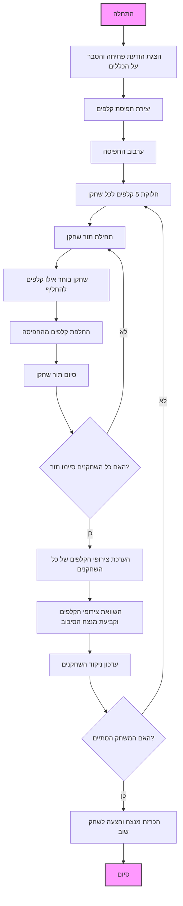

## <algorithm>

1.  **הצגת הודעת פתיחה והסבר על הכללים**:
    *   המשחק מתחיל בהודעת פתיחה למשתמש ומסביר את חוקי המשחק.
    *   **דוגמה**: "ברוכים הבאים לפוקר! המטרה היא ליצור את צירוף הקלפים החזק ביותר מחמישה קלפים. המשחק נמשך עד שמגיע מספר סיבובים מוגדר או עד שאחד השחקנים מגיע למספר הנקודות המקסימלי. בהצלחה!"
2.  **יצירת חפיסת קלפים**:
    *   נוצרת חפיסת קלפים סטנדרטית של 52 קלפים (13 קלפים מכל סוג: לב, יהלום, תלתן, עלה).
    *   **דוגמה**: רשימה או מערך המייצג את 52 הקלפים כאשר כל קלף הוא אובייקט עם ערך וסוג (למשל, "A לב", "10 תלתן").
3.  **ערבוב החפיסה**:
    *   החפיסה מעורבבת באופן אקראי כדי להבטיח שהקלפים יחולקו בצורה לא צפויה.
    *   **דוגמה**: שימוש באלגוריתם ערבוב אקראי (כגון אלגוריתם Fisher-Yates).
4.  **חלוקת קלפים לשחקנים**:
    *   כל שחקן מקבל 5 קלפים מהחפיסה המעורבבת.
    *   **דוגמה**: חלוקת 5 קלפים ראשונים לשחקן הראשון, 5 קלפים הבאים לשחקן השני וכו'.
5.  **סיבוב המשחק**:
    *   כל שחקן בתורו יכול להחליף חלק מהקלפים שלו.
    *   **דוגמה**: שחקן בוחר את מספרי הקלפים שהוא רוצה להחליף (למשל, קלף 1 וקלף 3) ומקבל קלפים חדשים מהחפיסה.
6.  **הערכת צירופי קלפים**:
    *   לאחר שכל שחקן סיים להחליף קלפים, התוכנית מעריכה את צירופי הקלפים של כל שחקן.
    *   **דוגמה**: פונקציה שבודקת האם יש לשחקן "רויאל פלאש", "סטרייט פלאש", "ארבעה מסוג" וכו'.
7.  **השוואת צירופי הקלפים**:
    *   התוכנית משווה את צירופי הקלפים של כל השחקנים כדי לקבוע את המנצח בסיבוב הנוכחי.
    *   **דוגמה**: השוואה לפי סדר החוזק של צירופי הקלפים, כאשר "רויאל פלאש" הוא החזק ביותר ו"קלף גבוה" הוא החלש ביותר.
8.  **עדכון ניקוד**:
    *   המנצח בסיבוב מקבל נקודה, והניקוד של השחקנים מתעדכן.
    *   **דוגמה**: אם שחקן 1 ניצח בסיבוב, מוסיפים נקודה לניקוד שלו.
9.  **סיום המשחק**:
    *   המשחק נגמר כאשר אחד השחקנים מגיע למספר נקודות מוגדר מראש או כאשר מספר סיבובים מוגדר מראש הסתיים.
    *   **דוגמה**: אם הוחלט שמשחקים עד 5 נקודות, המשחק יסתיים כאשר שחקן יגיע ל-5 נקודות.
10. **הכרזת מנצח**:
    * התוכנית מכריזה על המנצח במשחק ומציעה לשחק שוב.
    *   **דוגמה**: "המשחק נגמר! המנצח הוא שחקן 1 עם 5 נקודות".

## <mermaid>

## <explanation>

*   **ייבוא (Imports):**
    *   אין ייבוא מיוחד בקוד זה כיוון שהוא מתאר את הלוגיקה של המשחק ברמת התכנון בלבד, ללא קוד ספציפי. בעת מימוש הקוד, ייתכן שיידרשו ייבוא ספריות כגון `random` לערבוב החפיסה.
*   **מחלקות (Classes):**
    *   אין שימוש במחלקות בקוד זה. יישום בפועל עשוי לכלול מחלקות עבור `Card` (קלף), `Deck` (חפיסה), `Player` (שחקן) ו-`Game` (משחק).
*   **פונקציות (Functions):**
    *   למרות שלא מוגדרות פונקציות באופן מפורש, אפשר לראות פונקציות לוגיות כגון:
        *   `create_deck()`: יוצרת חפיסת קלפים.
        *   `shuffle_deck()`: מערבבת את חפיסת הקלפים.
        *   `deal_cards(players, deck)`: מחלקת קלפים לשחקנים.
        *   `player_turn(player, deck)`: מאפשרת לשחקן להחליף קלפים.
        *   `evaluate_hand(hand)`: מעריכה את צירוף הקלפים של שחקן.
        *   `compare_hands(player1_hand, player2_hand)`: משווה בין צירופי קלפים וקובעת מנצח.
        *   `update_score(player, points)`: מעדכנת את ניקוד השחקן.
        *   `check_game_end(players)`: בודקת האם המשחק הסתיים.
        *   `declare_winner(players)`: מכריזה על המנצח.
*   **משתנים (Variables):**
    *   `players`: רשימה או מערך של שחקנים.
    *   `deck`: רשימה או מערך של קלפים.
    *   `hand`: רשימה או מערך של קלפים עבור שחקן מסוים.
    *   `score`: ניקוד של שחקן.
    *   `round`: מספר הסיבוב הנוכחי.
*   **בעיות אפשריות או תחומים לשיפור:**
    *   **אימות קלט שחקן**: יש לוודא שקלט השחקן (למשל, מספרי הקלפים להחלפה) תקין ונמצא בטווח הנכון (1-5).
    *   **ניהול מצבי שגיאה**: הטיפול במצבי שגיאה צריך להיות מובנה כך שהתוכנית לא תקרוס.
    *   **חוקים נוספים**: יש להוסיף התייחסות למקרה של תיקו, אם רלוונטי.
    *   **ממשק משתמש**: הקוד המוצג הוא תיאורי, ומימוש של ממשק משתמש יהיה צורך לגרסה מלאה.
*   **שרשרת קשרים עם חלקים אחרים בפרויקט**:
    *   הקוד הזה מהווה חלק מרכזי במשחק פוקר. הוא מתקשר עם חלקים אחרים בפרויקט באמצעות קריאה לפונקציות (למשל, להערכת צירופים או לעדכון ניקוד). הקוד הוא עצמאי ולכן אינו תלוי בחלקים אחרים.

בסיכום, הקוד הזה מציג תיאור ברור של הלוגיקה של משחק הפוקר, החל משלבי האתחול, דרך תור השחקנים, ועד לסיום המשחק. זה מהווה בסיס טוב לפיתוח של משחק פוקר מלא.