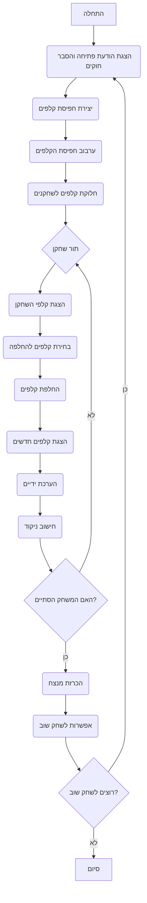

## <algorithm>

1. **הצגת הודעת פתיחה והסבר חוקים:**
   - התוכנית מציגה הודעת פתיחה למשחק פוקר ומסבירה את חוקי המשחק.
   - *דוגמה:* "ברוכים הבאים לפוקר! עליכם להרכיב את היד החזקה ביותר מחמישה קלפים..."

2. **יצירת חפיסת קלפים:**
   - התוכנית יוצרת חפיסת קלפים סטנדרטית בת 52 קלפים.
   - *דוגמה:* רשימה של כל הקלפים, לדוגמה: `['A♥', '2♥', ..., 'K♠']`.

3. **ערבוב חפיסת הקלפים:**
   - התוכנית מערבבת את חפיסת הקלפים באופן אקראי.
   - *דוגמה:* שימוש בפונקציה shuffle על רשימת הקלפים.

4. **חלוקת קלפים לשחקנים:**
   - התוכנית מחלקת 5 קלפים לכל שחקן.
   - *דוגמה:* כל שחקן מקבל רשימה של 5 קלפים מחפיסת הקלפים.

5. **תור השחקן:**
   - השחקן יכול לבחור אילו קלפים להחליף.
   - *דוגמה:* השחקן מזין מספרי קלפים, לדוגמה: "1, 3".
   - התוכנית מחליפה את הקלפים שנבחרו בקלפים חדשים מהחפיסה.
   - *דוגמה:* החלפת הקלפים במקומות 1 ו-3 בקלפים חדשים מהחפיסה.
   - התוכנית מציגה את היד החדשה של השחקן.
   - *דוגמה:* "הקלפים החדשים שלך: 10♥, K♦, 8♣, Q♠, A♥"

6. **הערכת ידיים:**
   - לאחר סבב ההחלפה, התוכנית מעריכה את היד של כל שחקן.
   - *דוגמה:* זיהוי סוג היד (רויאל פלאש, סטרייט, זוג, וכו').
    - התוכנית מציגה את סוג היד של כל שחקן.
    - *דוגמה:* "היד שלך היא סטרייט".
7. **חישוב ניקוד:**
   - התוכנית משווה בין הידיים של השחקנים וקובעת מנצח.
   - *דוגמה:* השוואה בין הצירופים לפי סדר החוזק.
   - התוכנית מעדכנת את הניקוד של השחקנים.
   - *דוגמה:* "שחקן 1: 2 נקודות, שחקן 2: 1 נקודה".

8. **סיום המשחק:**
   - המשחק מסתיים לאחר מספר סבבים או כאשר שחקן מגיע למספר נקודות מוגדר מראש.
   - *דוגמה:* המשחק נגמר כששחקן מגיע ל-5 נקודות.
   - התוכנית מכריזה על המנצח.
   - *דוגמה:* "המשחק הסתיים! שחקן 1 ניצח עם 5 נקודות".

9. **אפשרות לשחק שוב:**
   - התוכנית שואלת את השחקנים אם הם רוצים לשחק שוב.
   - *דוגמה:* "האם תרצו לשחק שוב? (כן/לא)"

## <mermaid>



## <explanation>

**ייבואים (Imports):**

אין ייבוא בסקריפט זה. הקוד מתאר תהליך לוגי של משחק ולא כולל קוד מימוש בפועל, לכן אין צורך בייבוא מודולים.

**מחלקות (Classes):**

אין מחלקות בקוד זה. הקוד מתאר את הפונקציונליות של המשחק בצורה אלגוריתמית ולא אובייקטית.

**פונקציות (Functions):**

אין פונקציות בקוד זה. הקוד מציג את זרימת הפעולות בצורה תיאורית ולא כולל מימוש של פונקציות ספציפיות.
   עם זאת,  ניתן לראות שימוש בפונקציות כגון:
      - **החלפת קלפים:** פונקציה שמקבלת את רשימת הקלפים המוחלפים ואת רשימת הקלפים החדשים, ומחזירה את רשימת הקלפים המעודכנת.
       - *דוגמה לשימוש:*
         ```python
         def החלף_קלפים(יד, אינדקסים_להחלפה, קלפים_חדשים):
            for אינדקס in אינדקסים_להחלפה:
                  יד[אינדקס] = קלפים_חדשים.pop(0)
            return יד
         ```
      - **הערכת ידיים:** פונקציה שמקבלת את היד של שחקן ומחזירה את סוג היד (רויאל פלאש, סטרייט, זוג, וכו').
       - *דוגמה לשימוש:*
        ```python
        def הערכת_יד(יד):
             # לוגיקה לזיהוי ודירוג סוגי הידיים
        ```

      -  **חישוב ניקוד:** פונקציה שמקבלת את הידיים של השחקנים ומחזירה את המנצח ואת הניקוד.
         -  *דוגמה לשימוש:*
           ```python
           def חישוב_ניקוד(יד_שחקן1, יד_שחקן2):
                 # לוגיקה להשוואת הידיים וקביעת המנצח
           ```

**משתנים (Variables):**

הקוד משתמש במשתנים שונים באופן תיאורי, אך אין הגדרה ספציפית של משתנים בקוד הזה. דוגמאות למשתנים שניתן למצוא במימוש קוד אמיתי:
-   `deck`: רשימה המכילה את הקלפים של החפיסה.
-   `players_hands`: מילון המכיל את הידיים של כל השחקנים.
-   `player_score`: מילון המכיל את הנקודות של כל שחקן.

**בעיות אפשריות או תחומים לשיפור:**

1.  **עיבוד קלט שחקן:** יש צורך לוודא שקלט השחקן (מספרי קלפים להחלפה) תקין ועומד במגבלות המשחק.
2.  **מימוש פונקציות:** יש לממש את הפונקציות להחלפת קלפים, להערכת ידיים ולחישוב ניקוד.
3.  **ממשק משתמש:** הקוד התיאורי אינו כולל ממשק משתמש. יש צורך ליצור ממשק שמאפשר לשחקנים להזין את הקלט שלהם ולקבל את תוצאות המשחק.
4. **יכולת הרחבה:** יש לאפשר להרחיב את המשחק כדי להוסיף אפשרויות משחק נוספות כמו הימורים, שחקן נגד מחשב וכו'.

**שרשרת קשרים עם חלקים אחרים בפרויקט:**

מאחר שהקוד הוא תיאור בלבד ואינו קוד מימוש, אין קשרים ישירים לחלקים אחרים בפרויקט. עם זאת, קוד מימוש בפועל עשוי להיות חלק מחבילת `ai_games` תחת  `hypotez/src/endpoints`.
הקוד הזה יהיה תלוי במודולים או ספריות לניהול קלט/פלט, גרפיקה (אם יש) וכן לוגיקה של משחק.