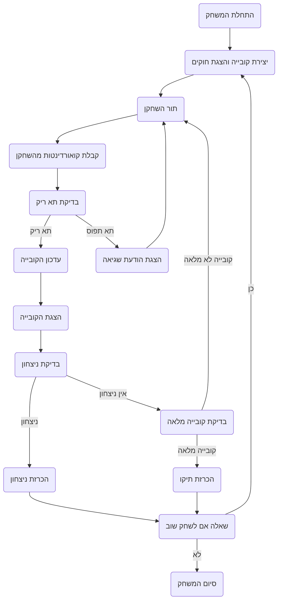

## <algorithm>
1. **התחלת המשחק:**
   - הצגת הודעת פתיחה והסבר על חוקי המשחק למשתמש.
   - יצירת קובייה תלת-ממדית בגודל 4x4x4, בה כל תא ריק בתחילה.
   - דוגמה:
     ```
     הודעת פתיחה: ברוכים הבאים לקוביק!
     ```
     קובייה: `[[[None, None, None, None], [None, None, None, None], [None, None, None, None], [None, None, None, None]], [[None, None, None, None], [None, None, None, None], [None, None, None, None], [None, None, None, None]], [[None, None, None, None], [None, None, None, None], [None, None, None, None], [None, None, None, None]], [[None, None, None, None], [None, None, None, None], [None, None, None, None], [None, None, None, None]]]`
2. **מהלך המשחק:**
   - תור השחקן:
      - קבלת קואורדינטות (X, Y, Z) מהשחקן.
      - בדיקה אם התא ריק:
          - אם התא ריק: סימון התא בסמל השחקן (X או O).
          - אם התא תפוס: הצגת הודעת שגיאה ובקשה לניסיון נוסף.
      - דוגמה:
          - קלט שחקן: `(1, 1, 1)`
          - בדיקת תא: `cube[0][0][0] == None`
          - עדכון קובייה: `cube[0][0][0] = 'X'`
      - הצגת מצב הקובייה הנוכחי למשתמש.
   - בדיקת ניצחון:
      - בדיקה אם שחקן יצר קו של ארבעה סמלים זהים:
         - במישור אופקי (בכל מישור).
         - במישור אנכי (בכל טור).
         - באלכסון (בכל מישור או דרך מישורים).
      - אם נמצא קו: הכרזה על השחקן כמנצח.
   - בדיקת סיום משחק:
      - בדיקה אם כל הקובייה מלאה:
         - אם מלאה ולא נמצא ניצחון: הכרזה על תיקו.
      - אם לא, המשחק ממשיך.
   - דוגמה:
      - בדיקת ניצחון:
        - בדיקה בשורה אופקית: `cube[0][0][:] == ['X', 'X', 'X', 'X']`
        - בדיקה בטור אנכי: `cube[:][0][0] == ['X', 'X', 'X', 'X']`
        - בדיקה אלכסונית: `cube[0][0][0], cube[1][1][1], cube[2][2][2], cube[3][3][3] == ['X', 'X', 'X', 'X']`
3. **סיום המשחק:**
   - שאלה אם לשחק שוב:
     - אם כן: אתחול קובייה חדשה וחזרה לשלב 1.
     - אם לא: סיום המשחק והצגת הודעת תודה.

## <mermaid>

## <explanation>
**ייבואים (Imports):**
- אין ייבואות בקוד זה. זהו תיאור מילולי של משחק ולא קוד בפועל, לכן אין ייבואות.

**מחלקות (Classes):**
- אין מחלקות בקוד זה. זהו תיאור מילולי של משחק ולא קוד בפועל.

**פונקציות (Functions):**
- אין פונקציות בקוד זה. זהו תיאור מילולי של משחק ולא קוד בפועל. הפונקציות המרכזיות שהיו ממומשות היו יכולות לכלול:
  - `init_game()`: לאתחל את המשחק, ליצור את הקובייה ולספק הודעת פתיחה.
  - `player_turn(cube, player)`: לקבל קלט מהשחקן, לבדוק את התא, ולעדכן את הקובייה.
  - `check_win(cube, player)`: לבדוק אם השחקן ניצח.
  - `check_full(cube)`: לבדוק אם הקובייה מלאה.
  - `display_cube(cube)`: להציג את מצב הקובייה הנוכחי.
  - `play_again()`: לשאול אם לשחק שוב.

**משתנים (Variables):**
- `cube`: משתנה מסוג מערך תלת-ממדי (רשימה מקוננת) המייצג את הקובייה. גודלו 4x4x4, וכל תא יכול להיות ריק (`None`), `X` או `O`.
  - דוגמה:
  `cube = [[[None for _ in range(4)] for _ in range(4)] for _ in range(4)]`
- `player`: משתנה המייצג את השחקן הנוכחי (לדוגמה, `X` או `O`).
- `coordinates`: משתנה המייצג את הקואורדינטות של התא שנבחר על ידי השחקן (X, Y, Z).

**הסברים מפורטים:**

- הקוד מתאר משחק קוביה תלת-ממדי (QuBIC) המבוסס על משחק איקס עיגול, אך עם שלושה ממדים.
- המשחק מתחיל בהצגת חוקים ובאתחול קובייה תלת-ממדית ריקה.
- השחקנים משחקים בתורות, בוחרים קואורדינטות בקובייה ומסמנים תאים.
- בכל מהלך נבדק האם יש ניצחון על ידי יצירת קו של ארבעה סמלים זהים במישור אופקי, אנכי או אלכסוני.
- אם כל הקובייה מלאה ולא הושג ניצחון, מוכרז על תיקו.
- בסיום המשחק, השחקנים יכולים לבחור לשחק שוב או לסיים.
- הקוד מפרט את התהליך של המשחק, אך לא מציג את הקוד האמיתי.

**בעיות אפשריות או תחומים לשיפור:**

- **ממשק משתמש:** כרגע מדובר בתיאור מילולי. שיפור משמעותי יהיה ליישם GUI (ממשק משתמש גרפי) כדי להציג את הקובייה בצורה ויזואלית.
- **התנהגות קלט:** הקוד לא מפרט טיפול בשגיאות קלט מהמשתמש. יש צורך להוסיף טיפול לקלט לא תקין.
- **בדיקת ניצחון יעילה:**  יש צורך בשיפור דרך הבדיקה של ניצחון, כרגע לא מוגדר כיצד זה ממומש וישנם הרבה מאוד תרחישים אפשריים לבדיקה.
- **אופטימיזציה:** יתכן וניתן לייעל את הקוד, בעיקר בנוגע לבדיקת תנאי ניצחון.
- **AI:** להוסיף אפשרות לשחק נגד מחשב (AI) יהיה שיפור משמעותי.
- **הגדרת גודל הקובייה:** לאפשר גודל קובייה משתנה.

**שרשרת קשרים עם חלקים אחרים בפרויקט:**

- כרגע מדובר בתיאור משחק עצמאי. אם היה חלק אחר של פרויקט, זה היה יכול להתקשר למשל למודול של משחקי AI, ספריה גרפית או לניהול משתמשים.
- ניתן לחבר את המשחק הזה לשרת שיאפשר משחק מרובה משתתפים.