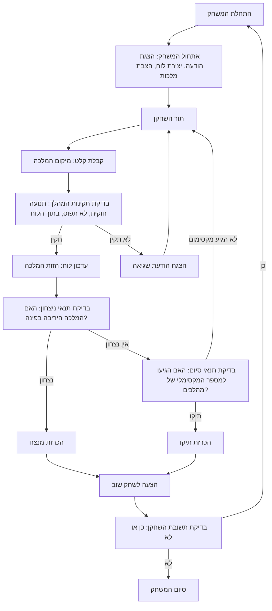

## ניתוח קוד המשחק "QUEEN"

### <algorithm>
הקוד מתאר את המשחק "QUEEN" שבו שני שחקנים מזיזים מלכות על לוח שחמט עד שאחת המלכות נלכדת בפינה או שמגיעים למספר מירבי של מהלכים.

1. **אתחול המשחק**:
   - הצגת הודעת פתיחה והסבר על חוקי המשחק.
   - יצירת לוח שחמט 8x8.
   - הצבת המלכות של השחקנים בשני קצוות נגדיים של הלוח (למשל, A1 ו-H8).

2. **לולאת המשחק הראשית**:
   - כל עוד המשחק לא הסתיים:
     - **תור השחקן**:
       - קבלת קלט מהשחקן לגבי מיקום המלכה.
       - **בדיקת תקינות המהלך**:
         - האם המלכה זזה באופן חוקי (אופקי, אנכי, או אלכסוני)?
         - האם המלכה לא עברה למיקום תפוס על ידי מלכה אחרת?
         - האם המלכה לא זזה מחוץ לגבולות הלוח?
       - אם המהלך תקין, הזז את המלכה ועדכן את מצב הלוח.
       - אם המהלך לא תקין, הצג הודעת שגיאה ובקש מהשחקן לנסות שוב.
     - **בדיקת תנאי ניצחון**:
       - האם המלכה היריבה נמצאת בפינת הלוח?
       - אם כן, הכרז על השחקן המנצח.
     - **בדיקת תנאי סיום**:
       - האם הגיעו למספר המקסימלי של מהלכים?
       - אם כן, הכרז על תיקו.

3. **סיום המשחק**:
   - הצע לשחקנים לשחק שוב.
   - אם השחקנים בוחרים לשחק שוב, אתחל את המשחק מחדש.

**דוגמה לזרימת נתונים**:
- השחקן מזין קלט (מיקום חדש למלכה).
- הקלט עובר לפונקציה שבודקת את תקינות המהלך.
- אם המהלך תקין, מיקום המלכה מתעדכן בלוח המשחק.
- הלוח המעודכן מוצג לשחקנים.
- לאחר כל מהלך, מתבצעת בדיקת תנאי ניצחון וסיום.

### <mermaid>

**ניתוח התלויות ביצירת התרשים**:
- התרשים אינו משתמש בספריות חיצוניות.
- התרשים מתאר את זרימת הפעולות והלוגיקה הפנימית של המשחק, ללא תלות בקוד ספציפי.
- שמות המשתנים בתרשים בעלי משמעות ותיאור. לדוגמה, `PlayerTurn` מציין את תור השחקן, `ValidateMove` מציין את תהליך בדיקת המהלך, וכן הלאה.

### <explanation>

**ייבואים (Imports)**:
- לא קיימים ייבואים בקוד זה, מכיוון שזהו תיאור של המשחק ולא קוד ממשי. כאשר ייושם הקוד, יהיו שימושים בייבואים לספריות רלוונטיות (למשל, ספריות לגרפיקה אם יהיה GUI).

**מחלקות (Classes)**:
- אין הגדרה של מחלקות בקוד זה, אך ייתכן שבעתיד, יישום של המשחק יכיל מחלקות כמו `Board` לניהול לוח המשחק, `Queen` לייצוג המלכות, ו-`Player` לניהול השחקנים.

**פונקציות (Functions)**:
- הקוד אינו מכיל פונקציות ספציפיות, אך ניתן לשער שייושמו פונקציות כמו:
   - `init_game()`: לאתחול המשחק (יצירת לוח, הצבת מלכות).
   - `get_player_move(player)`: לקבלת מהלך משחקן.
   - `is_valid_move(board, queen_pos, new_pos)`: לבדיקת תקינות מהלך.
   - `update_board(board, queen_pos, new_pos)`: לעדכון הלוח אחרי מהלך תקין.
   - `check_win(board)`: לבדיקת תנאי ניצחון.
   - `check_game_over(board, max_moves, current_move)`: לבדיקת תנאי סיום (הגעה למספר המקסימלי של מהלכים).
   - `play_again()`: לשאול את השחקנים האם לשחק שוב.

**משתנים (Variables)**:
- `board`: ייצוג של לוח המשחק (לדוגמה, רשימה דו-ממדית).
- `queen_player1_pos`: מיקום המלכה של שחקן 1.
- `queen_player2_pos`: מיקום המלכה של שחקן 2.
- `max_moves`: מספר מקסימלי של מהלכים עד סיום משחק בתיקו.
- `current_move`: מספר המהלך הנוכחי.
- `player_turn`: מציין את תור השחקן הנוכחי (1 או 2).

**בעיות אפשריות ותחומים לשיפור**:
- **טיפול בשגיאות קלט**: יש להוסיף בדיקות קלט כדי לוודא שהשחקן מזין קלט תקין (למשל, פורמט תקין של מיקום המלכה).
- **מימוש בינה מלאכותית**: להוסיף אפשרות למשחק נגד המחשב.
- **ממשק משתמש גרפי**: ליצור ממשק גרפי כדי להפוך את המשחק ליותר ידידותי למשתמש.
- **אפשרויות נוספות**: לאפשר לשחקנים לבחור גודל לוח משחק או סוגי משחקים שונים (למשל, משחק עם כמה מלכות).

**שרשרת קשרים עם חלקים אחרים בפרויקט**:
- המשחק `QUEEN` יכול להיות חלק מחבילת `ai_games`, כאשר הוא משתמש במנגנונים משותפים של הפרויקט, כגון ניהול ממשק משתמש, קלט משתמש, ועוד.
- המידע על חוקי המשחק ניתן לאחסון בקובץ טקסט חיצוני, או במשתנה מוגדר.
- במימוש, ייתכן שחלק מהפונקציות ימומשו במחלקות נפרדות, לשיפור קריאות הקוד וארגון נכון.