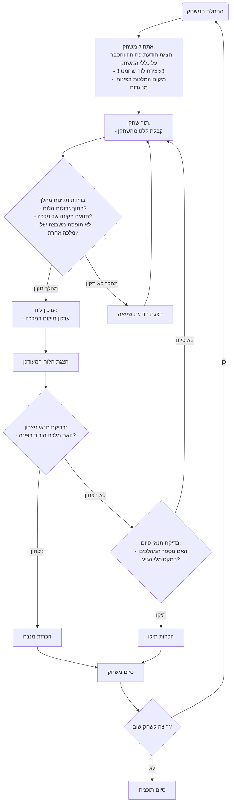

## ניתוח קוד המשחק "מלכה"

### 1. <algorithm>

1.  **התחלת המשחק:**
    *   הצגת הודעת פתיחה והסבר על כללי המשחק.
    *   יצירת לוח שחמט בגודל 8x8 (לדוגמה, באמצעות מערך או רשימה דו-ממדית).
    *   מיקום שתי המלכות של השחקנים בפינות מנוגדות של הלוח (שחקן 1 ב-A1, שחקן 2 ב-H8).
2.  **לולאת משחק עיקרית:**
    *   **תור השחקן:**
        *   קבלת קלט מהמשתמש לגבי מיקום המלכה המבוקש (לדוגמה, "B2").
        *   **בדיקת תקינות המהלך:**
            *   האם המהלך נמצא בתוך גבולות הלוח?
            *   האם המהלך תואם לתנועה של מלכה (כלומר, כל מספר משבצות לאורך, רוחב או אלכסון)?
            *   האם המהלך לא גורם למלכה לעמוד על משבצת בה כבר נמצאת מלכה אחרת?
            *   *דוגמה:* אם השחקן מנסה להזיז את המלכה שלו למשבצת "I9", הבדיקה תיכשל.
        *   אם המהלך תקין:
            *   עדכון מיקום המלכה בלוח המשחק.
            *   הצגת הלוח המעודכן.
        *   אם המהלך לא תקין:
            *   הצגת הודעת שגיאה למשתמש.
            *   חזרה לבקשת מהלך מהשחקן.
    *   **בדיקת תנאי ניצחון:**
        *   האם המלכה של היריב נמצאת באחת מפינות הלוח?
        *   אם כן, הכרז על המנצח.
    *   **בדיקת תנאי סיום:**
        *   האם מספר המהלכים המקסימלי הגיע?
        *   אם כן, הכרז על תיקו.
    *   חזרה ללולאת המשחק (תור השחקן השני)
3.  **סיום המשחק:**
    *   הצגת הודעה על סיום המשחק (ניצחון או תיקו).
    *   שאלה למשתמש אם הוא רוצה לשחק שוב.
    *   אם המשתמש עונה "כן", חזרה לשלב 1, אחרת סיום התוכנית.

### 2. <mermaid>

### 3. <explanation>

*   **ייבואים (Imports):**
    *   אין ייבוא מפורש בקוד זה מכיוון שהוא תיאור מילולי של המשחק ולא קוד בפועל.
    *   עם זאת, במידה והקוד היה מיושם בשפת תכנות, ייבואים רלוונטיים יכולים לכלול מודולים לטיפול בקלט/פלט, מבני נתונים (כמו רשימות או מערכים) ופונקציות מתמטיות.
*   **מחלקות (Classes):**
    *   אין שימוש במחלקות בתיאור זה.
    *   במידה והקוד היה מיושם באופן מונחה עצמים, ניתן היה ליצור מחלקות כמו `Board` (לוח המשחק), `Queen` (מלכה) ו-`Player` (שחקן) כדי לנהל את מצב המשחק ואת הפעולות השונות.
*   **פונקציות (Functions):**
    *   למרות שאין פונקציות מפורשות, אפשר להניח שמימוש המשחק היה כולל פונקציות כמו:
        *   `initialize_game()`: לאתחול המשחק.
        *   `display_board()`: להצגת מצב הלוח.
        *   `get_player_move()`: לקבלת קלט מהמשתמש.
        *   `validate_move(move)`: לבדיקת תקינות המהלך.
        *   `update_board(move)`: לעדכון הלוח.
        *   `check_win_condition()`: לבדיקת תנאי ניצחון.
        *   `check_end_condition()`: לבדיקת תנאי סיום.
    *   *דוגמה:* הפונקציה `validate_move(move)` תקבל את המהלך של השחקן כפרמטר (למשל "B2"), ותחזיר `True` אם המהלך חוקי ו-`False` אחרת.
*   **משתנים (Variables):**
    *   משתנים רלוונטיים יכולים לכלול:
        *   `board` (סוג נתונים: רשימה דו-ממדית): לייצוג לוח השחמט.
        *   `player1_queen_position` (סוג נתונים: טאפל או רשימה): מיקום המלכה של שחקן 1.
        *   `player2_queen_position` (סוג נתונים: טאפל או רשימה): מיקום המלכה של שחקן 2.
        *   `current_player` (סוג נתונים: מספר שלם): מזהה של השחקן הנוכחי.
        *   `max_moves` (סוג נתונים: מספר שלם): מספר המהלכים המקסימלי.
        *   `moves_count` (סוג נתונים: מספר שלם): מונה המהלכים הנוכחי.

**בעיות אפשריות או תחומים לשיפור:**
*   הקוד המתואר הוא תיאור כללי, וחסר בו מימוש קונקרטי. מימוש המשחק בשפה תכנות יכול להיות מורכב יותר (למשל, טיפול בקלט שגוי של המשתמש, ממשק משתמש).
*   חסרה אפשרות למשחק מול מחשב.
*   חסר ממשק משתמש גרפי.
*   חסרה אפשרות להתאמה של גודל הלוח.

**קשרים עם חלקים אחרים בפרויקט:**
*   מאחר ומדובר בתיאור משחק ולא בקוד בפועל, אין קשר ישיר לחלקים אחרים של פרויקט. עם זאת, במימוש מעשי, המשחק יכול להיות חלק מחבילת משחקי AI (כפי שמצוין במיקום הקובץ) ולחלוק מודולים או ספריות משותפות.