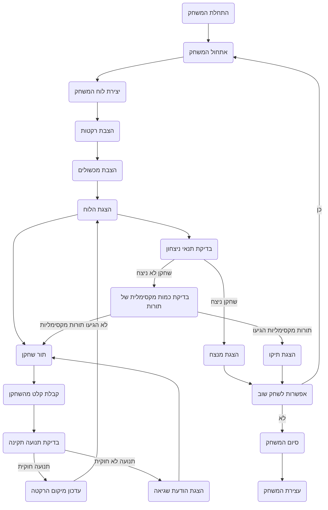

## ניתוח קוד: משחק "ROCKET"

### 1. <algorithm>

תיאור אלגוריתם המשחק "ROCKET" בתרשים זרימה:

1. **התחלת המשחק:**
   - המשחק מתחיל בהצגת הודעת פתיחה וכללי המשחק לשחקנים.
   - לדוגמה: "ברוכים הבאים ל-ROCKET! המטרה שלכם היא להגיע ראשונים למסלול של הכוכב."
   - נוצרת לוח משחק בגודל 10x10.
   - לדוגמה: `grid = [[" " for _ in range(10)] for _ in range(10)]`
   - מיקום התחלתי לשתי הרקטות נקבע בקצוות הנגדיים של הלוח. לדוגמה, רקטה 1 ב-A1 ורקטה 2 ב-J10.
   - לדוגמה: `rocket_1_pos = (0, 0)`, `rocket_2_pos = (9, 9)`
   - מכשולים (למשל אסטרואידים) ממוקמים באופן אקראי על הלוח, למעט מיקומי הרקטות.
   - לדוגמה: `obstacles = [(2,3), (5,5), (7,1), (8,7)]`.
   - המערך המלא מוצג לשחקנים עם מיקומי הרקטות והמכשולים.
   - לדוגמה: תצוגת הלוח עם סימונים לרקטות ומכשולים.

2. **תור שחקן:**
   - השחקן הנוכחי מתבקש להזין כיוון ומספר צעדים.
   - לדוגמה: "שחקן 1, אנא הזן את כיוון התנועה ומספר הצעדים (למשל, למעלה 2)".
   - בדיקת תקינות הקלט של השחקן (כיוון וצעדים תקינים).
   - בדיקה האם התנועה חוקית (האם הרקטה לא יוצאת מגבולות הלוח, פוגעת במכשול, או פוגעת ברקטה של שחקן אחר).
     - לדוגמה: אם הרקטה מנסה לזוז לקואורדינטות (-1,0), התנועה אינה חוקית.
   - אם התנועה חוקית, מעדכנים את מיקום הרקטה ומוצג לוח המשחק המעודכן.
   - לדוגמה: אם שחקן 1 זז שני צעדים למטה, מיקומו החדש יהיה (2,0).

3. **בדיקת תנאי ניצחון:**
   - לאחר כל תור, המשחק בודק האם הרקטה של השחקן הנוכחי הגיעה למסלול הניצחון (הקצה השני של הלוח).
   - לדוגמה: אם רקטה 1 נמצאת בקואורדינטה (9,0), שחקן 1 ניצח.
   - אם תנאי ניצחון מתקיים, מוצגת הודעת ניצחון ומוצעת אפשרות לשחק שוב.

4. **בדיקת תנאי סיום משחק:**
   - אם לא הושג ניצחון, המשחק בודק האם הגיע למספר המקסימלי של תורות.
   - אם הגיע למספר המקסימלי של תורות, המשחק מסתיים בתיקו ומוצעת אפשרות לשחק שוב.

5. **סיום המשחק:**
   - לאחר ניצחון או תיקו, השחקנים מקבלים אופציה לשחק שוב. אם בוחרים לשחק שוב, המשחק מתחיל מההתחלה עם מיקומים חדשים למכשולים ולרקטות.

**דוגמה לזרימת נתונים:**

- קלט משתמש (כיוון וצעדים) --> פונקציית בדיקת תנועה --> פונקציית עדכון מיקום --> פונקציית תצוגת לוח --> פונקציית בדיקת תנאי ניצחון / סיום.

### 2. <mermaid>

### 3. <explanation>

**ייבואים (Imports):**
אין ייבואות בקוד זה, משום שהקוד הוא תיאור של המשחק ולא קוד מימוש. אם היה מימוש, ייתכן שיהיה צורך בייבוא כמו `random` ליצירת מכשולים אקראיים, או `numpy` לייצוג נוח של הלוח.

**מחלקות (Classes):**
אין מחלקות בקוד הזה. במימוש בפועל ייתכן שייווצרו מחלקות כמו `Player` (שחקן), `Rocket` (רקטה), `Board` (לוח) ו-`Game` (משחק) לניהול נכון של ההגיון.

**פונקציות (Functions):**
- `InitializeGame()`: מאתחלת את המשחק - יוצרת את הלוח, ממקמת את הרקטות והמכשולים, ומציגה את הלוח ההתחלתי.
- `PlayerTurn()`: מטפלת בתור של שחקן בודד - קולטת קלט, בודקת תקינות תנועה, מעדכנת מיקום ומציגה את הלוח המעודכן.
- `ValidateMove()`: בודקת האם התנועה שבוצעה חוקית (האם התנועה בתוך הלוח, לא פוגעת במכשול או ברקטה של היריב).
- `UpdateRocketPosition()`: מעדכנת את מיקום הרקטה בהתאם לתנועה החוקית.
- `DisplayBoard()`: מציגה את הלוח עם מיקומי הרקטות והמכשולים.
- `CheckWinCondition()`: בודקת האם הרקטה הגיעה למסלול הניצחון.
- `CheckMaxTurns()`: בודקת האם הגיעו למספר המקסימלי של תורות.
- `DisplayWinner()`: מציגה הודעת ניצחון.
- `DisplayDraw()`: מציגה הודעה על תיקו.
- `PlayAgain()`: מציגה שאלה אם לשחק שוב.

**משתנים (Variables):**

- `grid` (לוח): דו-ממד של מחרוזות המייצגות את לוח המשחק.
- `rocket_1_pos`, `rocket_2_pos` (מיקומי הרקטות): צמדים של מספרים שלמים המייצגים את הקואורדינטות של הרקטות על הלוח.
- `obstacles` (מכשולים): רשימה של צמדים המייצגת את מיקומי המכשולים על הלוח.
- `max_turns` (מספר תורות מקסימלי): מספר שלם המייצג את המספר המקסימלי של התורות במשחק.
- `current_player` (השחקן הנוכחי): מספר שלם המייצג את תורו של השחקן (1 או 2).
- `direction`, `steps` (כיוון וצעדים): מחרוזות וערכים שלמים המייצגים את כיוון התנועה ואת מספר הצעדים שהשחקן בוחר לעשות.

**בעיות אפשריות או תחומים לשיפור:**

- **בדיקת קלט:** אין בדיקת קלט מפורטת עבור הקלט של השחקן (למשל, לבדוק האם הכיוון והצעדים שהוזנו הם חוקיים).
- **ממשק משתמש:** המשחק אינו כולל ממשק משתמש גרפי, מה שהופך אותו לפחות נוח למשתמש.
- **קוד מודולרי:** חלוקת הקוד לפונקציות ומחלקות באופן מסודר יכולה להקל על פיתוח המשחק.
- **משחק נגד המחשב:** אין אפשרות לשחק נגד מחשב, וזהו שיפור רצוי.

**שרשרת קשרים עם חלקים אחרים בפרויקט:**
אם המשחק היה חלק מפרויקט גדול יותר, שרשרת הקשרים הייתה כדלקמן:

- **הגדרות גלובליות:** המשחק עשוי לייבא הגדרות גלובליות ממודול `gs` כמו גודל הלוח, מיקומי התחלה, ועוד.
- **ממשק משתמש:** אינטראקציה עם ממשק המשתמש באמצעות פונקציות כמו הצגת הודעות, וקבלת קלט משתמש.
- **ניהול משחקים:** אינטראקציה עם מערכת ניהול משחקים להצגת תוצאות ושמירת היסטוריה של משחקים.

**לסיכום:**
הקוד המתואר מציג את ההגיון הבסיסי של המשחק "ROCKET", אך נדרשים פיתוחים נוספים כדי להפוך אותו למשחק מלא ומהנה, כולל יישום בפועל עם שפה כמו פייתון, ממשק משתמש, ובדיקות קלט מקיפות.