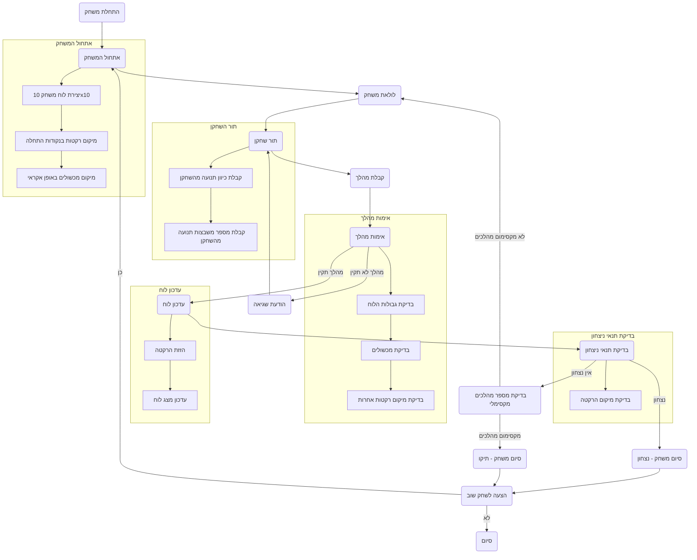

## ניתוח קוד המשחק "ROCKET"

### 1. **<algorithm>**

הקוד מתאר את לוגיקת המשחק "ROCKET" שבו שני שחקנים מזיזים את הרקטות שלהם על גבי לוח משחק כדי להגיע ליעד. הנה פירוט של תהליך העבודה צעד אחר צעד:

1.  **אתחול המשחק**:
    *   הצגת הודעת פתיחה והסבר על חוקי המשחק.
    *   יצירת לוח משחק בגודל 10x10.
    *   מיקום הרקטות של השחקנים בנקודות התחלה מנוגדות (לדוגמה, A1 ו-J10).
    *   מיקום אקראי של מכשולים (אסטרואידים) על הלוח.
    *   **דוגמה:**
        *   הודעת פתיחה: "ברוכים הבאים למשחק ROCKET!".
        *   לוח המשחק: מערך דו-ממדי ריק בהתחלה.
        *   מיקום רקטות: שחקן 1 ב-A1, שחקן 2 ב-J10.
        *   מיקום מכשולים: מספר אסטרואידים במיקומים אקראיים.
2.  **תהליך המשחק**:
    *   **תור השחקן:**
        *   השחקן בוחר כיוון ומספר משבצות להזיז את הרקטה (לדוגמה, "למעלה 2").
        *   **דוגמה:** השחקן בוחר "למעלה 2".
        *   **בדיקת תקינות המהלך:**
            *   הרקטה לא יוצאת מגבולות הלוח.
            *   הרקטה לא נעה למשבצת עם מכשול.
            *   הרקטה לא נעה למשבצת תפוסה על ידי הרקטה של השחקן השני.
            *   **דוגמה:** המהלך "למעלה 2" בטוח ומתקבל.
        *   אם המהלך תקין, הרקטה זזה, והלוח מוצג מעודכן.
        *   **דוגמה:** הרקטה של שחקן 1 זזה מ-A1 ל-A3, והלוח מוצג עם השינוי.
        *   אם המהלך לא תקין, מוצגת הודעת שגיאה, והשחקן נדרש לנסות שוב.
        *   **דוגמה:** אם השחקן בוחר לנוע למשבצת עם מכשול, מוצגת הודעת שגיאה: "מהלך לא תקין, נסה שוב."
    *   **בדיקת תנאי ניצחון:**
        *   אחרי כל מהלך, נבדק אם הרקטה הגיעה ליעד (אורביטה).
        *   אם כן, מוכרז השחקן כמנצח.
        *   **דוגמה:** אם הרקטה של שחקן 1 הגיעה לאורביטה, מוצגת הודעה: "המשחק הסתיים! שחקן 1 ניצח."
    *   **בדיקת תנאי סיום:**
        *   המשחק מסתיים גם אם הגיעו למספר המהלכים המקסימלי (לדוגמה, 20 מהלכים).
        *   אם המשחק הסתיים בתיקו, מוצגת הודעה מתאימה.
        *    **דוגמה:** אם הגיעו ל-20 מהלכים ולא הושג נצחון, מוצגת הודעה: "המשחק הסתיים! תיקו."
3.  **סיום המשחק**:
    *   הצעה לשחק שוב.
    *   אם השחקן בוחר "כן", המשחק מתחיל מחדש עם לוח משחק ומיקומים חדשים.

### 2.  **<mermaid>**

**ניתוח התלויות:**

התרשים מתאר את הזרימה הכללית של המשחק. אין תלויות מיובאות כאן מכיוון שהתרשים מתאר את הלוגיקה של המשחק ברמה גבוהה, בלי להתייחס ליישומו הספציפי בקוד.

### 3.  **<explanation>**

**ייבואים (Imports)**:
*   לא מוגדרים ייבואים בקטע הקוד שסופק, כי מדובר בתיאור מילולי של המשחק ולא בקוד ממשי. אם היה קוד אמיתי, ייתכן שהיינו רואים ייבוא של ספריות כמו `random` ליצירת מכשולים אקראיים, או ספריות גרפיות לייצוג הלוח.

**מחלקות (Classes)**:
*   לא מוגדרות מחלקות בקוד זה. אם היה קוד אמיתי, ייתכן שהיינו רואים מחלקות כמו `Rocket` לייצוג הרקטות, או `Gameboard` לייצוג לוח המשחק.

**פונקציות (Functions)**:
*   בקוד זה, הפונקציות אינן מפורשות, אך ניתן להבין מהתיאור שישנן פונקציות ליצירת לוח המשחק, מיקום הרקטות והמכשולים, אימות מהלכים, עדכון הלוח, בדיקת תנאי ניצחון וסיום המשחק.
    *   **דוגמה:**
        *   `create_board()`: פונקציה שיוצרת לוח משחק בגודל 10x10.
        *   `place_rockets()`: פונקציה שמיקמת את הרקטות בנקודות ההתחלה.
        *   `place_obstacles()`: פונקציה שמיקמת את המכשולים באופן אקראי.
        *   `validate_move(direction, moves_count, player_rocket)`: פונקציה שמאמתת את המהלך שנעשה על ידי השחקן.
        *   `update_board(rocket_move)`: פונקציה שמעדכנת את לוח המשחק לאחר כל מהלך.
        *   `check_win_condition()`: פונקציה שבודקת אם אחד השחקנים הגיע ליעד.
        *   `end_game()`: פונקציה שמציעה לשחק שוב, ומסיימת את המשחק.
**משתנים (Variables)**:

*   משתנים עיקריים שיכולים להיות ביישום:
    *   `board`: מערך דו ממדי (למשל, רשימה של רשימות) המייצג את לוח המשחק.
    *   `player1_rocket_position`: מיקום הרקטה של שחקן 1 על הלוח (לדוגמה, `(1, 1)`).
    *   `player2_rocket_position`: מיקום הרקטה של שחקן 2 על הלוח.
    *   `obstacles`: רשימה של מיקומי המכשולים על הלוח (לדוגמה, `[(2, 3), (5, 7)]`).
    *   `current_player`: משתנה המציין את תור השחקן הנוכחי.
    *   `max_turns`: המספר המקסימלי של תורות המותרות לפני שהמשחק מסתיים בתיקו.
    *   `direction`: משתנה המייצג את הכיוון שבו השחקן רוצה להזיז את הרקטה.
    *   `moves_count`: משתנה המייצג את מספר המשבצות שהשחקן רוצה להזיז את הרקטה.

**בעיות אפשריות ותחומים לשיפור:**

1.  **ממשק משתמש:**
    *   הקוד לא כולל ממשק משתמש (UI), מה שהופך את המשחק לקשה להבנה ולמשחק. ממשק משתמש גרפי יכול לשפר מאוד את חוויית המשתמש.
    *   הקלט מהמשתמש צריך להיות מפורש יותר, לדוגמה בחירה מתוך רשימת כיוונים אפשריים.
2.  **אימות קלט:**
    *   יש צורך בטיפול מקיף יותר בקלט מהמשתמש, כולל טיפול בשגיאות ומתן הנחיות ברורות.
3.  **יכולת משחק נגד המחשב:**
    *   המשחק מוגבל למשחק בין שני שחקנים אנושיים. הוספת אפשרות משחק מול המחשב תשפר את חווית המשתמש.
4.  **גמישות:**
    *   אפשרות בחירה של גודל לוח שונה מהברירת מחדל (10x10) יכולה להפוך את המשחק ליותר דינמי.

**קשרים עם חלקים אחרים בפרויקט:**

*   אם היה קוד אמיתי, הוא היה יכול להתחבר למודולים אחרים, כגון:
    *   `utils.py` - ייתכן שחלק מהפונקציות של הקוד הזה ימצאו שם, לדוגמה יצירת הלוח או בדיקת מהלך.
    *   `gui.py` - אם היה קיים ממשק גרפי, הקוד היה מתקשר איתו להצגת המשחק וקבלת קלט מהמשתמש.

בסך הכל, קטע קוד זה מספק תיאור מפורט של המשחק "ROCKET". כדי להפוך אותו למשחק מלא, נדרשת יישום בפועל עם התייחסות לנקודות החוזק והחולשה שהוזכרו.