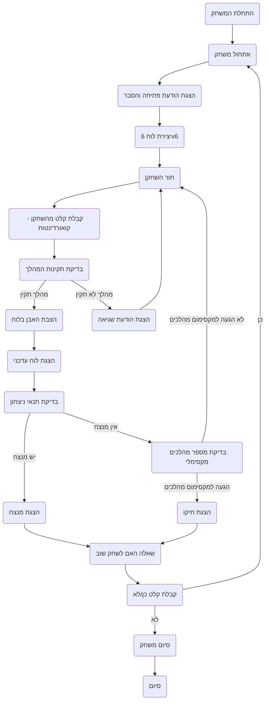

## <algorithm>

1.  **התחלת המשחק:**
    *   הצגת הודעת פתיחה והסבר על כללי המשחק.
        *   דוגמה: "ברוכים הבאים ל-ROCKSP! עליכם לחסום את היריב..."
    *   יצירת לוח משחק בגודל 6x6.
        *   דוגמה: יצירת מערך דו-ממדי בגודל 6x6 המייצג את הלוח.
    *   המשחק מתחיל כששחקנים מתחילים להזיז את האבנים שלהם בתורות.
2.  **מהלך המשחק (בכל סיבוב):**
    *   **תור השחקן:**
        *   הצגת הנחיה לשחקן להזין את הקואורדינטות של המשבצת בה הוא רוצה להציב את האבן.
            *   דוגמה: "שחקן 1, זה התור שלך. הכנס קואורדינטות (למשל, B2):"
        *   קריאה של קלט המשתמש (קואורדינטות) מהמסוף.
            *   דוגמה: קלט משתמש: "B2".
        *   בדיקה האם המהלך תקין:
            *   האם המשבצת ריקה.
                *   דוגמה: בדיקה אם המערך במיקום (1, 2) ריק (ערך 0 או None).
            *   האם המהלך הוא בתוך גבולות הלוח.
                *   דוגמה: בדיקה שהקואורדינטות לא גדולות מ-5 או קטנות מ-0.
        *   אם המהלך תקין:
            *   הצבת האבן של השחקן במשבצת הנבחרת בלוח.
                *   דוגמה: עדכון ערך המערך במיקום (1, 2) לערך השחקן (למשל, 1 או 2).
            *   הדפסה של מצב הלוח העדכני.
                *   דוגמה: הדפסת לוח המשחק עם האבנים שהוצבו.
        *   אם המהלך אינו תקין:
            *   הצגת הודעת שגיאה לשחקן.
                *   דוגמה: "מהלך לא תקין. נסה שוב."
            *   חזרה לראשית סעיף 2.1 (אפשר לשחקן לנסות שוב).
    *   **בדיקת תנאי ניצחון:**
        *   בדיקה האם ליריב יש אפשרות לבצע מהלך תקין.
            *   דוגמה: בדיקה האם יש משבצות ריקות סביב אבני היריב.
        *   אם ליריב אין אפשרות לבצע מהלך תקין:
            *   הכרזה על המנצח.
                *   דוגמה: "המשחק נגמר! שחקן 1 ניצח."
            *   מעבר לסעיף 3.
    *   **בדיקת תנאי סיום משחק:**
        *   בדיקה האם מספר המהלכים הגיע למקסימום.
            *   דוגמה: בדיקה אם מספר הסיבובים שווה ל-20 (או מספר אחר).
        *   אם מספר המהלכים הגיע למקסימום:
            *   הכרזה על תיקו.
                *   דוגמה: "המשחק נגמר! תיקו."
            *   מעבר לסעיף 3.
3.  **סיום המשחק:**
    *   הצגת שאלה לשחקנים האם ברצונם לשחק שוב.
        *   דוגמה: "האם ברצונכם לשחק שוב? (כן/לא)"
    *   קריאת קלט המשתמש (כן או לא).
    *   אם המשתמש הזין "כן":
        *   חזרה לסעיף 1 (אתחול משחק חדש).
    *   אם המשתמש הזין "לא":
        *   הצגת הודעת תודה.
            *   דוגמה: "תודה ששיחקתם!"
        *   סיום התוכנית.
## <mermaid>

## <explanation>

**ייבואים (Imports):**
אין ייבוא ספציפי בקוד שסופק מכיוון שמדובר בתיאור של לוגיקת משחק ולא בקוד ממשי. במימוש בפועל, ייתכן שיהיה צורך לייבא מודולים כמו `random` (למשחק נגד המחשב) או `pygame` (לממשק גרפי).

**מחלקות (Classes):**
אין מחלקות בקוד שסופק. אם המשחק היה ממומש בקוד, ייתכן שהיינו רואים מחלקה בשם `Board` (לניהול לוח המשחק) ומחלקה בשם `Player` (לייצוג שחקנים).

**פונקציות (Functions):**
*   **`initialize_game()`**: מאתחלת את המשחק, יוצרת לוח ריק ומציגה הודעת פתיחה.
    *   פרמטרים: אין.
    *   ערך מוחזר: לוח המשחק (מערך דו-ממדי).
    *   דוגמה: `board = initialize_game()`
*   **`get_player_move(board, current_player)`**: מקבלת קואורדינטות מהשחקן הנוכחי ובודקת תקינות.
    *   פרמטרים: `board` (לוח משחק), `current_player` (מספר שחקן).
    *   ערך מוחזר: קואורדינטות תקינות (tuple של מספרים) או None אם המהלך לא תקין.
    *   דוגמה: `row, col = get_player_move(board, 1)`.
*   **`validate_move(board, row, col)`**: בודקת אם מהלך מסוים תקין (משבצת ריקה ובתוך גבולות הלוח).
    *   פרמטרים: `board` (לוח משחק), `row` (שורה), `col` (עמודה).
    *   ערך מוחזר: `True` אם המהלך תקין, `False` אחרת.
    *   דוגמה: `is_valid = validate_move(board, 2, 3)`
*   **`place_stone(board, row, col, player)`**: מציבה אבן של שחקן בלוח.
    *   פרמטרים: `board` (לוח משחק), `row` (שורה), `col` (עמודה), `player` (מספר שחקן).
    *   ערך מוחזר: הלוח המעודכן.
    *   דוגמה: `board = place_stone(board, 1, 2, 1)`
*   **`display_board(board)`**: מדפיסה את מצב הלוח למסך.
    *   פרמטרים: `board` (לוח משחק).
    *   ערך מוחזר: אין.
    *   דוגמה: `display_board(board)`
*   **`check_win_conditions(board, current_player)`**: בודקת האם יש שחקן מנצח.
    *   פרמטרים: `board` (לוח משחק), `current_player` (מספר שחקן).
    *   ערך מוחזר: `True` אם יש מנצח, `False` אחרת.
    *   דוגמה: `if check_win_conditions(board, 1):`
*   **`check_max_moves(moves_counter)`**: בודקת אם מספר המהלכים הגיע למקסימום.
    *   פרמטרים: `moves_counter` (מספר מהלכים).
    *   ערך מוחזר: `True` אם הגיע למקסימום, `False` אחרת.
    *   דוגמה: `if check_max_moves(20):`
*   **`ask_play_again()`**: שואלת את השחקן האם הוא רוצה לשחק שוב.
    *   פרמטרים: אין.
    *   ערך מוחזר: `True` אם רוצה לשחק שוב, `False` אחרת.
    *   דוגמה: `if ask_play_again():`

**משתנים (Variables):**
*   `board`: מערך דו-ממדי המייצג את לוח המשחק.
*   `current_player`: משתנה המציין את מספר השחקן הנוכחי (1 או 2).
*   `moves_counter`: משתנה הסופר את מספר המהלכים במשחק.
*   `row`, `col`: משתנים המייצגים את קואורדינטות המהלך.

**בעיות אפשריות ותחומים לשיפור:**
*   **קלט שגוי:** התוכנית צריכה לטפל בקלט שגוי מהמשתמש בצורה טובה יותר (למשל, לא רק קואורדינטות מחוץ ללוח, אלא גם קלט שאינו קואורדינטות).
*   **אינטליגנציה מלאכותית:** חסר מימוש של משחק נגד מחשב.
*   **ממשק משתמש:** אין ממשק משתמש גרפי, המשחק רץ בטרמינל.
*   **התרחבות:** קשה להגדיל את גודל הלוח או את מספר השחקנים ללא שינויים משמעותיים בקוד.

**שרשרת קשרים עם חלקים אחרים בפרויקט:**
קובץ זה (תיאור המשחק) לא מתקשר ישירות עם קבצים אחרים בפרויקט. אולם אם המשחק היה ממומש, הוא היה משתמש במודולים סטנדרטיים של פייתון (כמו `random`, `input`) וייתכן מודולים נוספים אם היו נוספים לו ממשק גרפי.