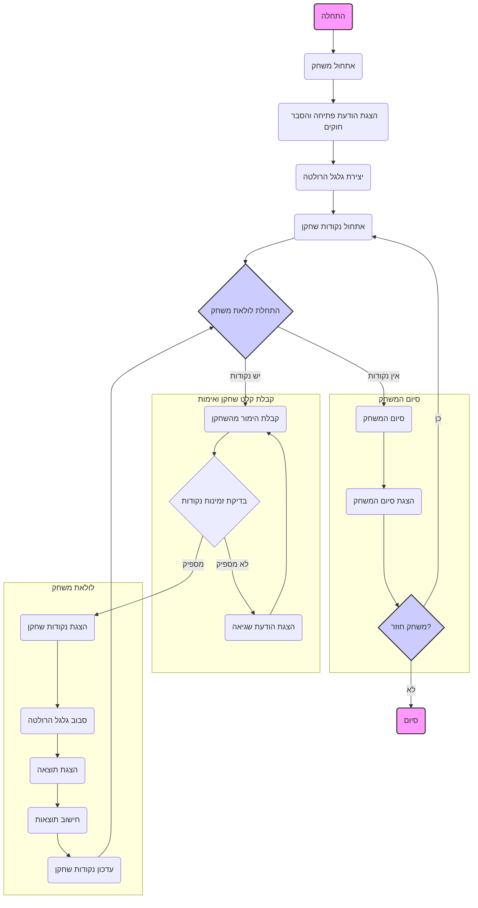

## ניתוח קוד המשחק "ROULET" (רולטה)

### <algorithm>
1. **הצגת פתיחה והסבר חוקים:**
   - מציג הודעת ברוכים הבאים למשחק הרולטה.
   - מסביר את חוקי המשחק: הימור על מספרים, צבעים או קבוצות מספרים במטרה לזכות בנקודות.
   - המשחק נמשך כל עוד יש לשחקן נקודות להימור.
   - *דוגמה:* "ברוכים הבאים ל-ROULET! עליך להמר על מספרים, צבעים או קבוצות מספרים ולזכות בנקודות. המשחק נמשך כל עוד יש לך נקודות להימור. בהצלחה!"

2. **יצירת גלגל הרולטה:**
   - יוצר גלגל רולטה וירטואלי עם 37 סקטורים (מספרים מ-0 עד 36).
   - *דוגמה:* מערך או רשימה המייצגת את המספרים מ-0 עד 36.

3. **אתחול נקודות השחקן:**
   - השחקן מתחיל עם מספר נקודות התחלתי (לדוגמה, 100 נקודות).
   - *דוגמה:* `player_points = 100`

4. **לולאת משחק ראשית:**
   - הלולאה ממשיכה כל עוד לשחקן יש נקודות.
   - בתוך הלולאה:
     - **קבלת הימור מהשחקן:**
       - השחקן בוחר סוג הימור (מספר, צבע או קבוצה) וסכום הימור.
       - *דוגמה:* "בחר סוג הימור (מספר, צבע, קבוצה) וסכום הימור: > מספר 15, 10"
     - **בדיקת זמינות נקודות:**
       - בודק אם לשחקן יש מספיק נקודות להימור.
       - אם אין מספיק נקודות, מוצגת הודעת שגיאה והשחקן מתבקש להמר שוב.
       - *דוגמה:* "אין לך מספיק נקודות להימור זה. נסה שוב."
       - אם יש מספיק נקודות, ההימור מתקבל.
     - **הצגת כמות הנקודות הנוכחית:**
       - מציג את כמות הנקודות הנוכחית של השחקן.
       - *דוגמה:* "יש לך 100 נקודות."
     - **סבוב גלגל הרולטה:**
       - בוחר מספר אקראי מגלגל הרולטה.
       - *דוגמה:* תוצאה רנדומלית בין 0 ל-36.
     - **הצגת תוצאה:**
       - מציג את התוצאה שהתקבלה (מספר וצבע, אם יש).
       - *דוגמה:* "התוצאה היא 15 (אדום)."
     - **חישוב תוצאות:**
       - בודק האם השחקן ניצח:
         - אם השחקן צדק בהימור, מוסיפים לו נקודות בהתאם לסוג ההימור.
         - אם השחקן לא צדק, מורידים את סכום ההימור מהנקודות שלו.
       - *דוגמה:* "זכית ב-36 נקודות! יש לך עכשיו 136 נקודות."
     - **עדכון נקודות השחקן:**
       - מעדכן את מספר הנקודות של השחקן בהתאם לתוצאות ההימור.

5. **סיום המשחק:**
   - אם לשחקן אין יותר נקודות, המשחק מסתיים.
   - מוצגת הודעה המציינת שהמשחק נגמר ומה מספר הנקודות של השחקן.
   - *דוגמה:* "המשחק נגמר! יש לך 0 נקודות."

6. **הצעה למשחק חוזר:**
   - שואל את השחקן האם הוא רוצה לשחק שוב.
   - אם השחקן עונה "כן", המשחק מתחיל מחדש עם מספר נקודות התחלתי.

### <mermaid>


### <explanation>

**ייבואים (Imports):**
   - לא קיים ייבוא בקוד, מכיוון שהקוד הוא תיאור טקסטואלי של המשחק ולא קוד בפועל.

**מחלקות (Classes):**
   - לא קיימות מחלקות מכיוון שזהו תיאור של משחק ולא קוד אובייקט-אוריינטד.

**פונקציות (Functions):**
   - למרות שאין הגדרה מפורשת של פונקציות, ישנם שלבים לוגיים שניתן לממש כפונקציות:
        - `init_game()`: מאתחלת את המשחק (הצגת הודעה, יצירת גלגל).
        - `get_player_bet()`: מקבלת הימור מהשחקן.
        - `check_player_points(bet_amount)`: בודקת אם יש מספיק נקודות להימור.
        - `spin_roulette()`: מסובבת את הגלגל ומחזירה תוצאה רנדומלית.
        - `calculate_results(player_bet, result)`: מחשבת את תוצאות ההימור ומעדכנת את הנקודות.
        - `update_player_points(player_points, points_change)`: מעדכנת את נקודות השחקן.
        - `game_over()`: מסיימת את המשחק ומציגה את התוצאה הסופית.
        - `play_again()`: שואלת האם השחקן רוצה לשחק שוב.
   - *דוגמה לשימוש:*
        ```python
        def spin_roulette():
            import random
            return random.randint(0, 36)

        result = spin_roulette()
        print(f"תוצאת הרולטה: {result}")
        ```

**משתנים (Variables):**
   - `player_points`: סוג - מספר שלם, מייצג את הנקודות של השחקן.
   - `roulette_wheel`: סוג - רשימה או מערך, מייצג את המספרים בגלגל הרולטה.
   - `bet_type`: סוג - מחרוזת, מייצג את סוג ההימור (מספר, צבע, קבוצה).
   - `bet_amount`: סוג - מספר שלם, מייצג את סכום ההימור.
   - `result`: סוג - מספר שלם, מייצג את התוצאה של סיבוב הגלגל.
   - *דוגמה:*
       ```python
       player_points = 100
       bet_amount = 10
       ```

**שרשרת קשרים עם חלקים אחרים בפרויקט:**
  - אין קשר ישיר לחלקים אחרים בפרויקט, מכיוון שזהו תיאור של משחק בלבד. אך ביישום בפועל, יכול להיות קשר עם מערכת ניהול משחקים גדולה יותר או מערכת ניהול משתמשים.

**בעיות אפשריות או תחומים לשיפור:**
  - **טיפול בשגיאות:** הקוד לא מציין כיצד לטפל בקלט לא תקין (למשל, כאשר השחקן מזין סוג הימור לא חוקי).
  - **פונקציונליות הימור מורכבת:** חסרה אפשרות להימור על דברים נוספים חוץ ממספר או צבע בסיסי.
  - **ממשק משתמש:** אין ממשק משתמש גרפי, דבר שיכול לשפר את חוויית השחקן.
  - **הגדרות קשיחות:** הגדרות כמו מספר נקודות התחלתי או סכומי זכייה/הפסד יכולות להיות קשיחות ודורשות שינוי בקוד.

**סיכום:**
  - הקוד מציג לוגיקה ברורה של משחק רולטה.
  - התרשים הזרימה מאפשר הבנה פשוטה של תהליך המשחק.
  - יש לשפר את טיפול בשגיאות ופונקציונליות ההימור למימוש מלא.