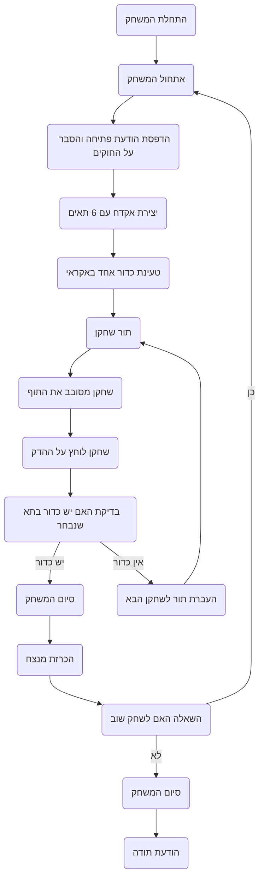

## ניתוח קוד המשחק "RUSROU" (רולטה רוסית)

### 1. <algorithm>

תיאור שלבי המשחק רולטה רוסית:

1.  **אתחול המשחק:**
    *   הדפסת הודעת פתיחה והסבר על החוקים.
    *   יצירת "אקדח" עם 6 תאים.
    *   טעינת כדור אחד באקראי.
    *   התחלת סבב בין השחקנים.

    *דוגמה:*
    ```
    הודעת פתיחה: "ברוכים הבאים לרולטה הרוסית! המטרה שלך היא לסובב את התוף ולהימנע מירי."
    אקדח: [ריק, ריק, ריק, ריק, ריק, כדור]
    שחקן נוכחי: שחקן 1
    ```

2.  **תור של שחקן:**
    *   השחקן מסובב את התוף (בחירת תא אקראית).
    *   השחקן לוחץ על ההדק.
    *   בדיקה האם יש כדור בתא שנבחר:
        *   אם כן:
            *   המשחק מסתיים, מוכרז על ירי והשחקן השני מנצח.

             *דוגמה:*
            ```
             תוף: [ריק, כדור, ריק, ריק, ריק, ריק]
             השחקן סובב את התוף: מקבל תא 2
             השחקן לוחץ על ההדק: ירי! שחקן 1 הפסיד. שחקן 2 ניצח.
             ```
        *   אם לא:
            *   ההודעה "אין ירי" מוצגת, והתור עובר לשחקן הבא.

             *דוגמה:*
            ```
             תוף: [ריק, ריק, כדור, ריק, ריק, ריק]
             השחקן סובב את התוף: מקבל תא 1
             השחקן לוחץ על ההדק: אין ירי. התור עובר לשחקן 2.
             ```

3.  **בדיקת תנאי סיום:**
    *   המשחק מסתיים כאשר מתבצע ירי.
    *   מוכרז על המנצח.

    *דוגמה:*
    ```
     ירי התרחש: שחקן 2 ניצח
    ```

4.  **סיום המשחק:**
    *   המשחק שואל אם השחקן רוצה לשחק שוב.
    *   אם כן, המשחק חוזר לשלב 1 עם אתחול חדש.
    *   אם לא, המשחק מסתיים עם הודעת תודה.

    *דוגמה:*
    ```
     המשחק נגמר.
     האם לשחק שוב? (כן/לא): כן
    ```
    המשחק חוזר לשלב 1.

### 2. <mermaid>



הקוד אינו כולל את השורה `import header`, ולכן אין צורך בתרשים זרימה של `header.py`.

### 3. <explanation>

**ייבואים (Imports):**

*   המסמך מציין כי המשחק צריך להשתמש במודול `random` כדי לבחור באקראי את תא הכדור. אין ייבוא ישיר בקוד המוצג, אבל ההסבר מרמז על כך שהמשחק יכלול אותו.

**מחלקות (Classes):**

*   אין מחלקות מוגדרות בקוד, אך ניתן להסיק כי תהיה מחלקה בשם "Revolver" אשר תייצג את האקדח ואת התהליכים הקשורים אליו.
    *   **מאפיינים:**
        *   `chambers`: רשימה או מערך המייצג את התאים באקדח (6 תאים).
        *   `bullet_position`: האינדקס של התא שבו נמצא הכדור.
    *   **שיטות:**
        *   `spin()`: בוחר באקראי תא חדש שהכדור נמצא בו.
        *   `shoot(selected_chamber)`: בודק האם הכדור נמצא בתא שנבחר, ומחזיר `true` אם כן ו-`false` אם לא.

**פונקציות (Functions):**

*   אין פונקציות ספציפיות מוגדרות בקוד המסופק, אך המשחק יצטרך פונקציות עבור:
    *   `init_game()`: לאתחל את המשחק, כולל הדפסת ההודעות, יצירת האקדח, טעינת הכדור והחלטה על השחקן הראשון.
    *   `player_turn(player)`: לבצע את תורו של השחקן, לסובב את התוף, לבדוק ירי, ולהעביר את התור לשחקן הבא אם לא היה ירי.
    *   `game_over(winner)`: לסיים את המשחק ולהודיע על המנצח.
    *   `play_again()`: לשאול את השחקן האם הוא רוצה לשחק שוב ולהתחיל משחק חדש במידת הצורך.
    *   `load_bullet()`: טעינת כדור אחד באקראי לתוך האקדח.
    *  `check_shot(selected_chamber)`: בודק אם היה ירי.
    * `spin()`: בחירת תא אקראי.
*   **דוגמאות שימוש:**
    *   `init_game()`: נקראת בתחילת המשחק.
    *   `player_turn("שחקן 1")`: יתחיל את התור של שחקן 1.
    *   `game_over("שחקן 2")`: יכריז על שחקן 2 כמנצח.
    *   `play_again()`: יקרא לאחר סיום המשחק כדי לשאול אם לשחק שוב.
    *   `load_bullet()`: יטען כדור באקדח.
    *   `check_shot(3)`: יבדוק האם היה ירי בתא השלישי.
    *   `spin()`: יבחר תא אקראי.

**משתנים (Variables):**

*   `players`: רשימה או מערך של שחקנים.
*   `current_player`: השחקן הנוכחי.
*   `revolver`: עצם של המחלקה "Revolver".
*   `game_running`: דגל בוליאני המציין האם המשחק פועל.

**בעיות אפשריות או תחומים לשיפור:**

*   **ממשק משתמש:** הקוד הנוכחי הוא טקסטואלי. ניתן לשפר על ידי הוספת ממשק משתמש גרפי (GUI).
*   **ריבוי שחקנים:** כרגע המשחק תומך בשני שחקנים בלבד, כדאי לאפשר ריבוי שחקנים.
*   **ריבוי כדורים:** אפשרות לשחק עם מספר רב יותר של כדורים באקדח.
*   **החלטות שחקן:** כרגע ההחלטה היא אקראית, ניתן לשלב אלמנט של החלטת השחקן.
*   **טיפול בשגיאות:** אין טיפול בשגיאות קלט, יש להוסיף זאת.

**שרשרת קשרים עם חלקים אחרים בפרויקט:**

*   המשחק יכול להתממשק עם מערכת ניקוד.
*   המשחק יכול להתממשק עם מערכת ניהול משתמשים.
*   המשחק יכול להשתמש במודולים אחרים של הפרויקט לניהול קלט ופלט.