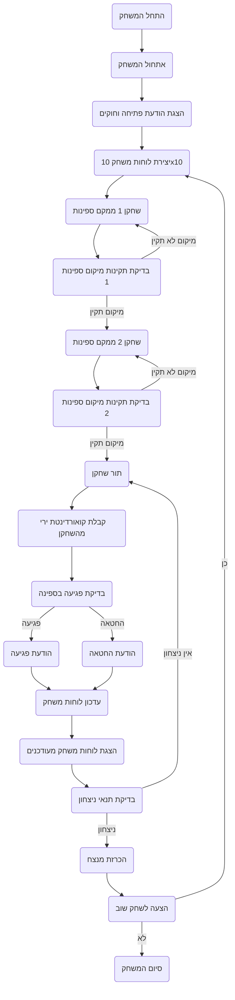

## <algorithm>
הקוד מתאר את המשחק "סלוו" (SALVO), בו שני שחקנים מנהלים קרב ימי, על ידי השמדת ספינות היריב. הנה תרשים זרימה המתאר את תהליך המשחק:

1. **אתחול המשחק**:
    - תצוגת הודעת פתיחה והסבר על חוקי המשחק.
    - יצירת שני לוחות משחק בגודל 10x10 לשני השחקנים.
    - כל שחקן ממקם את הספינות שלו בלוח שלו.

2. **תהליך המשחק**:
    - **מיקום ספינות**:
        - השחקן מקבל הנחייה להזין קואורדינטות למיקום הספינה (לדוגמה, "A1-A5").
        - התוכנית בודקת אם המיקום חוקי:
           - אין חפיפה בין ספינות.
           - ספינות לא נוגעות זו בזו.
           - הספינות נמצאות בתוך גבולות הלוח.
        - אם המיקום לא תקין, תוצג הודעת שגיאה והשחקן יתבקש להזין מיקום חדש.

    - **תור השחקן**:
       - השחקן בוחר קואורדינטה לירות בה (לדוגמה, "B2").
       - התוכנית בודקת האם הפגיעה הצליחה:
          - אם הפגיעה פגעה בספינה, תודפס הודעה "פגיעה!".
          - אם הפגיעה לא פגעה בספינה, תודפס הודעה "החטאה".
       - עדכון לוחות המשחק והצגתם:
            - הצגת הלוח של השחקן.
            - הצגת הלוח של היריב, עם מצב הפגיעות האחרונות.

    - **בדיקת תנאי ניצחון**:
        - אחרי כל תור, התוכנית בודקת האם כל ספינות היריב הושמדו.
        - אם כל ספינות היריב הושמדו, התוכנית מכריזה על ניצחון השחקן הנוכחי.

3. **סיום המשחק**:
    -  לאחר ניצחון, השחקנים מקבלים את ההצעה לשחק שוב.
    - אם השחקן בוחר לשחק שוב, המשחק מתחיל מחדש, עם מיקום ספינות חדש.

**דוגמה לזרימת נתונים**:

1.  **אתחול**: התוכנית יוצרת את משתנה לוחות המשחק (דו מימד) עבור כל שחקן.
2.  **מיקום ספינות**: הקלט של השחקן (מחרוזת קואורדינטות) עובר לפונקציה שבודקת תקינות מיקום הספינה.
3.  **תור השחקן**: הקלט של השחקן (מחרוזת קואורדינטה) עובר לפונקציה שבודקת פגיעה בספינה.
4.  **עדכון הלוחות**: הפונקציה שבודקת פגיעה מעדכנת את מצב הלוחות לאחר הפגיעה.
5.  **בדיקת ניצחון**: לוח המשחק של השחקן היריב עובר לפונקציה שבודקת האם כל הספינות הושמדו.

## <mermaid>

## <explanation>

**הסברים מפורטים:**

הקוד שסופק אינו קוד ממשי אלא תיאור מפורט של משחק "סלוו" (SALVO), שבו שני שחקנים מתחרים זה בזה באמצעות יריות על גבי לוחות משחק. התיאור כולל את חוקי המשחק, תהליך העבודה, דוגמאות, ואף הגבלות ושיפורים אפשריים. הנה פירוט של מרכיבי התיאור:

**1. מבנה כללי:**

*   **שם המשחק:** SALVO (סלוו).
*   **תיאור:** משחק אסטרטגיה שבו השחקנים משמידים את ספינות היריב על ידי יריות.
*   **הוראות שלב אחר שלב:** מפרטות את תהליך המשחק, החל מאתחול המשחק, דרך מהלך המשחק ועד לסיומו.

**2. מרכיבים מרכזיים:**

*   **אתחול המשחק:**
    *   הודעת פתיחה למשתמש.
    *   יצירת לוחות משחק לשני השחקנים (מערכים בגודל 10x10).
    *   מיקום הספינות על ידי השחקנים, כל אחד בלוח שלו.
*   **מהלך המשחק:**
    *   **מיקום ספינות:**
        *   קבלת קואורדינטות מהשחקן.
        *   בדיקה שהמיקום חוקי:
            *   אין חפיפה בין ספינות.
            *   אין מגע בין ספינות.
            *   הספינות בתוך גבולות הלוח.
        *   אם המיקום אינו חוקי, תינתן הודעת שגיאה והשחקן יתבקש לנסות שוב.
    *   **תור שחקן:**
        *   קבלת קואורדינטות ירי מהשחקן.
        *   בדיקת פגיעה בספינה:
            *   אם פגע – הודעת "פגיעה!".
            *   אם לא פגע – הודעת "החטאה".
        *   עדכון מצב הלוחות והצגה לשחקנים.
    *   **בדיקת תנאי ניצחון:**
        *   בדיקה האם כל הספינות של היריב הושמדו.
        *   אם כן, הכרזה על המנצח.
*   **סיום המשחק:**
    *   הצעה לשחק שוב.
    *   אם השחקן מסכים – המשחק מתחיל מחדש עם מיקומי ספינות חדשים.

**3. דוגמאות:**

*   דוגמאות לקלט מהמשתמש: "A1-A5" למיקום ספינה, "B2" לירי.
*   דוגמאות להודעות למשתמש: "פגיעה!", "החטאה", "המשחק הסתיים! ניצח שחקן 1".

**4. הגבלות אפשריות:**

*   קלט חייב להיות בפורמט נכון.
*   התוכנית צריכה לטפל במקרים של קלט שגוי.
*   יש לוודא שספינות לא נוגעות אחת בשניה.

**5. שיפורים אפשריים:**

*   אפשרות לשחק נגד המחשב.
*   ממשק גרפי (GUI) למשחק.
*   אפשרות לבחירת גודל הלוח.

**6. יישום:**

*   המשחק יכול להיות מיושם בפייתון, באמצעות מערכים/רשימות לייצוג לוחות וספינות, לולאות ותנאים לבדיקת הקלט ומהלכי המשחק, ופונקציות למימוש כל שלב בתהליך.

**יחסי גומלין עם חלקים אחרים בפרויקט:**

הקוד אינו מתייחס לחלקים אחרים בפרויקט באופן ישיר. הוא מהווה תיאור מפורט של משחק, שניתן להשתמש בו כבסיס לפיתוח המשחק עצמו. אם המשחק היה מפותח בתוך פרויקט גדול יותר, הוא היה יכול להיות קשור למודולים נוספים, כמו ממשק משתמש, ניהול שחקנים, שמירת משחקים וכו'. אך מכיוון שהקוד שסופק הינו רק מסמך תיעודי - אין לו תלות בקבצים נוספים.