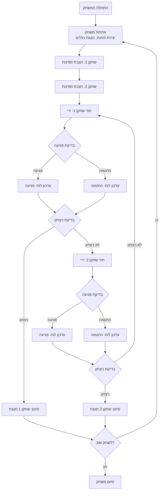

## <algorithm>

הקוד המתואר הוא תיאור מפורט של משחק ה"סלבו" (SALVO) וכולל את השלבים הבאים:

1. **התחלת המשחק:**
   - הצגת הודעת פתיחה וכללי המשחק לשחקנים.
   - יצירת שני לוחות משחק בגודל 10x10 עבור כל שחקן.

2. **הצבת ספינות:**
   - כל שחקן בתורו מציב את הספינות שלו על לוח המשחק.
   - השחקן מזין את קואורדינטות ההתחלה והסוף של כל ספינה, לדוגמה, `A1-A5`.
   - התוכנית בודקת שההצבה חוקית:
     - הספינות לא חופפות או נוגעות זו בזו.
     - הספינות נמצאות בתוך גבולות לוח המשחק.
   - אם ההצבה לא חוקית, מוצגת הודעה על כך והשחקן מתבקש לנסות שוב.

3. **מהלך המשחק:**
   - כל שחקן בתורו מבצע ירייה על הלוח של השחקן השני על ידי הזנת קואורדינטות, לדוגמה, `B2`.
   - התוכנית בודקת אם הפגיעה פגעה בספינה:
     - אם כן, מוצגת הודעה "פגיעה!".
     - אם לא, מוצגת הודעה "החטאה".
   - מצב הלוחות מעודכן ומוצג לשחקנים:
     - לוח המשחק של השחקן עצמו.
     - לוח המשחק של היריב.
   - לדוגמה:

      ```
         לוח שלך:
         A B C D E F G H I J
       1 [ ][ ][ ][ ][ ][ ][ ][ ][ ][ ]
       2 [ ][ ][ ][ ][ ][ ][ ][ ][ ][ ]
       3 [ ][ ][ ][ ][ ][ ][ ][ ][ ][ ]
       4 [ ][ ][ ][ ][ ][ ][ ][ ][ ][ ]
       5 [ ][ ][ ][ ][ ][ ][ ][ ][ ][ ]
       6 [ ][ ][ ][ ][ ][ ][ ][ ][ ][ ]
       7 [ ][ ][ ][ ][ ][ ][ ][ ][ ][ ]
       8 [ ][ ][ ][ ][ ][ ][ ][ ][ ][ ]
       9 [ ][ ][ ][ ][ ][ ][ ][ ][ ][ ]
      10 [ ][ ][ ][ ][ ][ ][ ][ ][ ][ ]

       לוח יריב:
         A B C D E F G H I J
       1 [ ][ ][ ][ ][ ][ ][ ][ ][ ][ ]
       2 [ ][ ][ ][ ][ ][ ][ ][ ][ ][ ]
       3 [ ][ ][ ][ ][ ][ ][ ][ ][ ][ ]
       4 [ ][ ][ ][ ][ ][ ][ ][ ][ ][ ]
       5 [ ][ ][ ][ ][ ][ ][ ][ ][ ][ ]
       6 [ ][ ][ ][ ][ ][ ][ ][ ][ ][ ]
       7 [ ][ ][ ][ ][ ][ ][ ][ ][ ][ ]
       8 [ ][ ][ ][ ][ ][ ][ ][ ][ ][ ]
       9 [ ][ ][ ][ ][ ][ ][ ][ ][ ][ ]
      10 [ ][ ][ ][ ][ ][ ][ ][ ][ ][ ]
     ```

4. **בדיקת ניצחון:**
   - לאחר כל מהלך, התוכנית בודקת אם כל הספינות של השחקן היריב הושמדו.
   - אם כן, השחקן הנוכחי מוכרז כמנצח.

5. **סיום המשחק:**
   - לאחר סיום המשחק, השחקנים מקבלים אפשרות לשחק שוב או לסיים.
   - אם הם בוחרים לשחק שוב, המשחק מתחיל מחדש עם לוחות משחק חדשים.

**זרימת הנתונים:**

- **התחלה:** המשחק מתחיל בפונקציית אתחול שמגדירה את המשתנים ההתחלתיים, לוחות המשחק, ומוצגת הודעת הפתיחה.
- **הצבת ספינות:** הפונקציה המטפלת בהצבת ספינות מקבלת את הקואורדינטות שהוזנו על ידי השחקן. היא בודקת את תקינות ההצבה ובהתאם לכך מעדכנת את לוח המשחק.
- **מהלך המשחק:** הפונקציה המטפלת במהלכי המשחק מקבלת את קואורדינטות הירייה מהשחקן. היא בודקת את הפגיעה ומעדכנת את הלוח הרלוונטי.
- **בדיקת ניצחון:** פונקציה נפרדת בודקת אם כל ספינות היריב הושמדו.
- **סיום:** הפונקציה המטפלת בסיום המשחק שואלת את השחקנים אם הם רוצים לשחק שוב.

## <mermaid>



**ניתוח תלויות ה-mermaid:**

- אין תלויות מיובאות, מכיוון שהקוד של `mermaid` עצמו אינו קוד בשפת תכנות.
- התרשים מציג את זרימת המשחק, החל מאתחול המשחק ועד לסיומו, תוך שימוש בצורות המייצגות פעולות שונות:
  - מלבנים מייצגים פעולות (לדוגמה, אתחול המשחק, הצבת ספינות).
  - מעוינים מייצגים החלטות (לדוגמה, בדיקת פגיעה, בדיקת ניצחון).
  - קווים עם חיצים מייצגים זרימה.

## <explanation>

**הסבר מפורט:**

1.  **מטרת המשחק:**
    -   משחק הסלבו הוא משחק אסטרטגיה לשני שחקנים, שבו כל שחקן מנסה להשמיד את ספינות היריב על ידי יריות על לוח המשחק. המטרה היא להיות השחקן הראשון שמצליח להשמיד את כל הספינות של היריב.

2.  **אתחול המשחק:**
    -   המשחק מתחיל בהודעה מברכת למשתמש ובהצגת כללי המשחק.
    -   התוכנית יוצרת שני לוחות משחק ריקים בגודל 10x10 עבור כל שחקן, כאשר כל תא יכול להיות ריק או להכיל חלק מספינה.

3.  **הצבת ספינות:**
    -   כל שחקן בתורו מציב את הספינות שלו על לוח המשחק.
    -   השחקן מזין את קואורדינטות ההתחלה והסוף של כל ספינה, לדוגמה, `A1-A5`.
    -   התוכנית בודקת שההצבה חוקית:
        -   הספינות לא חופפות או נוגעות זו בזו.
        -   הספינות נמצאות בתוך גבולות לוח המשחק.
    -   אם ההצבה אינה חוקית, מוצגת הודעה על כך והשחקן מתבקש לנסות שוב.
    -   המידע הזה נשמר במבנה נתונים מתאים (כנראה רשימה או מערך דו-ממדי) המייצג את לוח המשחק של כל שחקן.

4.  **מהלך המשחק:**
    -   כל שחקן בתורו מבצע ירייה על לוח המשחק של השחקן השני.
    -   השחקן מזין את הקואורדינטות של הירייה, לדוגמה, `B2`.
    -   התוכנית בודקת אם הירייה פגעה בספינה:
        -   אם כן, מוצגת הודעה "פגיעה!".
        -   אם לא, מוצגת הודעה "החטאה".
    -   מצב הלוחות מעודכן: תאים שנפגעו מסומנים בסימון אחר (למשל, "X" לפגיעה, "O" להחטאה).
    -   הלוחות המעודכנים מוצגים לשחקנים, כולל לוח המשחק שלהם ולוח המשחק של היריב, כאשר הפגיעות וההחטאות מסומנות בהתאם.

5.  **בדיקת ניצחון:**
    -   לאחר כל מהלך, התוכנית בודקת אם כל הספינות של השחקן היריב הושמדו.
    -   בדיקה זו מתבצעת על ידי ספירת מספר התאים בלוח של היריב שמסומנים כ"פגיעה", ובדיקה אם כל תאי הספינות שלו נפגעו.
    -   אם כן, השחקן הנוכחי מוכרז כמנצח.

6.  **סיום המשחק:**
    -   לאחר סיום המשחק, השחקנים מקבלים אפשרות לשחק שוב או לסיים.
    -   אם הם בוחרים לשחק שוב, המשחק מתחיל מחדש עם לוחות משחק חדשים.

**בעיות אפשריות ותחומים לשיפור:**

-   **קלט לא חוקי:** יש לוודא שהקלט של המשתמש (קואורדינטות) תקין ולטפל במקרים של קלט שגוי (למשל, קואורדינטות מחוץ לטווח, פורמט שגוי).
-   **מימוש ההצבה:** נדרש מימוש מורכב יותר של ההצבה, כולל בדיקות מפורטות יותר כדי לוודא שאין חפיפות בין ספינות או שהן לא מחוץ לגבולות הלוח.
-   **AI:** המשחק יכול להיות משופר על ידי הוספת אפשרות לשחק נגד מחשב.
-   **ממשק משתמש:** ניתן לשפר את חוויית המשתמש על ידי הוספת ממשק גרפי במקום להשתמש בקלט טקסטואלי בלבד.
-   **גודל לוח:** הוספת אפשרות להתאמת גודל הלוח יכולה להוסיף גיוון למשחק.

**קשר עם חלקים אחרים בפרויקט:**

-   הקוד הזה מייצג את הלוגיקה הבסיסית של המשחק "סלבו".
-   הוא יכול להיות חלק ממרכיב משחקים גדול יותר שכולל משחקים נוספים.
-   הוא יכול להשתלב עם חלקים אחרים בפרויקט המטפלים בקלט משתמש, גרפיקה וניהול משחקים.

**סיכום:**

הקוד המתואר מציג תיאור מפורט וברור של משחק הסלבו, כולל את השלבים העיקריים: אתחול, הצבת ספינות, מהלך המשחק, בדיקת ניצחון וסיום. הקוד כולל הסברים על כל השלבים והבעיות האפשריות, ומציע דרכים לשיפור.