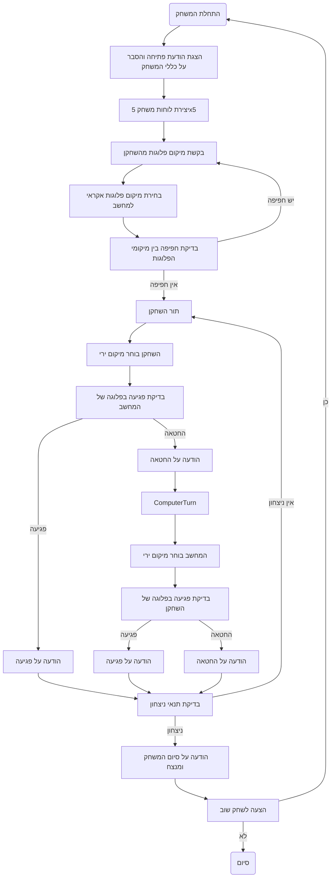

## <algorithm>

הקוד מתאר משחק קרב ארטילריה (Salvo I) בין שחקן למחשב. המשחק מתרחש על לוחות משחק בגודל 5x5, כאשר כל שחקן ממקם ארבע פלוגות במיקומים שונים. מטרת המשחק היא להשמיד את כל הפלוגות של היריב.

**תרשים זרימה צעד-אחר-צעד:**

1.  **התחלה:**
    *   הצגת הודעת פתיחה עם הסבר על כללי המשחק.
    *   יצירת שני לוחות משחק 5x5, אחד לשחקן ואחד למחשב.

2.  **מיקום הפלוגות:**
    *   **שחקן:** מבקש מהשחקן לבחור 4 מיקומים (בין 1 ל-25) עבור הפלוגות שלו.
        *   **דוגמה:** השחקן בוחר: 3, 7, 12, 18.
    *   **מחשב:** המחשב בוחר 4 מיקומים אקראיים עבור הפלוגות שלו.
        *   **דוגמה:** המחשב בוחר: 2, 8, 15, 22.
    *   **בדיקה:** מוודאים שאין חפיפה בין מיקומי הפלוגות של השחקן לבין המחשב.

3.  **מהלך המשחק:**

    *   **תור השחקן:**
        1.  השחקן בוחר מיקום ירי (בין 1 ל-25).
            *   **דוגמה:** השחקן בוחר: 7.
        2.  בודקים אם הפגיעה פגעה בפלוגה של המחשב.
            *   **פגיעה:** מודיעים על פגיעה.
            *   **החטאה:** מודיעים על החטאה.
    *   **תור המחשב:**
        1.  המחשב בוחר מיקום ירי אקראי.
            *   **דוגמה:** המחשב בוחר: 12.
        2.  בודקים אם הפגיעה פגעה בפלוגה של השחקן.
            *   **פגיעה:** מודיעים על פגיעה.
            *   **החטאה:** מודיעים על החטאה.
    *   **בדיקת ניצחון:** לאחר כל תור בודקים אם כל הפלוגות של השחקן או המחשב הושמדו.
        *   אם כן, מודיעים על המנצח.
        *   אם לא, ממשיכים לסעיף הבא.

4.  **סיום המשחק:**

    *   מוצע לשחקן לשחק שוב.
    *   אם השחקן בוחר כן, המשחק מתחיל מחדש.
    *   אם השחקן בוחר לא, המשחק מסתיים.

## <mermaid>

## <explanation>

**ייבואים (Imports):**

הקוד הזה אינו כולל ייבוא. לכן, אין כאן שימוש בחבילות חיצוניות.

**מחלקות (Classes):**

הקוד הזה לא מגדיר מחלקות. כל הפונקציונליות ממומשת באמצעות תרשים זרימה ודוגמאות טקסטואליות, ואין בו חלוקה למחלקות או אובייקטים.

**פונקציות (Functions):**

בתיאור הקוד, ישנן מספר פונקציות לוגיות המגדירות את מהלך המשחק, אך הן לא מוגדרות כפונקציות קוד בפועל:

*   **התחלת המשחק:**
    *   מטרות: להציג את כללי המשחק, ליצור לוחות משחק ולבקש מהשחקן למקם את הפלוגות.
    *   דוגמה לשימוש: להציג את ההודעה ההתחלתית ולבקש קלט מהמשתמש למיקום הפלוגות שלו.
*   **מיקום הפלוגות:**
    *   מטרות: לקבל את מיקומי הפלוגות של השחקן ושל המחשב.
    *   דוגמה לשימוש: הקלט מהשחקן, חישוב מיקומים אקראיים למחשב.
*   **תור השחקן:**
    *   מטרות: לקבל מיקום ירי מהשחקן, לבדוק אם הוא פגע בפלוגה של המחשב, ולהודיע על התוצאה.
    *   דוגמה לשימוש: קבלת קלט מהמשתמש, בדיקה אם הפגיעה היא הצלחה.
*   **תור המחשב:**
    *   מטרות: לבחור מיקום ירי אקראי, לבדוק אם הוא פגע בפלוגה של השחקן, ולהודיע על התוצאה.
    *   דוגמה לשימוש: בחירה אקראית של מיקום, בדיקה אם הפגיעה היא הצלחה.
*   **בדיקת ניצחון:**
    *   מטרות: לבדוק אם כל הפלוגות של השחקן או המחשב הושמדו.
    *   דוגמה לשימוש: בדיקת כל המיקומים של הפלוגות כדי לדעת האם יש ניצחון.
*   **סיום המשחק:**
    *   מטרות: להציע לשחק שוב או לסיום את המשחק.
    *   דוגמה לשימוש: שאילת השחקן האם ברצונו לשחק שוב.

**משתנים (Variables):**

*   **לוחות משחק (PlayerBoard, ComputerBoard):** מערכים או רשימות דו-ממדיות שמייצגות את לוחות המשחק.
*   **מיקומי הפלוגות (PlayerPlatoons, ComputerPlatoons):** רשימות או מערכים שמכילים את מיקומי הפלוגות של השחקן והמחשב.
*   **מיקום ירי (AttackPosition):** משתנה שמייצג את המיקום שבו השחקן או המחשב יורים.

**בעיות אפשריות ותחומים לשיפור:**

*   **קלט שגוי:** הקוד צריך להיות מסוגל לטפל בקלט לא תקין מהמשתמש, כמו מיקומים מחוץ לטווח או קלט שאינו מספרי.
*   **אימות חפיפה:** הקוד צריך לוודא שלא תהיה חפיפה במיקומי הפלוגות של השחקן והמחשב.
*   **חוסר גרפיקה:** המשחק חסר ממשק גרפי, מה שעלול להפוך אותו לפחות מושך חזותית.
*   **מורכבות קוד:** הפונקציות לא מוגדרות בקוד בפועל, מה שעלול לגרום לחוסר בהירות במבנה.

**שרשרת קשרים עם חלקים אחרים בפרויקט:**

הקוד הזה הוא חלק מהפרויקט `hypotez`. הוא משמש ליצירת משחקי מחשב בסיסיים ולכן אינו מתקשר ישירות לחלקים אחרים בקוד, אך ניתן להשתמש בו כבסיס למשחקים מורכבים יותר.

בנוסף, מכיוון שהקוד אינו כולל `import header`, אין צורך לכלול תרשים זרימה עבור `header.py`.