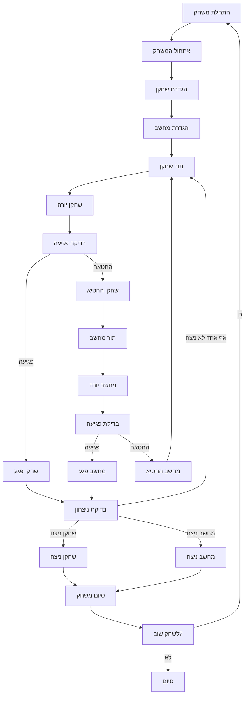

## ניתוח קוד המשחק "SALVO I" (קרב ארטילריה)

### 1. <algorithm>

הקוד מתאר את המשחק "SALVO I" (קרב ארטילריה) בו שני שחקנים (אחד מהם המחשב) מנסים להשמיד את יחידות הארטילריה של היריב. להלן תרשים הזרימה של תהליך המשחק:

1.  **אתחול המשחק:**
    *   הצגת הודעת פתיחה והסבר על חוקי המשחק.
        *   דוגמה: "אתה נמצא בשדה קרב עם 4 יחידות. יש לך 25 עמדות להצבה."
    *   יצירת שני לוחות משחק בגודל 5x5 (אחד לשחקן ואחד למחשב).
        *   דוגמה: לוח משחק דו-מימדי המייצג 25 עמדות.
    *   הצבת יחידות הארטילריה (4 יחידות לכל שחקן) באופן הבא:
        *   שחקן: השחקן בוחר 4 עמדות מתוך 25.
            *   דוגמה: השחקן בוחר עמדות 3, 7, 12, 18.
        *   מחשב: המחשב בוחר 4 עמדות באופן אקראי.
            *   דוגמה: המחשב בוחר עמדות 1, 5, 15, 22.
2.  **מהלך המשחק:**
    *   **תור שחקן:**
        *   השחקן בוחר עמדה לירות אליה.
            *   דוגמה: השחקן בוחר לירות לעמדה 7.
        *   בדיקה האם הפגיעה פגעה ביחידת ארטילריה של המחשב:
            *   אם כן, מוצגת הודעה "פגעת!" והיחידה של המחשב הושמדה.
                *   דוגמה: "השמדת את אחת מיחידותיי!".
            *   אם לא, מוצגת הודעה "החטאת!".
                *   דוגמה: "החטאת. תורי".
    *   **תור מחשב:**
        *   המחשב בוחר עמדה אקראית לירות אליה.
            *   דוגמה: המחשב בוחר לירות לעמדה 12.
        *   בדיקה האם הפגיעה פגעה ביחידת ארטילריה של השחקן:
            *   אם כן, מוצגת הודעה "המחשב פגע!" והיחידה של השחקן הושמדה.
                *   דוגמה: "המחשב השמיד את היחידה שלך בעמדה 12".
            *   אם לא, מוצגת הודעה "המחשב החטיא!".
                *   דוגמה: "המחשב החטיא. תורך".
    *   **בדיקת ניצחון:**
        *   בדיקה לאחר כל תור האם אחד מהשחקנים השמיד את כל יחידות הארטילריה של היריב.
            *   אם כן, מוצגת הודעת ניצחון.
                *   דוגמה: "המשחק הסתיים! השחקן ניצח."
            *   אם לא, המשחק ממשיך לתור הבא.
3.  **סיום המשחק:**
    *   הצגת הודעת סיום והצעה לשחק שוב.
        *   דוגמה: "האם תרצה לשחק שוב? (כן/לא)"
    *   אם השחקן בוחר לשחק שוב, המשחק מתחיל מחדש.
        *   דוגמה: אם התשובה היא "כן", המשחק חוזר לשלב האתחול.

### 2. <mermaid>

**הסבר התלויות:**

אין תלויות חיצוניות לקוד זה, זהו תיאור של לוגיקת המשחק. כל הפונקציונליות תלויה בהגיון שמומש בתוך המשחק עצמו.

**הסבר התרשים:**

*   **Start**: תחילת המשחק.
*   **Initialize**: אתחול לוחות המשחק והצבת היחידות.
*  **Player_Setup**: השחקן בוחר את מיקומי היחידות שלו.
*  **Computer_Setup**: המחשב בוחר באופן אקראי את מיקומי היחידות שלו.
*   **Player_Turn**: תור השחקן.
*   **Player_Attack**: השחקן בוחר עמדה לירות אליה.
*   **Check_Hit_Player**: בדיקה האם הפגיעה פגעה ביחידת אויב.
*   **Player_Hit**: שחקן פגע ביחידת אויב.
*   **Player_Miss**: שחקן החטיא.
*   **Computer_Turn**: תור המחשב.
*   **Computer_Attack**: המחשב בוחר עמדה לירות אליה.
*  **Check_Hit_Computer**: בדיקה האם הפגיעה פגעה ביחידת אויב.
*   **Computer_Hit**: מחשב פגע ביחידת אויב.
*   **Computer_Miss**: מחשב החטיא.
*   **Check_Win**: בדיקה האם אחד מהשחקנים ניצח.
*   **Player_Win**: השחקן ניצח.
*   **Computer_Win**: המחשב ניצח.
*  **End**: סיום המשחק.
*  **Play_Again**: שאלה האם לשחק שוב.
*  **End_Game**: סיום מוחלט של המשחק.

### 3. <explanation>

**ייבואים (Imports):**

אין ייבואות ספציפיים בתיאור הקוד שסופק. המימוש של המשחק עצמו עשוי להשתמש בספריות שונות, אבל הם לא מצוינים במסמך זה.

**מחלקות (Classes):**

אין מחלקות ספציפיות בתיאור הקוד שסופק. אם כי, במימוש ניתן יהיה להשתמש במחלקות כמו:
*  `Board`: לייצג את לוח המשחק.
*  `Player`: לייצג שחקן.
*  `Game`: לייצג את המשחק כולו.

**פונקציות (Functions):**

*   `initialize_game()`: מאתחלת את המשחק, כולל יצירת הלוחות והצבת היחידות.
*   `player_turn()`: מקבלת קלט מהשחקן ומבצעת את פעולות התור שלו.
*   `computer_turn()`: מבצעת את פעולות התור של המחשב.
*   `check_hit()`: בודקת האם פגיעה פגעה ביחידת אויב.
*   `check_win()`: בודקת האם המשחק הסתיים בניצחון של אחד מהשחקנים.
*   `play_again()`: מציעה לשחק שוב או לסיים את המשחק.

**משתנים (Variables):**

*   `board_size`: גודל לוח המשחק (במקרה הזה 5x5).
*   `player_units`: מערך או רשימה המייצגת את מיקומי יחידות הארטילריה של השחקן.
*   `computer_units`: מערך או רשימה המייצגת את מיקומי יחידות הארטילריה של המחשב.
*   `player_hits`: מספר הפגיעות של השחקן.
*   `computer_hits`: מספר הפגיעות של המחשב.

**בעיות אפשריות או תחומים לשיפור:**

*   **אימות קלט:** הקוד צריך לאמת את הקלט מהמשתמש כדי לוודא שהוא נמצא בטווח הנכון (בין 1 ל-25) ושהוא לא בוחר עמדה שכבר תפוסה.
*   **הצגת מידע:** הקוד יכול לשפר את הצגת המידע למשתמש, לדוגמה, להציג את לוח המשחק עם מיקומי הפגיעות.
*   **מורכבות המחשב:** ניתן לשפר את בינה מלאכותית של המחשב כדי שלא יבחר מיקומים אקראיים בלבד.
*   **ממשק משתמש:** הממשק כרגע טקסטואלי ויכול להיות משופר ע"י ממשק גרפי.

**שרשרת קשרים עם חלקים אחרים בפרויקט:**

אין מידע ספציפי על קשרים עם חלקים אחרים בפרויקט, אבל המשחק יכול להיות חלק מחבילת משחקים גדולה יותר.