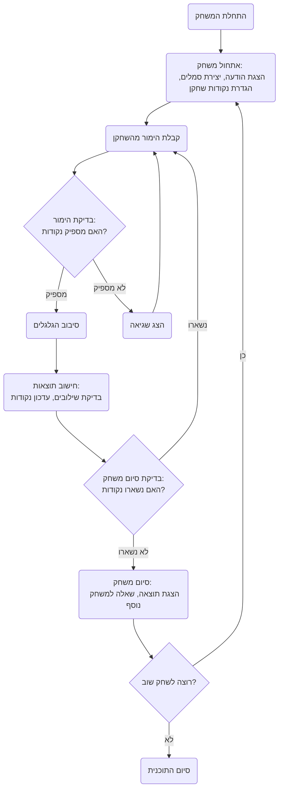

## <algorithm>
1.  **התחלת המשחק:**
    *   הצגת הודעת פתיחה וכללי המשחק.
    *   יצירת מערך של סמלים לבחירתם באקראי עבור שלושת הגלגלים, לדוגמא: `symbols = ["תפוח", "בננה", "דובדבן", "לימון", "7"]`.
    *   אתחול סכום נקודות התחלתי לשחקן, לדוגמא: `player_points = 100`.
2.  **לולאת משחק ראשית (כל עוד לשחקן יש מספיק נקודות):**
    *   **הזנת הימור:**
        *   הצגת נקודות השחקן הנוכחיות, לדוגמא: `הנקודות שלך: 100`.
        *   בקשת סכום הימור מהשחקן.
        *   בדיקה האם סכום ההימור קטן או שווה לנקודות השחקן:
            *   אם **כן**: המשך.
            *   אם **לא**: הצג הודעת שגיאה והמשך ללולאה.
    *   **סיבוב הגלגלים:**
        *   בחירה אקראית של סמל מתוך מערך הסמלים עבור כל אחד משלושת הגלגלים.
        *   הצגת תוצאות הסיבוב, לדוגמא: `גלגלים: תפוח, בננה, דובדבן`.
    *   **חישוב תוצאות:**
        *   בדיקת סמלי הגלגלים:
            *   **שלושה סמלים זהים**: הוספת כמות נקודות מוגדרת לניקוד השחקן, לדוגמא: `+10` נקודות.
            *   **שני סמלים זהים**: הוספת כמות נקודות שונה מוגדרת לניקוד השחקן, לדוגמא: `+5` נקודות.
            *   **אף צירוף מנצח**: הפחתת סכום ההימור מניקוד השחקן.
        *   עדכון ניקוד השחקן.
        *   הצגת הודעה על תוצאות הסיבוב, לדוגמא: `ניצחת 10 נקודות! יש לך עכשיו 110 נקודות`. או: `הפסדת 10 נקודות! יש לך עכשיו 90 נקודות`.
    *   **בדיקת סיום המשחק:**
        *   בדיקה האם לנקודות השחקן נשארו יותר מ-0 נקודות.
            *   אם **כן**: חזור ללולאת ההימור.
            *   אם **לא**: המשך לשלב הסיום.
3.  **סיום המשחק:**
    *   הצגת הודעת סיום, לדוגמא: `המשחק הסתיים! יש לך 0 נקודות`.
    *   שאל את השחקן האם הוא רוצה לשחק שוב.
        *   אם **כן**: חזרה לתחילת המשחק עם אתחול של כמות הנקודות ההתחלתית.
        *   אם **לא**: הצגת הודעת תודה וסיום התוכנית.

## <mermaid>

## <explanation>

### ייבואים (Imports)
בתיאור של המשחק הספציפי הזה אין ייבוא של קוד. עם זאת, מוזכר שיישום של המשחק בפייתון יכלול שימוש במודול `random` לסיבוב הגלגלים. המודול `random` בפייתון מספק כלים לייצור מספרים אקראיים, דבר הכרחי ליצירת סימולציה של מכונת מזל.

### מחלקות (Classes)
הקוד אינו מציג שימוש במחלקות, אלא רק תיאור של תהליך המשחק. אם הקוד היה מיושם, ניתן היה להשתמש במחלקות לצורך ארגון הקוד בצורה מודולרית, למשל ליצירת מחלקות עבור `Player`, `Reel`, ו-`Game`.

### פונקציות (Functions)
גם פה, הקוד לא מציג פונקציות בפועל. אם הקוד היה מיושם, היה צורך בפונקציות שונות, לדוגמה:
*   `start_game()`: מאתחלת את המשחק, קבלת שם שחקן, קבלת כמות נקודות התחלתית.
*   `get_bet()`: קבלת הימור מהשחקן, בדיקה שההימור חוקי.
*   `spin_reels()`: מדמה את סיבוב הגלגלים, החזרת תוצאות הסיבוב.
*   `calculate_result()`: בדיקת תוצאות הסיבוב, עדכון ניקוד השחקן.
*   `check_game_end()`: בדיקה האם המשחק צריך להסתיים, על פי כמות הנקודות שנותרו.
*   `end_game()`: מציגה את תוצאות המשחק, שואלת אם לשחק שוב, סיום המשחק.

### משתנים (Variables)
*   `symbols` (רשימה): רשימה של סמלים לגלגלים. לדוגמא: `symbols = ["תפוח", "בננה", "דובדבן", "לימון", "7"]`.
*   `player_points` (מספר שלם): כמות הנקודות של השחקן, מתחילה מ-100.
*   `bet` (מספר שלם): סכום ההימור של השחקן.
*   `reel1`, `reel2`, `reel3` (מחרוזות): הסמלים שנבחרו באקראי על כל גלגל.

### בעיות אפשריות ותחומים לשיפור
*   **אימות קלט:** נדרשת בדיקת קלט נוספת עבור הימורים לא חוקיים (למשל, קלט שהוא לא מספר).
*   **מערכת תגמול מורכבת:** אפשר להוסיף סוגים שונים של תגמול עבור צירופים שונים.
*   **ממשק משתמש:** ניתן להוסיף ממשק משתמש גרפי ליצירת משחק ויזואלי.
*   **אפשרויות הימור נוספות:** ניתן להוסיף אפשרויות הימור שונות, כגון הימור על סמל בודד.

### שרשרת קשרים עם חלקים אחרים בפרויקט
הקוד המקורי לא מספק קשרים ישירים עם חלקים אחרים בפרויקט. עם זאת, אם היה מדובר ביישום אמיתי, היינו רואים קשר בין המודולים הבאים:
*   **`gs.py`**: (Global settings) - הגדרות כלליות למשחק כגון: כמות נקודות התחלתית, רשימת סמלים.
*   **`ui.py`**: מודול אשר היה אחראי להצגה של הממשק, כגון הצגת נקודות השחקן, גלגלים וכו'.
*   **`utils.py`**: יכול להכיל פונקציות עזר, כגון פונקציה לבחירת סימבולים אקראיים.

אני מקווה שהניתוח הזה מקיף וברור!