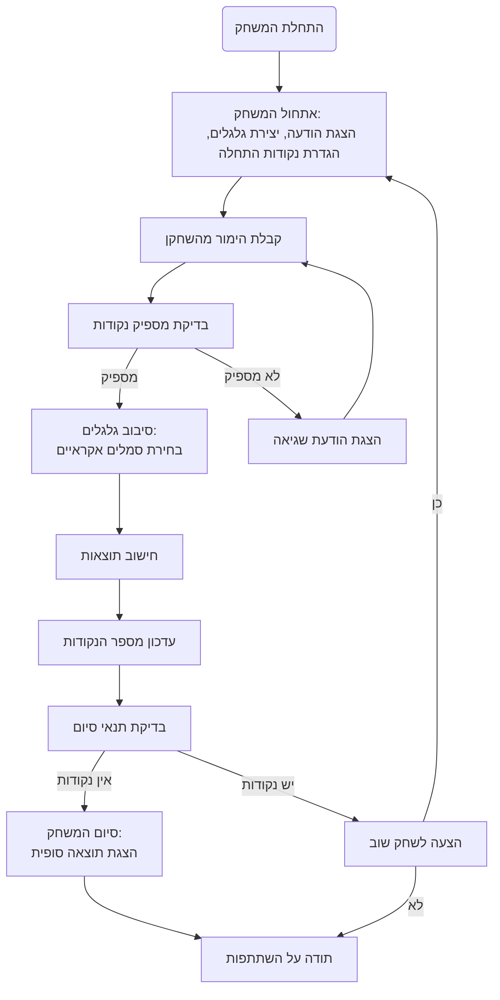

## <algorithm>

1. **אתחול המשחק:**
   - הצגת הודעת פתיחה והסבר על חוקי המשחק.
     - דוגמה: "ברוכים הבאים למשחק SLOTS! המטרה היא להרוויח כמה שיותר נקודות על ידי ביצוע הימורים וסיבוב הגלגלים."
   - יצירת שלושה גלגלים עם סמלים (לדוגמה: תפוח, בננה, דובדבן, לימון, שבע).
   - הגדרת נקודות התחלה לשחקן (לדוגמה: 100 נקודות).
   - **זרימת נתונים:** אין העברת נתונים, רק הגדרות ראשוניות.
2. **לולאה ראשית של המשחק:**
   - **2.1 קבלת הימור מהשחקן:**
     - השחקן מזין את סכום ההימור.
     - בדיקה אם יש מספיק נקודות לשחקן.
       - אם מספיק, המשך.
         - דוגמה: "יש לך 100 נקודות. אנא הזן את סכום ההימור שלך:"
       - אם לא מספיק, הצגת הודעת שגיאה והחזרה לבקשת הימור.
         - דוגמה: "אין לך מספיק נקודות עבור הימור זה. נסה שוב."
     - הצגת מספר הנקודות הנוכחי לשחקן.
       - דוגמה: "יש לך 100 נקודות."
     - **זרימת נתונים:** קלט (סכום הימור) -> בדיקה -> פלט (הודעת שגיאה/המשך, מספר נקודות).
   - **2.2 סיבוב הגלגלים:**
     - בחירת סמלים אקראיים לכל גלגל.
     - הצגת תוצאות הסיבוב.
       - דוגמה: "הגלגלים: תפוח, בננה, דובדבן"
     - **זרימת נתונים:** ללא קלט, פלט (תוצאות סיבוב).
   - **2.3 חישוב תוצאות:**
     - בדיקה האם השחקן זכה.
       - שלוש סמלים זהים -> זכייה (לדוגמה: 10 נקודות עבור שלושה תפוחים).
       - שני סמלים זהים -> זכייה חלקית (לדוגמה: 5 נקודות עבור שני בננות).
       - אין התאמה -> הפסד (הסכום ההימור יורד).
     - עדכון מספר הנקודות של השחקן.
       - דוגמה: "זכית ב-10 נקודות! יש לך עכשיו 110 נקודות."
     - **זרימת נתונים:** קלט (תוצאות סיבוב, סכום הימור), פלט (ניקוד מעודכן).
   - **2.4 בדיקת תנאי סיום:**
     - אם לשחקן אין נקודות -> סיום המשחק.
     - הצגת הודעת סיום.
       - דוגמה: "המשחק הסתיים! יש לך 0 נקודות."
     - **זרימת נתונים:** קלט (מספר נקודות), פלט (הודעת סיום/המשך).
3. **סיום המשחק:**
    - הצעה לשחק שוב (כן/לא).
    - אם כן -> חזרה לשלב 1 עם כמות נקודות התחלתית חדשה.
    - אם לא -> הודעת סיום ותודה על השתתפות.
       - דוגמה: "רוצה לשחק שוב? (כן/לא)" "תודה על המשחק!"
    - **זרימת נתונים:** קלט (תשובת השחקן), ללא פלט.

## <mermaid>

## <explanation>

**ייבואים (Imports):**
- הקוד מתאר משחק, והוא לא כולל יבוא של מודולים חיצוניים או קבצים אחרים. עם זאת, המשחק יסתמך על המודול `random` של פייתון לבחירת סמלים באופן אקראי.

**מחלקות (Classes):**
- אין מחלקות בקוד הזה. כל הלוגיקה מיושמת באמצעות פונקציות ומשתנים.

**פונקציות (Functions):**
- הקוד מתאר את הזרימה הלוגית של המשחק אך לא מספק קוד פונקציונלי קונקרטי. כדי לממש את המשחק, יש צורך להגדיר פונקציות שונות, כגון:
    - `init_game()`: מאתחלת את המשחק, מגדירה את הגלגלים, קובעת את כמות הנקודות ההתחלתית ומציגה את הודעת הפתיחה.
    - `get_bet()`: מקבלת את ההימור מהשחקן, בודקת אם יש מספיק נקודות ומחזירה את ההימור או מבקשת להזין שוב אם ההימור אינו חוקי.
    - `spin_reels()`: מסובבת את הגלגלים ובוחרת סמלים אקראיים עבור כל אחד מהם.
    - `calculate_result()`: מחשבת את תוצאות הסיבוב, בודקת האם השחקן זכה ועדכנת את הניקוד בהתאם.
    - `check_game_over()`: בודקת האם המשחק הסתיים (אם לשחקן אין נקודות) ומחזירה `True` או `False`.
    - `play_again()`: מציגה לשחקן אפשרות לשחק שוב ומתחילה את המשחק מחדש אם השחקן בוחר בכך.

**משתנים (Variables):**
- `reels` (רשימה): רשימה של שלושה גלגלים, כל אחד עם קבוצה של סמלים אפשריים.
    - דוגמה: `reels = [["תפוח", "בננה", "דובדבן", "לימון", "שבע"], ["תפוח", "בננה", "דובדבן", "לימון", "שבע"], ["תפוח", "בננה", "דובדבן", "לימון", "שבע"]]`
- `player_points` (מספר שלם): מספר הנקודות שיש לשחקן.
    - דוגמה: `player_points = 100`
- `bet_amount` (מספר שלם): סכום ההימור הנוכחי של השחקן.
- `winning_combinations` (מילון): מילון המגדיר את צירופי הזכייה ואת הנקודות שהם מקנים.
    - דוגמה: `winning_combinations = {("תפוח", "תפוח", "תפוח"): 10, ("בננה", "בננה", "בננה"): 20, ...}`
- `symbols` (רשימה): רשימה של הסמלים השונים שיופיעו על הגלגלים.

**בעיות אפשריות ותחומים לשיפור:**
- הקוד המוצג אינו כולל טיפול בשגיאות קלט של השחקן (לדוגמה, הזנה של מחרוזת במקום מספר).
- המנגנון של הגדרת הזכיות והקשר בינו לבין שווי הנקודות חסר.
- אין ממשק גרפי, רק טקסטואלי.
- המימוש של פונקציות שונות (כמו `spin_reels()`, `calculate_result()`) אינו ספציפי ודורש מימוש.
- אפשר להוסיף אפשרות לשחק עם מספר שחקנים.
- אפשר להוסיף אפשרות של בחירה לסוג ההימור (למשל, הימור על קו או על סמלים מסוימים).

**שרשרת קשרים עם חלקים אחרים בפרויקט:**
- המשחק יכול להשתלב במערכת משחקים כוללת.
- אפשר להשתמש בגישה מודולרית כדי שיהיה קל להוסיף משחקים נוספים.
- את הניקוד של השחקן אפשר לשמור במערכת ניהול שחקנים וניקוד.
- אפשר להשתמש במערכת ממשק משתמש כללית להצגת תוצאות המשחק.