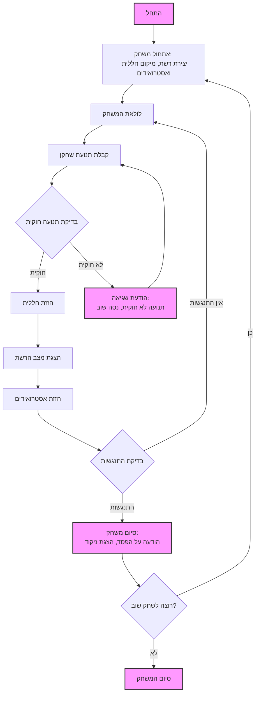

## <algorithm>

1.  **הצגת הודעת פתיחה והסבר על החוקים:**
    -   התוכנית מציגה הודעת פתיחה: "ברוכים הבאים ל-SPACWR!"
    -   התוכנית מסבירה את כללי המשחק: "המשימה שלך היא לשלוט בחללית ולהימנע מהתנגשות עם אסטרואידים. המשחק נמשך עד להתנגשות."
    -   דוגמה:
        ```
        ברוכים הבאים ל-SPACWR!
        המשימה שלך היא לשלוט בחללית ולהימנע מהתנגשות עם אסטרואידים.
        המשחק נמשך עד להתנגשות.
        בהצלחה!
        ```

2.  **אתחול המשחק:**
    -   יצירת רשת משחק בגודל 10x10.
    -   מיקום החללית במרכז הרשת.
    -   יצירת אסטרואידים באופן רנדומלי על קצוות הרשת, שנעים לכיוון המרכז.
    -   דוגמה: רשת בגודל 10x10, חללית במרכז (5, 5), אסטרואידים על הקצוות.

3.  **לולאת משחק ראשית:**
    -   המשחק ממשיך כל עוד לא התרחשה התנגשות.
    -   בתוך הלולאה:
        1.  **קליטת קלט משחקן:**
            -   התוכנית מבקשת מהמשתמש להכניס כיוון תנועה: "למעלה, למטה, שמאלה, ימינה".
            -   דוגמה: המשתמש מכניס "למעלה".
        2.  **בדיקת תנועה חוקית:**
            -   האם החללית לא יוצאת מגבולות הרשת?
            -   האם החללית לא נעה לתא עם אסטרואיד?
            -   דוגמה: אם החללית ב- (0,0) והמשתמש מנסה לנוע "שמאלה" - התנועה לא חוקית.
        3.  **ביצוע תנועת חללית:**
            -   אם התנועה חוקית, החללית זזה לכיוון הרצוי.
            -   דוגמה: החללית הייתה ב- (5,5) והמשתמש נכנס "למעלה" אז היא תעבור ל- (4,5).
        4.  **הצגת מצב משחק:**
            -   הצגת הרשת עם מיקום החללית והאסטרואידים.
            -   דוגמה:
                ```
                A B C D E F G H I J
                1 [ ][ ][ ][ ][ ][ ][ ][ ][ ][ ]
                2 [ ][ ][ ][ ][ ][ ][ ][ ][ ][ ]
                3 [ ][ ][ ][ ][ ][ ][ ][ ][ ][ ]
                4 [ ][ ][ ][ ][ ][ ][ ][ ][ ][ ]
                5 [R][ ][ ][ ][ ][ ][ ][ ][ ][ ]
                6 [ ][ ][ ][ ][ ][ ][ ][ ][ ][ ]
                7 [ ][ ][ ][ ][ ][ ][ ][ ][ ][ ]
                8 [ ][ ][ ][ ][ ][ ][ ][ ][ ][ ]
                9 [ ][ ][ ][ ][ ][ ][ ][ ][ ][ ]
                10[ ][ ][ ][ ][ ][ ][ ][ ][ ][ ]
                ```
        5.  **הזזת אסטרואידים:**
            -   האסטרואידים זזים לכיוון מרכז הרשת.
            -   דוגמה: אסטרואיד ב- (0,0) יעבור ל- (1,1) וכדומה.
        6.  **בדיקת התנגשות:**
            -   האם החללית נמצאת באותו התא של אסטרואיד?
            -   אם התנגשות, סוף משחק.
            -   דוגמה: אם החללית ב- (2,2) ואסטרואיד הגיע ל- (2,2) -> סוף המשחק.

4.  **סוף משחק:**
    -   הודעה על הפסד: "התנגשות! החללית שלך נהרסה."
    -   הודעה על כמות הצעדים שהשחקן שרד.
    -   דוגמה: "התנגשות! החללית שלך נהרסה. שרדת 15 צעדים."
5.  **אפשרות למשחק חוזר:**
    -   הצגת שאלה אם לשחק שוב: "האם אתה רוצה לשחק שוב? (כן/לא)"
    -   אם "כן", חזרה לשלב 2 עם רשת חדשה ואסטרואידים חדשים.
    -   אם "לא", תודה על המשחק.
    -   דוגמה: "האם אתה רוצה לשחק שוב? (כן/לא) > לא" -> "תודה על המשחק!"

## <mermaid>



## <explanation>

**ייבואים (Imports):**

אין ייבוא מפורש בקוד הזה. זהו תיאור של משחק, ולא קוד ממשי. אם ימומש בקוד פייתון, ייתכן שיהיו ייבואים של מודולים כגון:

*   `random`: ליצירת מיקומים אקראיים של אסטרואידים.
*   `numpy`: לשימוש במערכים רב ממדיים (אם צריך).

**מחלקות (Classes):**

אין מחלקות בתיאור הזה. אם המשחק ימומש, יכולות להיות מחלקות כמו:

*   `Game`: לניהול המשחק (רשת, חללית, אסטרואידים, תנועות).
*   `Ship`: לניהול מיקום החללית ותנועותיה.
*   `Asteroid`: לניהול מיקום האסטרואידים ותנועתם.
*   `Grid`: לניהול הרשת של המשחק.

**פונקציות (Functions):**

בתיאור אין פונקציות, אבל יישום יכלול פונקציות כגון:

*   `init_game()`: לאתחול המשחק.
*   `get_player_move()`: לקבלת תנועת השחקן.
*   `is_move_valid(move)`: בדיקה אם תנועה חוקית.
*   `move_ship(move)`: הזזת החללית.
*   `display_grid()`: הצגת מצב הרשת.
*   `move_asteroids()`: הזזת האסטרואידים.
*   `check_collision()`: בדיקת התנגשות.
*   `game_over()`: סיום המשחק.

**משתנים (Variables):**

*   `grid`: מערך דו-ממדי המייצג את רשת המשחק.
*   `ship_position`: מיקום החללית ברשת.
*   `asteroids_positions`: רשימה של מיקומי האסטרואידים.
*   `moves_count`: מספר הצעדים שהשחקן שרד.

**שרשרת קשרים עם חלקים אחרים בפרויקט:**

משחק זה יכול להיות חלק מפרויקט גדול יותר של אוסף משחקים, למשל:

*   אפשר יהיה להשתמש ב-`header.py` כדי להגדיר הגדרות גלובליות.
*   ייתכן קובץ תצורה לקביעת גודל רשת, כמות אסטרואידים וכדומה.
*   מערכת ניקוד מרכזית או ממשק משתמש גרפי.

**בעיות אפשריות:**

*   טיפול שגוי בקלט מהמשתמש: לא לטפל במקרים שבהם המשתמש מכניס קלט שגוי (למשל, לא "למעלה, למטה, ימינה, שמאלה").
*   קוד מסובך לניהול מצב המשחק אם אין שימוש במחלקות ופונקציות.
*   הגיאומטריה של תנועת האסטרואידים היא פשוטה מדי (למרכז) ואפשר יהיה להוסיף לה מורכבות.

**תחומים לשיפור:**

*   הוספת רמות קושי על ידי הגדלת כמות האסטרואידים.
*   הוספת תנועה אלכסונית לחללית.
*   הוספת אפשרויות משחק מתקדמות (כמו לייזר).
*   מימוש ממשק משתמש גרפי (GUI) כדי לשפר את חווית המשחק.
*   אפשרות להגדרת גודל הרשת.