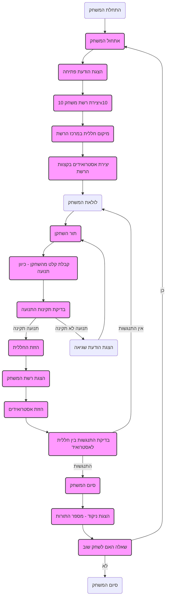
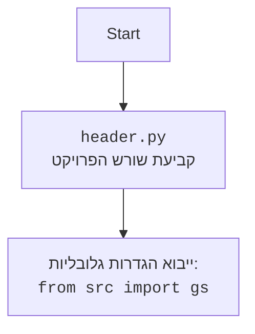

## <algorithm>
1. **התחלת המשחק:**
   - הצגת הודעת פתיחה והסבר על חוקי המשחק.
     - דוגמה: "ברוכים הבאים ל-SPACWR! המטרה שלך היא לנווט חללית ולהימנע מאסטרואידים."
   - יצירת רשת משחק בגודל 10x10.
     - דוגמה: רשימה דו-ממדית המייצגת את הרשת.
   - מיקום החללית במרכז הרשת.
     - דוגמה: החללית ממוקמת בתא [5,5].
   - יצירת אסטרואידים באופן אקראי בקצוות הרשת.
     - דוגמה: אסטרואיד ממוקם בתא [0,3], [9,7], [2,0] וכו'.

2. **לולאת המשחק:**
   - **תור השחקן:**
     - השחקן בוחר כיוון תנועה (למעלה, למטה, שמאלה, ימינה).
       - דוגמה: השחקן בוחר "למעלה".
     - בדיקת תקינות התנועה:
       - החללית לא יכולה לצאת מגבולות הרשת.
         - דוגמה: ניסיון לזוז מעלה מהשורה הראשונה הוא מהלך לא חוקי.
       - החללית לא יכולה לעבור לתא תפוס על ידי אסטרואיד.
         - דוגמה: ניסיון לזוז לתא שכבר יש בו אסטרואיד הוא מהלך לא חוקי.
     - אם התנועה תקינה, החללית זזה והרשת מוצגת.
       - דוגמה: החללית זזה לתא [4,5].
     - אם התנועה לא תקינה, מוצגת הודעת שגיאה והשחקן מתבקש לנסות שוב.
       - דוגמה: "מהלך לא תקין, נסה שוב."

   - **תנועת האסטרואידים:**
     - לאחר תור השחקן, האסטרואידים זזים לכיוון מרכז הרשת.
       - דוגמה: אסטרואיד בתא [0,3] זז לתא [1,3].
     - בדיקה אם התרחש התנגשות בין החללית לאסטרואיד:
       - אם התנגשות התרחשה, המשחק נגמר.
         - דוגמה: "התרחשה התנגשות, החללית שלך הושמדה!".
       - אם לא, המשחק ממשיך.

3. **סיום המשחק:**
   - המשחק נגמר כאשר החללית פוגעת באסטרואיד.
   - מוצג מספר התורות שהשחקן שרד.
     - דוגמה: "המשחק נגמר! שרדת 15 תורות."
   - השחקן מתבקש לשחק שוב.
     - דוגמה: "האם תרצה לשחק שוב? (כן/לא)"
   - אם השחקן בוחר "כן", המשחק מתחיל מחדש.

## <mermaid>

## <explanation>

**ייבואים (Imports):**
- אין ייבוא ספציפי בקוד זה, אך ההערה האחרונה "<code>from src import gs</code>" מצביעה על כך שהמשחק מסתמך על קבצי תצורה ונתונים גלובליים הנמצאים בספרייה "src".

**מחלקות (Classes):**
- אין מחלקות בקוד זה. הקוד מתאר את הלוגיקה של המשחק באופן פרוצדורלי. עם זאת, ניתן לראות שיהיה צורך במחלקות כמו `Grid` או `Spaceship` אם המשחק ימומש בגישה מונחית עצמים.

**פונקציות (Functions):**
- הקוד לא מספק מימוש פונקציות, אלא מתאר מה יהיה תפקידן:
  - `init_game()`: תפקידה לאתחל את המשחק, ליצור את הרשת, למקם את החללית והאסטרואידים.
  - `player_turn()`: תפקידה לקבל קלט מהשחקן, לבדוק את תקינות התנועה, ולהזיז את החללית.
  - `move_asteroids()`: תפקידה להזיז את האסטרואידים לכיוון מרכז הרשת.
  - `check_collision()`: תפקידה לבדוק האם יש התנגשות בין החללית לאסטרואיד.
  - `game_over()`: תפקידה להציג את הניקוד ולהציע לשחק שוב.
  - `display_grid()`: תפקידה להציג את מצב הרשת הנוכחי למשתמש.

**משתנים (Variables):**
- `grid`: משתנה המייצג את רשת המשחק, ייתכן כרשימה דו-ממדית (מטריצה).
- `spaceship_position`: משתנה המייצג את מיקום החללית ברשת, ייתכן כקואורדינטות (x, y).
- `asteroids_positions`: משתנה המייצג את מיקומי האסטרואידים ברשת, ייתכן כרשימה של קואורדינטות.
- `moves_count`: משתנה המייצג את מספר התורות שהשחקן שיחק.

**בעיות אפשריות ותחומים לשיפור:**
- **טיפול בקלט משתמש:** הקוד לא מציין כיצד לטפל בקלט לא תקין מהשחקן (לדוגמה, אם הוא מכניס משהו שאינו "למעלה", "למטה", "שמאלה" או "ימינה"). צריך להוסיף לוגיקה שתבדוק את הקלט ותבקש מהמשתמש להזין שוב במקרה של קלט שגוי.
- **מימוש תנועה אסטרואידים:** הקוד מציין שאסטרואידים זזים לכיוון מרכז הרשת, אבל לא מפרט איך התנועה הזו מחושבת. צריך לממש את הלוגיקה הזו.
- **מבנה קוד:** הקוד הנוכחי מתאר את המשחק בצורה של "שלבים" ולא כקוד מובנה. יהיה נכון יותר לממש את הלוגיקה באמצעות פונקציות ו/או מחלקות.
- **הפרדה בין לוגיקה לתצוגה:** הקוד מערבב את הלוגיקה של המשחק עם ההצגה למשתמש. מומלץ להפריד בין הלוגיקה של המשחק לממשק המשתמש (GUI).

**שרשרת קשרים עם חלקים אחרים בפרויקט:**
- הקוד מסתמך על קבצי הגדרות גלובליים באמצעות הייבוא `from src import gs`. דבר זה מעיד על כך שהקוד תלוי בתצורה והגדרות של הפרויקט כולו.
- בנוסף, סביר להניח שהקוד משתמש ברכיבים נוספים, כמו פונקציות עזר ליצירת מספרים אקראיים למיקום האסטרואידים.
- יתכן ויהיו רכיבים נוספים הקשורים לתצוגה גרפית, אם יתווסף ממשק משתמש גרפי.