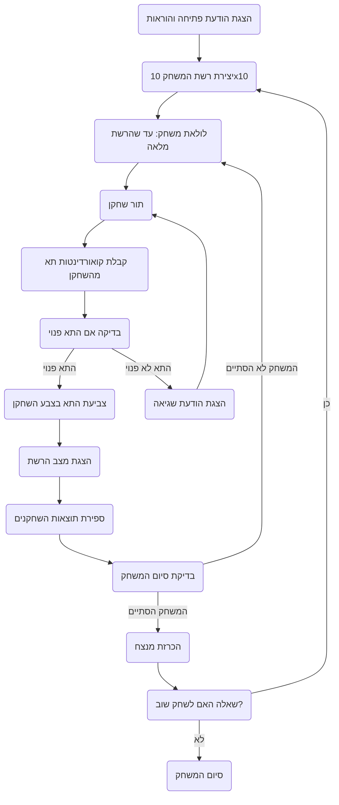

## <algorithm>

1. **הצגת הודעת פתיחה והוראות**:
   - התוכנית מדפיסה הודעת ברוכים הבאים למשחק SPLAT והסבר על כללי המשחק.
   - לדוגמה:
     ```
     ברוכים הבאים ל-SPLAT!
     המטרה שלך היא לצבוע כמה שיותר תאים ברשת בצבע שלך.
     המשחק נמשך עד שהרשת מלאה.
     המנצח הוא השחקן שצבע יותר תאים.
     בהצלחה!
     ```

2. **יצירת רשת המשחק**:
   - התוכנית יוצרת רשת בגודל 10x10 המיוצגת על ידי מערך דו-ממדי.
   - כל תא ברשת מתחיל כריק.

3. **לולאת המשחק**:
   - המשחק ממשיך עד שהרשת מלאה (כל התאים צבועים).

4. **תור שחקן**:
   - התוכנית מבקשת מהשחקן הנוכחי להזין קואורדינטות של תא (לדוגמה, A1).
   - דוגמה לקלט:
     ```
     שחקן 1, תורך.
     הכנס את קואורדינטות התא שברצונך לצבוע (לדוגמה, A1):
     > A1
     ```

5. **בדיקת תא**:
   - התוכנית בודקת אם התא שצוין פנוי (לא צבוע).
     - אם התא פנוי: התא נצבע בצבע של השחקן הנוכחי.
     - אם התא לא פנוי: התוכנית מציגה הודעת שגיאה ומבקשת מהשחקן לנסות שוב.
     - לדוגמה:
       ```
        התא כבר צבוע. נסה שוב.
       ```

6. **הצגת מצב הרשת**:
   - התוכנית מציגה את המצב הנוכחי של רשת המשחק.
   - לדוגמה:
     ```
     מצב הרשת הנוכחי:
     A B C D E F G H I J
     1 [X][ ][ ][ ][ ][ ][ ][ ][ ][ ]
     2 [ ][ ][ ][ ][ ][ ][ ][ ][ ][ ]
     3 [ ][ ][ ][ ][ ][ ][ ][ ][ ][ ]
     ...
     ```

7. **ספירת תוצאות**:
   - התוכנית סופרת את מספר התאים הצבועים של כל שחקן.
   - לדוגמה:
     ```
     שחקן 1: 5 תאים
     שחקן 2: 3 תאים
     ```

8. **בדיקת סיום המשחק**:
   - התוכנית בודקת אם כל התאים ברשת צבועים.
   - אם הרשת מלאה: המשחק מסתיים.

9. **הכרזת מנצח**:
   - התוכנית מכריזה על המנצח בהתבסס על כמות התאים הצבועים.
   - לדוגמה:
     ```
     המשחק הסתיים! ניצח שחקן 1 עם 60 תאים צבועים.
     ```

10. **אפשרות משחק חוזר**:
   - התוכנית שואלת אם השחקנים מעוניינים לשחק שוב.
   - אם התשובה היא "כן": המשחק מתחיל מחדש עם רשת חדשה.

## <mermaid>



## <explanation>

**ייבואים (Imports)**:
   - אין ייבוא בסקריפט הנתון, אבל באופן כללי, ניתן לייבא מודולים כדי לסייע בביצוע פעולות שונות (למשל, מודול `random` ליצירת קואורדינטות רנדומליות).

**מחלקות (Classes)**:
   - אין שימוש במחלקות בקוד המוצג, אבל במימוש מלא, ניתן ליצור מחלקה לניהול לוגיקת המשחק, כגון מחלקה שמייצגת את השחקן, הרשת, וכו'.

**פונקציות (Functions)**:
   - **`init_game()`** - פונקציה זו תציג הודעה פתיחה ותיצור את הרשת הראשונית.
     - פרמטרים: אין
     - ערך מוחזר: רשת ריקה
     - מטרה: אתחול המשחק.
     - דוגמה לשימוש: `grid = init_game()`
   - **`player_turn()`** - פונקציה המטפלת בתור השחקן, מקבלת קלט, בודקת ומעדכנת את הרשת.
     - פרמטרים: רשת נוכחית, מספר השחקן
     - ערך מוחזר: הרשת המעודכנת
     - מטרה: ניהול תור שחקן.
     - דוגמה לשימוש: `grid = player_turn(grid, player_number)`
   - **`count_results()`** - פונקציה לספירת התאים הצבועים של כל שחקן.
     - פרמטרים: רשת המשחק
     - ערך מוחזר: מילון (Dictionary) עם מספר התאים שצבע כל שחקן
     - מטרה: ספירת התאים של כל שחקן.
     - דוגמה לשימוש: `scores = count_results(grid)`
   - **`display_grid()`** - פונקציה להצגת רשת המשחק למשתמש.
      - פרמטרים: רשת המשחק
      - ערך מוחזר: אין
      - מטרה: להציג את מצב הרשת בצורה ברורה.
      - דוגמה לשימוש: `display_grid(grid)`
   - **`check_end_game()`** - פונקציה שבודקת אם המשחק הסתיים.
     - פרמטרים: רשת המשחק
     - ערך מוחזר: בוליאני (True אם המשחק נגמר, False אם לא).
     - מטרה: לקבוע אם המשחק הסתיים.
     - דוגמה לשימוש: `end_game = check_end_game(grid)`
   - **`declare_winner()`** - פונקציה המכריזה על המנצח בסוף המשחק.
     - פרמטרים: מילון עם תוצאות המשחק.
     - ערך מוחזר: אין.
     - מטרה: להכריז על המנצח.
     - דוגמה לשימוש: `declare_winner(scores)`
   - **`play_again()`** - פונקציה שמציעה לשחק שוב.
     - פרמטרים: אין.
     - ערך מוחזר: בוליאני (True אם השחקנים מעוניינים לשחק שוב, False אם לא).
     - מטרה: לבדוק אם לשחק מחדש.
     - דוגמה לשימוש: `replay = play_again()`

**משתנים (Variables)**:
   - **`grid`**: מערך דו-ממדי (רשימה של רשימות) שמייצג את רשת המשחק.
     - סוג: רשימה מקוננת.
     - שימוש: אחסון מצב הרשת.
   - **`player_number`**: מספר השחקן הנוכחי.
     - סוג: שלם (Integer).
     - שימוש: מציין מי תורו לשחק.
   - **`scores`**: מילון המאחסן את כמות התאים הצבועים של כל שחקן.
      - סוג: מילון.
      - שימוש: מעקב אחר הניקוד של כל שחקן.

**בעיות אפשריות ותחומים לשיפור**:
   - **עיבוד קלט לא תקין**: יש לוודא שהתוכנית מטפלת בקלט שגוי (לדוגמה, קואורדינטות לא חוקיות).
   - **ממשק משתמש**: כדאי להוסיף ממשק משתמש ידידותי יותר (למשל, גרפי) במקום טקסט בלבד.
   - **אפשרות לבחירת גודל רשת**: כדאי לאפשר למשתמש לבחור את גודל הרשת.
   - **משחק נגד המחשב**: כדאי להוסיף אפשרות לשחק נגד המחשב ברמות קושי שונות.
   - **מניעת צביעה כפולה**: צריך לוודא שלא ניתן לצבוע את אותו תא שוב.

**קשרים עם חלקים אחרים בפרויקט**:
   - אם הפרויקט מורכב יותר, ניתן להוסיף מודולים נפרדים לטיפול בגרפיקה, בינה מלאכותית (משחק נגד המחשב), ואחסון הנתונים.
   - יצירת פונקציות או מחלקות ברורות, מאפשרת לשנות חלקים קטנים בלי לפגוע בפונקציונאליות הכללית.