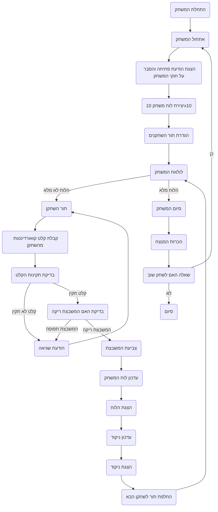

## <algorithm>
1. **התחלת המשחק:**
   - הצגת הודעת פתיחה והסבר על חוקי המשחק.
     - דוגמה: "ברוכים הבאים ל-SPLAT! עליכם לצבוע כמה שיותר משבצות. המשחק נגמר כשכל המשבצות צבועות. המנצח הוא מי שצבע הכי הרבה משבצות. בהצלחה!"
   - יצירת לוח משחק בגודל 10x10.
     - דוגמה: לוח ריק המיוצג ע"י מערך דו-ממדי.
   - הגדרת תור השחקנים (למשל, שחקן 1 ושחקן 2).

2. **לולאת המשחק:**
   - כל עוד הלוח לא מלא:
       - **תור השחקן:**
           - בקשת קלט מהשחקן - קואורדינטות המשבצת אותה הוא רוצה לצבוע (לדוגמה, "A1").
           - **בדיקת תקינות:**
                - בדיקה האם הקואורדינטות תקינות (למשל, בתוך גבולות הלוח).
                - בדיקה האם המשבצת ריקה.
                - אם המשבצת תפוסה, הצגת הודעת שגיאה ובקשה לניסיון חוזר.
                    - דוגמה: "המשבצת כבר צבועה. נסו שוב."
           - **צביעת המשבצת:**
                - עדכון לוח המשחק בצבע השחקן הנוכחי.
                - דוגמה: שינוי ערך המערך הדו-ממדי בהתאם.
           - **הצגת הלוח:**
                - הצגת מצב הלוח הנוכחי.
           - **עדכון ניקוד:**
                - ספירת מספר המשבצות שצבע כל שחקן.
           - **הצגת ניקוד:**
                - הצגת הניקוד הנוכחי של כל שחקן.
                - דוגמה: "שחקן 1: 5 משבצות, שחקן 2: 3 משבצות."
       - החלפת תור לשחקן הבא.

3. **סיום המשחק:**
   - כאשר הלוח מלא:
       - הכרזה על המנצח.
       - דוגמה: "המשחק נגמר! המנצח הוא שחקן 1 עם 60 משבצות צבועות."
   - שאלה האם לשחק שוב.
   - אם כן, התחל את המשחק מחדש.

## <mermaid>

**הסבר תלויות:**
אין תלויות מיובאות בתיאור האלגוריתם, התרשים מתאר את זרימת העבודה של המשחק עצמו, לא של הקוד.

## <explanation>

**ייבואים (Imports):**
אין ייבואים בקוד הזה. זהו תיאור מילולי של משחק ולא קוד, כך שלא נדרשים ייבואים.

**מחלקות (Classes):**
אין מחלקות בקוד הזה. זהו תיאור מילולי של משחק ולא קוד.

**פונקציות (Functions):**
למרות שאין קוד בפועל, ניתן להניח את קיומן של הפונקציות הבאות לצורך יישום המשחק:
   - `init_game()`: אתחול המשחק, הצגת הודעת פתיחה, יצירת לוח ריק, והגדרת תור השחקנים.
   - `player_turn()`: טיפול בתור השחקן, קבלת קלט מהשחקן, בדיקת תקינות קלט, צביעת המשבצת, עדכון הלוח והניקוד, והצגת הלוח.
       - פרמטרים: מספר שחקן נוכחי.
       - ערך מוחזר: אין.
       - מטרה: ניהול תור השחקן, כולל קלט, עדכון הלוח והניקוד.
       - דוגמה: `player_turn(1)` יטפל בתור השחקן הראשון.
   - `validate_input(input)`: בדיקת תקינות הקלט (קואורדינטות).
       - פרמטרים: קלט מהמשתמש (קואורדינטות).
       - ערך מוחזר: `True` אם הקלט תקין, `False` אחרת.
       - מטרה: וידוא שהקלט של המשתמש הוא קואורדינטות תקניות בתוך הלוח.
       - דוגמה: `validate_input("A1")` יחזיר `True`, ו `validate_input("Z10")` יחזיר `False`.
   - `is_cell_empty(board, x, y)`: בדיקה האם המשבצת בלוח ריקה.
       - פרמטרים: הלוח, קואורדינטות x ו-y.
       - ערך מוחזר: `True` אם ריקה, `False` אחרת.
       - מטרה: וידוא שמשבצת לא נצבעה קודם.
       - דוגמה: `is_cell_empty(board, 0, 0)` יחזיר `True` אם המשבצת הראשונה ריקה.
   - `update_board(board, x, y, player)`: עדכון הלוח עם צבע השחקן במשבצת הנבחרת.
       - פרמטרים: הלוח, קואורדינטות x,y ומספר שחקן.
       - ערך מוחזר: אין.
       - מטרה: עדכון הלוח בצבע השחקן.
       - דוגמה: `update_board(board, 0, 0, 1)` יצבע את המשבצת הראשונה בצבע של שחקן 1.
   - `show_board(board)`: הצגת הלוח הנוכחי.
       - פרמטרים: הלוח.
       - ערך מוחזר: אין.
       - מטרה: להציג למשתמש את מצב הלוח.
       - דוגמה: `show_board(board)` יציג את הלוח בצורה טקסטואלית.
   - `update_score(board, player)`: עדכון וחישוב הניקוד של כל שחקן.
       - פרמטרים: הלוח, מספר שחקן.
       - ערך מוחזר: הניקוד של השחקן.
       - מטרה: חישוב הניקוד של השחקן על פי מספר המשבצות הצבועות.
       - דוגמה: `update_score(board, 1)` יחזיר את הניקוד של שחקן 1.
   - `show_score(player1_score, player2_score)`: הצגת הניקוד של כל השחקנים.
       - פרמטרים: הניקוד של השחקן הראשון והניקוד של השחקן השני.
       - ערך מוחזר: אין.
       - מטרה: להציג למשתמש את הניקוד הנוכחי של כל שחקן.
       - דוגמה: `show_score(5,3)` יציג "שחקן 1: 5 משבצות, שחקן 2: 3 משבצות."
   - `is_board_full(board)`: בדיקה האם הלוח מלא.
       - פרמטרים: הלוח.
       - ערך מוחזר: `True` אם הלוח מלא, `False` אחרת.
       - מטרה: לבדוק האם המשחק הסתיים.
       - דוגמה: `is_board_full(board)` יחזיר `True` אם כל המשבצות בלוח צבועות.
   - `end_game()`: סיום המשחק, הכרזה על המנצח, ושאלה האם לשחק שוב.
       - פרמטרים: אין.
       - ערך מוחזר: אין.
       - מטרה: להציג את תוצאות המשחק ולשאול אם לשחק שוב.

**משתנים (Variables):**
- `board`: מערך דו-ממדי (רשימה של רשימות או מטריצה) המייצג את לוח המשחק.
    - סוג: רשימה של רשימות של תווים או מספרים שלמים.
    - שימוש: אחסון מצב הלוח, כאשר כל תא מייצג משבצת.
    - דוגמה: `[[' ', ' ', ' '], [' ', 'X', ' '], [' ', ' ', 'O']]`
- `player`: מספר שלם המייצג את השחקן הנוכחי.
    - סוג: מספר שלם.
    - שימוש: מעקב אחר תור השחקן (למשל, 1 או 2).
- `input`: מחרוזת המייצגת קלט מהמשתמש (קואורדינטות).
    - סוג: מחרוזת.
    - שימוש: אחסון הקואורדינטות שניתנו ע"י המשתמש.
    - דוגמה: `"A1"`, `"B2"`.
- `player1_score` ו- `player2_score`: משתנים שלמים המייצגים את ניקוד השחקנים.
  - סוג: מספר שלם.
  - שימוש: מעקב אחר הניקוד של כל שחקן.

**בעיות אפשריות או תחומים לשיפור:**
-   **טיפול בשגיאות קלט:** יש לוודא שהקלט מהמשתמש (קואורדינטות) מטופל כראוי, כולל שגיאות כמו קואורדינטות לא חוקיות או תווים לא מתאימים.
-   **גמישות גודל הלוח:** כרגע גודל הלוח קבוע (10x10). כדאי לאפשר למשתמש לבחור את גודל הלוח.
-   **ממשק משתמש:** כרגע מוצג רק ממשק טקסטואלי. כדאי לשקול להשתמש בממשק גרפי כדי לשפר את חוויית המשתמש.
-   **משחק מול מחשב:** כרגע המשחק מוגבל לשני שחקנים אנושיים. ניתן להוסיף אפשרות לשחק מול המחשב.
-   **שיפור אלגוריתם סיום המשחק:** אפשר להוסיף מצב שהמשחק מסתיים כשאין יותר מהלכים אפשריים, במקום רק כאשר כל המשבצות תפוסות.

**שרשרת קשרים עם חלקים אחרים בפרויקט:**
  - הקוד הזה אמור לשמש כחלק מתוכנית משחק בסיסית, כאשר הפונקציות שתיארנו אמורות להיות מיושמות בפועל בשפת תכנות כמו פייתון.

זהו ניתוח מפורט של תיאור המשחק SPLAT, המתאר את כל המרכיבים והתפקידים שלו בצורה ברורה ומובנת.